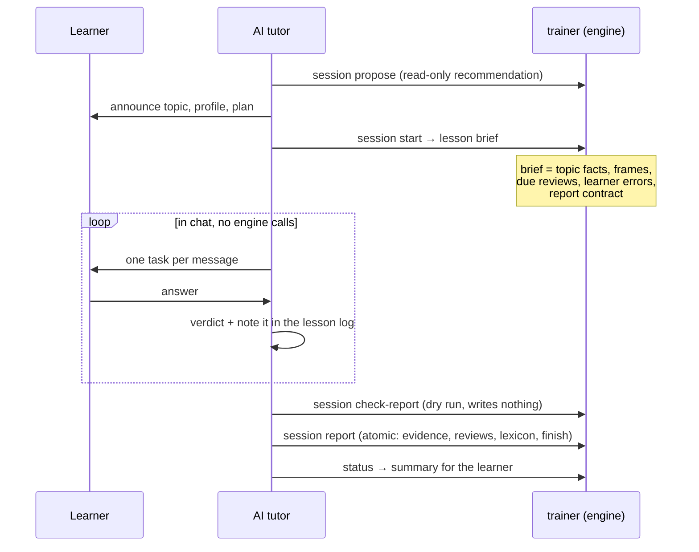

# English Memory Trainer

A local-first engine for learning American English with an AI tutor you already use in your terminal (Claude Code, Codex or a similar shell-capable agent). The split of responsibilities is the whole idea:

- **The tutor is the teacher.** It runs the lesson in chat: explains, asks, corrects, and decides whether each answer is correct, partial or incorrect.
- **The engine is the memory.** A deterministic Python CLI (`trainer`) proposes what to learn next, stores every piece of evidence (prompt, verbatim answer, verdict, error cause), schedules spaced reviews and computes levels. Chat context is never memory: any tutor can pick up where another left off.

Scope is text only: **Reading, Writing, grammar and vocabulary**. Listening and Speaking are deliberately out of scope, so TOEFL is covered only in part (Reading, Writing and the language base). Learner state can be projected into an **Obsidian vault** as linked, read-only Markdown.

Product docs, the dev wiki and the tutor skills are written in Russian (the learner is a Russian speaker); code, identifiers and this README are in English.

## How a lesson works

A lesson costs the tutor about three engine calls: one to get a brief, one to validate the report and one to commit it. Everything in between happens in chat.



1. **Brief** (`trainer session start`) opens a session, pins the active policy versions and returns a `lesson_brief@1`: the central topic with its explanation, typical errors and frames, the reviews that are due, the learner's recent errors and preferences, an advisory plan, and a `report_contract` with a `brief_hash`.
2. **Chat.** The tutor teaches from the brief and presents tasks one at a time. No engine calls are needed during the lesson. If the chat is lost, `trainer session resume` rebuilds the same brief for any tutor.
3. **Check** (`trainer session check-report`) validates a `lesson_report@1` file and writes nothing. For each item it returns accepted or rejected with a stable reason code (`unknown_target`, `learner_form_not_in_answer`, `review_mismatch`, ...) and the effect the item would have.
4. **Report** (`trainer session report`) commits the whole report in one transaction and finishes the session. If any item is rejected, nothing is written.

The engine never re-grades a verdict. It checks that every error quotes the learner's answer verbatim, works out the text spans itself, and then aggregates deterministically: `correct` scores 1.0 and `partial` 0.5, and a due review closes as `CONFIRMED` (correct or partial) or `REGRESSION` (incorrect). Tutor verdicts can be audited afterwards against the stored answers with the `audit-english-tutor` skill.

A trimmed report:

```json
{
  "schema": "lesson_report@1",
  "session_id": "01M396YTMNZ4472ASYJH0QGP14",
  "brief_hash": "00f4d4f6…",
  "items": [
    {
      "item_id": "i1",
      "target_ref": "grammar.be.identity",
      "dimension": "controlled_production",
      "kind": "production",
      "prompt": "Скажи по-английски: Я аналитик данных.",
      "raw_answer": "I am data analyst.",
      "verdict": "partial",
      "hints": 0,
      "errors": [
        {
          "learner_form": "am data analyst",
          "correction": "am a data analyst",
          "cause": "article dropped before a singular job noun"
        }
      ]
    }
  ],
  "reviews_skipped": [],
  "teaching": [{ "target_ref": "grammar.be.identity", "summary": "be for identity" }],
  "lexicon": [],
  "summary": { "text": "First lesson on be for identity.", "next_focus": "articles with job nouns" }
}
```

Optional sections: `blocks` (drill rounds, `blocked` or `interleaved`), `reviews_skipped` with a reason, and `lexicon` (new words the learner met, recorded as met but not yet known).

## Architecture

It is a **modular monolith**. Modules talk only through public APIs and events, and each one owns its own tables. Everything sits on a **kernel**: typed IDs, an injected clock and random source, command and event envelopes, idempotency and correlation IDs, a versioned policy registry, a unit of work, a transactional outbox and a JSONL exporter.

| Package (`src/english_trainer/`) | Role |
|---|---|
| `kernel` | Event store, envelopes, idempotency, policy registry, replay, projections |
| `storage` | Storage layout, SQLite lifetime, snapshots |
| `curriculum` | The authored program as data: loader, validator, `carries` tags |
| `control` | Lesson composition: profiles, saturation, deferral, availability, metrics |
| `lessons` | Session lifecycle (`STARTED → IN_PROGRESS → FINISHED`), brief and report |
| `evidence` | The only way knowledge reaches scoring: report builders, reviews, rubric |
| `scoring` | The only writer of evaluative state: mastery, levels, automaticity, replay |
| `scheduler` | When to repeat: intervals and the relearning ladder |
| `assessments` | Placement diagnostics: fixed forms, lifecycle, self-assessment |
| `learner` | What belongs to the person: personal lexicon, preferences |
| `memory` | Obsidian projection (generated `memory/` zone) |
| `audit` | Read-only views and tutor-compliance obligations |
| `adapters` | Replaceable tutors: skills sync, parity comparison |
| `cli` | The single boundary: `trainer` commands, JSON envelope, command registry |

**State.** SQLite (`trainer.db`) is authoritative and holds the append-only event log. The kernel also has an exporter for a derived JSONL copy (`trainer.events.jsonl`), which can always be rebuilt, but no CLI command writes it yet, so `trainer doctor` warns that the file is missing. The Obsidian vault is a projection and is never used as a scoring source.

**Determinism.** The same events, timestamps and policy versions always produce the same learner state. `trainer scoring replay` recomputes every score from the log and fails loudly if the result diverges. A golden-replay test checks that a committed log from the retired step-by-step protocol still replays to the same scores.

**Policies** (`curriculum/policies/`) are versioned YAML payloads, currently 23 of them (`scoring@2`, `scheduler@2`, `evidence@2`, `obligations@4`, ...). Each session pins the versions it started with, and older versions stay resolvable for replay.

**Curriculum is data** (`curriculum/`): 283 topics in 53 modules and 10 tracks covering A1–C2, 2671 lexical units (including 1529 grammar *frames*, memorised phrase templates tied to a grammar topic), 150 reconstruction texts, and two fixed placement forms. Prerequisites are advisory: nothing is locked.

## Install and first run

You need Python 3.12 or newer. Linux and macOS:

```bash
git clone https://github.com/alexmaralless-bit/AI_trainer_eng.git
cd AI_trainer_eng
uv sync --python 3.12                    # or: python3.12 -m venv .venv && .venv/bin/pip install -e . --group dev  (pip >= 25.1)
source .venv/bin/activate                # or call .venv/bin/trainer directly
```

Use an **editable** install (`uv sync` or `pip install -e`). The package list in `pyproject.toml` does not name every subpackage, so a plain non-editable `pip install .` gives an incomplete package.

On **Windows**, the same steps work in PowerShell with `.venv\Scripts\activate`. The project was developed on Windows before moving to Linux, but it is no longer tested there.

Bootstrap the local state. All commands default to `--root .`, and the curriculum is read from `./curriculum`, so run them from the repo root:

```bash
trainer init                                    # create trainer.db and apply migrations
trainer curriculum validate                     # check the authored program
trainer curriculum activate --version curriculum@2026-09-24
trainer doctor                                  # read-only environment and state check
```

`--version` is a **label you choose** for this snapshot of the program. The engine validates `curriculum/`, registers it under that id and makes it active, and sessions pin it from then on. After you edit the curriculum, activate again with a new label (`--expected-active <old-label>` makes the switch a compare-and-set).

Placement is optional and never blocks anything:

```bash
trainer placement start                         # a fixed diagnostic form; the tutor presents items one by one
trainer placement decline --self-assessment '{"schema_version":1,"levels":{"grammar":"A2"}}'
```

After that, just ask your tutor for a lesson (see below). `trainer status` shows mastery, levels, XP and lexicon counts at any time. `trainer memory render` regenerates the Obsidian vault under `memory/`.

In text mode (the default) commands need no extra flags. Agents call them with `--format json`, and every mutating command then also requires `--idempotency-key`. JSON goes to stdout, diagnostics to stderr, and exit codes come from a stable set.

**Your data stays local.** `trainer.db`, its WAL/SHM files, `trainer.events.jsonl` and `snapshots/` are gitignored and never committed.

## Tutor skills

Skills are the tutor's operating procedures. The canonical copies live in `agent-skills/`. `trainer skills sync` writes deterministic, byte-identical copies to `.claude/skills/` (Claude Code) and `.agents/skills/` (Codex). Never edit those copies by hand.

```bash
trainer skills sync        # canon → .claude/skills/ and .agents/skills/
trainer skills validate    # structure, cli_calls resolvable, drift in both directions
trainer adapters compare   # parity of recorded observable effects across providers (diagnostic)
```

**Starting a lesson.** Open Claude Code or Codex in the repo directory and ask for a lesson in plain words (for example "давай урок" or "let's do a lesson on articles"), or name the skill (`run-english-session`). If you named a topic or profile, that counts as agreement. Otherwise the skill asks the engine for a recommendation (`session propose`), announces it and waits for your confirmation. Then it calls `session start --provider claude-code` (or `--provider codex`).

| Skill | What it does |
|---|---|
| `run-english-session` | Runs a full lesson: announce, brief, teach in chat, give verdicts, file one report |
| `run-drill-block` | Drill profile: frames, blocked then interleaved rounds, text reconstruction, timed writing, debrief |
| `run-spaced-review` | A lesson built from due reviews: recall by meaning (RU→EN), retry, transfer |
| `run-placement-assessment` | Initial fixed-form diagnostic through the placement lifecycle |
| `coach-english-conversation` | Free conversation within known language, 1–3 new useful items |
| `teach-english-topic` | Reference for explaining a topic: frames before form, grounded in the brief |
| `correct-learner-output` | Reference for feedback by stage: verdict, self-correction, short retry |
| `assess-english-gate` | Reference for a no-hints checkpoint task and an honest verdict |
| `finish-english-session` | Build the report, `check-report`, fix, `report`, or `abandon` explicitly |
| `audit-english-tutor` | Read-only: compare the chat against the stored report and obligations |
| `maintain-english-curriculum` | Edit `curriculum/`, run the authoring checks, validate, sync skills |

## Compatibility

The trainer works with **agents that can run shell commands**: Claude Code, Codex and similar tools. The whole agent-facing contract is the CLI plus skill files.

It is **not an MCP server**. "No MCP" is a deliberate decision in `docs/design-direction.md` §4. As a result, chat-only apps such as ChatGPT desktop cannot drive it today. With the brief/report protocol, an MCP layer would come down to about six tools, and that option is recorded but deferred as OPEN-44 in `wiki/OPEN.md`.

## Development

```bash
.venv/bin/python -m pytest       # ~950 tests, no network
ruff check .
ruff format --check src tests
mypy src                         # strict
trainer scoring replay           # reproduce every score from the event log
trainer memory check             # drift check of the generated vault
```

Use `python -m pytest`: the bare `pytest` entry point fails to collect the modules that import `tests.*` helpers.

Curriculum tooling (the full workflow is in `agent-skills/maintain-english-curriculum/`):

- `python tools/check_authoring.py <files>` pre-checks frames and reconstruction texts.
- `python tools/link_frames.py` is an idempotent post-pass that links frames to their topics before `trainer curriculum validate`.
- `python tools/enrich_lexicon.py --cache <dir> --check` reproduces the corpus frequencies from pinned artifacts. It needs network access and the optional dependency `pip install -e '.[corpus]'`, and its cache must live outside the repo.

Rules for contributors, human or agent, are in `CLAUDE.md` and `AGENTS.md`. The most important one: learner state is read and changed only through the CLI, never by editing SQLite, the event log or the generated vault.

## AI-native development

This project is designed, built and reviewed with AI agents under explicit human product ownership. The machinery is simple. A wiki acts as the canon and has its own constitution. Changes go concept → owner's "ок" → canon. Product forks are decided only by the human and marked `[PD-date]`. Implementation happens in waves with disjoint file ownership, independent reviews check the work, the owner accepts it by running the full suite, and live lessons serve as acceptance tests. Read the walkthrough, with Phase 4 as the worked example, in [docs/ai-native-process.md](docs/ai-native-process.md).

Case study of that phase (problem, diagnosis, decision, measured results): [docs/case-study-lesson-protocol.md](docs/case-study-lesson-protocol.md).

## Repository map

| Path | Contents |
|---|---|
| `src/english_trainer/` | The engine (packages above) |
| `tests/` | pytest suite: unit, integration, architecture boundaries, golden replay, lexicon invariants |
| `curriculum/` | Authored program as data: topics, modules, tracks, lexicon, texts, placement forms, policies |
| `agent-skills/` | Canonical tutor skills (synced to `.claude/skills/` and `.agents/skills/`) |
| `tools/` | Authoring and corpus tooling |
| `wiki/` | Dev canon: constitution, glossary, specs, `roadmap.md` (status), `OPEN.md` (open questions) |
| `docs/` | Original brief, build prompt, agreed design direction, AI-native process |
| `staging/` | Non-canon provenance: concepts, journals, reviews, handoff prompts, demos |
| `CLAUDE.md`, `AGENTS.md` | Operating rules for Claude Code and Codex |

## License and attributions

Code and authored content are MIT-licensed — see [LICENSE](LICENSE). Some values in `curriculum/lexicon/` are derived from CC BY-SA 4.0 sources (wordfreq 3.1.1 frequency data, NGSL 1.2 / BSL 1.2 membership) and remain under CC BY-SA 4.0; full per-source notices are in [ATTRIBUTIONS.md](ATTRIBUTIONS.md) and `curriculum/lexicon/_provenance.yaml`. Raw datasets are never committed.
