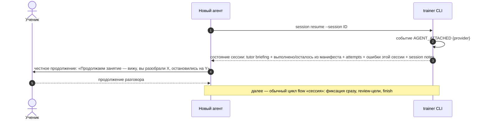
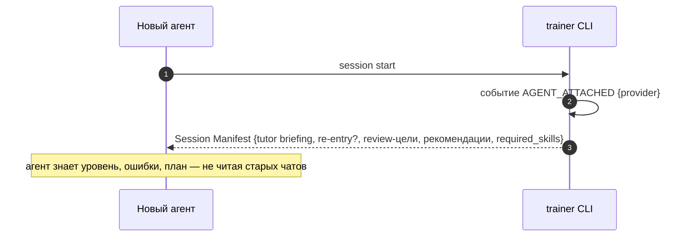

# Flow: продолжение без старого чата (continuation)

> **Status**: current
> **Last updated**: 2026-07-19
> **Sources**: [[session]] · [[../product/learning-model]] · Concept Gate 2026-07-19 (три развилки, [PD-2026-07-19]) · концепт одобрен («ок»)
> **Роль**: спинной сценарий (roadmap 0.8). Ключевое свойство системы: контекст чата — не память; любой агент продолжает обучение из состояния движка. Проверяется демо 2.7.

---

## Решения этого flow [PD-2026-07-19]

1. **Session notes — опциональные.** При любой фиксации через CLI агент МОЖЕТ добавить короткую контекстную заметку (о чём говорили, на чём остановились, настроение). Resume возвращает заметки хронологически — продолжение звучит естественно. Обязаловки нет.
2. **Tutor briefing в манифесте.** Движок отдаёт полную картину ученика одним JSON внутри Session Manifest (и в ответе resume). Чтение Obsidian агенту не требуется — vault остаётся проекцией для человека; briefing генерится из state, нечему расходиться.
3. **Без блокировок, с учётом.** Lease/блокировки сессий в MVP не вводятся: ученик один, реальная одновременность агентов маловероятна. `start`/`resume` регистрируют провайдера событием `AGENT_ATTACHED`; idempotency keys защищают от дублей. Lease — `[post-mvp]`.

## Состав tutor briefing

Генерится движком из состояния (не из Markdown):

- рабочий уровень по навыкам + confidence;
- активные темы и их состояния;
- топ повторяющихся ошибок;
- недавние vocabulary и chunks;
- re-entry статус (перерыв, упавшая Retrievability);
- рекомендации тем и повторений;
- краткая сводка последней сессии (итог + session notes, если были).

## Сценарий A — resume брошенной IN_PROGRESS сессии

Чат умер посреди занятия. Всё зафиксированное сохранено инкрементально ([[session]]); новый агент — тот же или другой провайдер.

## Сценарий B — холодный старт нового агента (новая сессия)

Прошлую сессию вёл другой провайдер и завершил её штатно. Новый агент стартует по flow [[session]]; специфика continuation — в протоколе восстановления картины:

## Правила сценария

- **MUST**: `resume` и `start` возвращают tutor briefing — агенту достаточно одного вызова CLI, чтобы вести занятие корректно.
- **MUST**: агент честен с учеником: он продолжает по сохранённому состоянию и не притворяется, что помнит разговор дословно.
- **MUST NOT**: агент не восстанавливает картину из Obsidian vault, старых чатов или расспросов ученика «что мы проходили» — источник только движок. (Заглянуть в vault агент может, но любое расхождение трактуется в пользу CLI.)
- **MUST**: каждое подключение агента к сессии фиксируется событием `AGENT_ATTACHED` с провайдером — вход для Tutor Compliance и аудита смены агентов.
- **MAY**: session note при любой фиксации (`--note "..."`); движок хранит их в составе сессии и отдаёт при resume.
- **MUST**: незакрытые review-цели брошенной сессии остаются обязательными к исходу перед finish (правило [[session]] сохраняется при смене агента).

## Выведенные контракты (фиксируются в спеках модулей)

| Модуль (спека) | Обязан предоставить |
|---|---|
| `lessons` (0.5) | `resume` API: полное состояние сессии одним ответом; переживание смены агента без потери обязательств |
| `learner` | агрегация tutor briefing из состояния (уровень, ошибки, vocabulary, рекомендации) |
| `evidence` (0.4) | приём опциональной `--note` при фиксациях; выдача notes хронологически |
| `audit` | событие `AGENT_ATTACHED {provider, session}`; след смены агентов для Tutor Compliance |
| `cli` (0.7) | briefing в ответах `session start`/`resume`; стабильная схема briefing JSON |
| `adapters`/skills (0.7) | cold-start протокол в session-skill: один вызов CLI → полная картина; запрет восстановления из сторонних источников |

## Открытые вопросы

Нет новых. Lease на сессию — `[post-mvp]`, вернуться при появлении параллельных агентских сессий.

## История изменений

- **2026-07-19**: создан по Concept Gate: опциональные session notes, tutor briefing в манифесте, без блокировок с событием AGENT_ATTACHED. Все решения [PD-2026-07-19].
