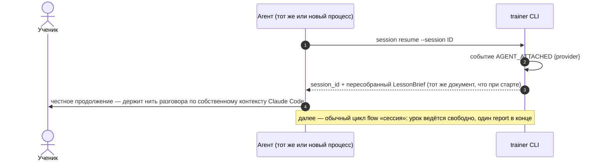
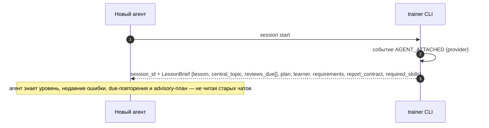

# Flow: продолжение без старого чата (continuation)

> **Status**: current
> **Last updated**: 2026-09-23
> **Sources**: [[session]] · [[../product/learning-model]] · Concept Gate 2026-07-19 (три развилки, [PD-2026-07-19]) · `staging/concepts/2026-09-23-lesson-brief-report-concept.md` (одобрен, [PD-2026-09-23]) · концепт одобрен («ок»)
> **Роль**: спинной сценарий (roadmap 0.8). Ключевое свойство системы: контекст чата — не память; любой агент продолжает обучение из состояния движка. Проверяется демо 2.7.

---

## Решения этого flow

1. **Session notes — retired** [PD-2026-09-23]: до brief/report протокола агент **мог** добавить короткую untrusted-заметку при любой фиксации (`--note`). Обеих команд, которые её принимали (`attempt record`, `observed record`), больше нет; текстовый контекст урока теперь несут собственные поля `LessonReport.teaching[]`/`summary`, а не отдельная заметка ([[../modules/evidence]] §5).
2. **LessonBrief в манифесте и в `resume`** [PD-2026-09-23, наследует решение 2026-07-19 про tutor briefing]. Движок отдаёт полную картину ученика одним документом — `LessonBrief` — из `session start` и снова из `session resume`; чтение Obsidian агенту не требуется, vault остаётся проекцией для человека. `resume` **пересобирает тот же brief заново** из текущего состояния — сохранённого черновика между вызовами нет (PD-B).
3. **Без блокировок, с учётом.** Lease/блокировки сессий не вводятся: ученик один, реальная одновременность агентов маловероятна ([PD-2026-07-19]). `start`/`resume` регистрируют провайдера событием `AGENT_ATTACHED`. [PD-2026-07-22] Семантический конфликт двух агентов закрывает coarse `session_revision`: `resume` и `abandon` предъявляют текущий токен и увеличивают его в одной UoW со своим эффектом; stale writer получает `SESSION_REVISION_CONFLICT` без частичной записи. [PD-2026-09-23] `report` токена не требует — единственность коммита обеспечивают `idempotency-key` и бизнес-правило «сессия завершается ровно один раз»; узкого `plan_version` не существует — план advisory. Lease — MAY: необязательное усиление поверх этой защиты.

## Состав LessonBrief

Генерится движком из состояния (не из Markdown), `lessons/brief.py::build_brief`:

- `lesson` — профиль, название, причина, agenda, language envelope, длительность;
- `central_topic` — target_ref, can-do, факты программы для объяснения (explanation, typical_errors, фреймы, reconstruction text для drill);
- `reviews_due[]` — review_id, target_ref, dimension, urgency, RU-подсказка смысла;
- `plan` — advisory шаги `compose_plan`;
- `learner` — рабочий уровень по навыкам + confidence, активные темы и их состояния, **реальные** недавние ошибки из `evidence.error_observed`, недавние vocabulary/chunks, re-entry статус, `known_language` (доказанно знакомые targets для понятного free conversation), краткая сводка последней сессии, предпочтения — поглощает прежний Tutor briefing;
- `requirements` — advisory (§4d [[../modules/lessons]]);
- `report_contract` — schema отчёта, лимиты, `brief_hash`.

`resume` возвращает **тот же** документ, пересобранный из текущего состояния — не инкрементальный «что уже сделано, что осталось»: до отчёта в движке ничего не зафиксировано (PD-B, PD-2026-09-23). Восстановление хода уже состоявшегося разговора — ответственность контекста Claude Code, а не движка: если сам чат оборвался, движок не хранит его содержимого и не пытается его реконструировать.

## Сценарий A — resume до отчёта

Инструменту (тому же или другому агенту) нужен LessonBrief повторно — контекст сжался, начался новый процесс, чат переоткрыт в том же разговоре Claude Code. До `session report` в движке ничего не записано инкрементально: возвращать «что уже пройдено» неоткуда, потому что отчёт либо ещё не подан, либо уже завершил сессию.

## Сценарий B — холодный старт нового агента (новая сессия)

Прошлую сессию вёл другой провайдер и завершил её штатно (`session report` довёл её до `FINISHED`). Новый агент стартует по flow [[session]]; специфика continuation — в протоколе восстановления картины:

## Правила сценария

- **MUST**: `resume` и `start` возвращают LessonBrief — агенту достаточно одного вызова CLI, чтобы вести занятие корректно.
- **MUST [PD-2026-09-23]**: `resume` пересобирает **тот же** LessonBrief, что вернул бы свежий `start` этой сессии — центральную тему, due-повторения, advisory-план и `known_language` он собирает заново из текущего состояния, а не читает сохранённый снимок.
- **MUST [PD-2026-07-23]**: перед attach `resume` разрешает каждый required skill по точной тройке `(name, version, content_hash)`. Если active skill новее, агент использует архивный pinned snapshot; если архив отсутствует, resume fail-closed и не пишет `AGENT_ATTACHED`.
- **MUST**: агент честен с учеником: он продолжает по сохранённому состоянию и не притворяется, что помнит разговор дословно, если контекст Claude Code его действительно не сохранил.
- **MUST NOT**: агент не восстанавливает картину из Obsidian vault, старых чатов или расспросов ученика «что мы проходили» — источник состояния только движок. (Заглянуть в vault агент может, но любое расхождение трактуется в пользу CLI.)
- **MUST**: каждое подключение агента к сессии фиксируется событием `AGENT_ATTACHED` с провайдером — вход для Tutor Compliance и аудита смены агентов.
- **MUST**: незакрытые ReviewAssignment сессии, для которой отчёт так и не подан, остаются в `reviews_due` пересобранного brief'а — они по-прежнему обязаны получить терминальную диспозицию через отчёт или `abandon`.
- **MUST [PD-2026-07-22, сужено PD-2026-09-23]**: при `resume` двумя агентами — coarse optimistic `session_revision`; конкурентная запись с устаревшей ревизией отклоняется `SESSION_REVISION_CONFLICT`. `resume` и `abandon` предъявляют и увеличивают токен; `report` его не использует (§ «Решения этого flow», пункт 3).

## Выведенные контракты (фиксируются в спеках модулей)

| Модуль (спека) | Обязан предоставить |
|---|---|
| `lessons` (0.5) | `resume` API: LessonBrief, пересобранный из состояния; переживание смены агента без потери обязательств ([[../modules/lessons]] §4c) |
| `control` | `compose_plan`, вызываемый заново внутри `resume` для advisory-плана brief'а |
| `evidence` (0.4) | недавние ошибки (`evidence.error_observed`) в `LessonBrief.learner` |
| `lessons` (0.5) | **владелец** события `AGENT_ATTACHED {provider, session, skills}`; `resume --provider` фиксирует подключение атомарно с возобновлением (R-3). `audit` событие только читает |
| `cli` (0.7) | LessonBrief в ответах `session start`/`resume`; стабильная схема brief JSON |
| `kernel` (0.2) | envelopes, global idempotency cache, CAS и общий coarse `session_revision` fence — без бизнес-логики |
| `lessons` (0.5) | **уникальность терминального outcome на ReviewAssignment** — бизнес-правило (rereview J-R1), поверх kernel CAS |
| `adapters`/skills (0.7) | cold-start протокол: один вызов CLI → полная картина; запрет восстановления из сторонних источников |

## Открытые вопросы

OPEN-11 закрыт [PD-2026-07-22]: coarse session fence + идемпотентность. Lease на сессию — MAY (см. инвариант 3), не часть roadmap.

## История изменений

- **2026-09-23**: [PD-2026-09-23] переход на протокол «задание → отчёт»: session notes ретайрены (§ «Решения», п.1); tutor briefing слит в LessonBrief, `resume` пересобирает **тот же** документ, а не инкрементальный прогресс — до отчёта в движке ничего не зафиксировано (PD-B); восстановление содержания разговора — ответственность контекста Claude Code, не движка; session fence сужен — `report` токена не использует.
- **2026-07-23**: [PD-2026-07-23] continuation дополнен current LessonArc, immutable TeachingSegment history и known-language envelope для свободного разговора. *(Историческое: LessonArc/TeachingSegment ретайрены, известный язык теперь часть `LessonBrief.learner`, PD-2026-09-23.)*
- **2026-07-22 (4)**: OPEN-11 закрыт [PD-2026-07-22]: coarse session fence реализован на всех публичных мутациях, cold `resume` возвращает и увеличивает токен, stale writer не оставляет эффекта.
- **2026-07-22**: фазовые теги `[mvp]`/`[post-mvp]` сняты [PD-2026-07-22]: спека описывает одну цель продукта, порядок и статус — только в roadmap (Принцип 4). lease — MAY.
- **2026-07-19 (3)**: rereview — boundary J-R1: kernel даёт CAS/optimistic revision (механизм), уникальность терминального outcome на ReviewAssignment — бизнес-правило 0.5 (README: platform без бизнес-логики).
- **2026-07-19 (2)**: red-team триаж — session notes untrusted non-evidence с trust boundary в briefing (C-8); optimistic session revision и уникальный терминальный outcome против двух агентов (G-8).
- **2026-07-19**: создан по Concept Gate: опциональные session notes, tutor briefing в манифесте, без блокировок с событием AGENT_ATTACHED. Все решения [PD-2026-07-19].
