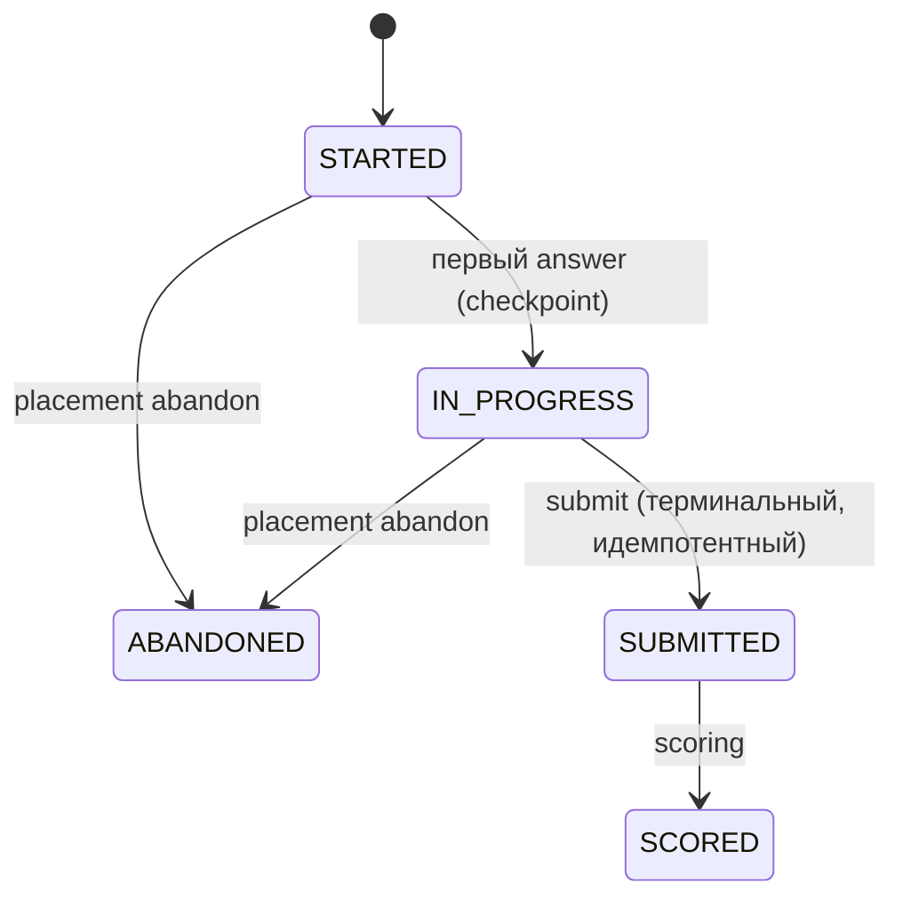

# Flow: placement (стартовая диагностика)

> **Status**: current
> **Last updated**: 2026-07-19
> **Sources**: [[../product/learning-model]] §6 · [[../product/lexical-system]] · Concept Gate 2026-07-19 (две развилки, [PD-2026-07-19]) · концепт одобрен («ок»)
> **Роль**: спинной сценарий (roadmap 0.8, третий из трёх). Как ученик получает стартовые уровни без листания старых чатов и без фиктивных оценок.

---

## Решения этого flow [PD-2026-07-19]

1. **Evidence только проверенным темам.** Каждый placement-item привязан к теме программы или LexicalItem. Проверенные единицы получают настоящий evidence и стартовые состояния; все остальные остаются `NEW`. Предположительной разметки «ниже уровня — значит знает» нет: рекомендации строятся от уровней+confidence.
2. **Placement рекомендован, отказ возможен.** При onboarding агент настойчиво предлагает placement; при отказе — консервативный старт, rolling-уточнение берёт оценку на себя. Жёсткого гейта нет.
3. **Потолок** [ревью D-9]: проверенным темам placement выдаёт максимум `ACTIVE`, **никогда `MASTERED`** (нет retention во времени); writing из одного rubric-фрагмента — только provisional (полный уровень — ≥2 независимых items).
4. **Самооценка отдельно** [ревью A-2]: `placement decline --self-assessment` пишет `self_reported_level` **отдельно** от измеренного уровня; это provisional working estimate, полностью перекрываемый первым допустимым evidence ([[../product/learning-model]] §5).

Унаследовано из [[../product/learning-model]] §6: короткий тест (целевая медиана ~30–40 мин, SHOULD); grammar/vocabulary/reading — объективно, writing — короткий фрагмент по rubric с ограниченным вкладом; deterministic seed; минимум две формы; `low-confidence` с rolling-уточнением (окно — versioned policy, OPEN-8); после перерыва — re-entry ([[session]]), не повторный placement; повторный placement — по запросу ученика.

## Правило форм и exposure

- **MUST**: placement-формы — фиксированные авторские наборы items в curriculum/assessments (версионируемые), не генерённые на лету. Причина: сравнимость результатов между формами и повторными прохождениями.
- **MUST — exposure history** [ревью C-6]: движок хранит историю показанных items/форм; при повторном прохождении применяются rotation/cooldown, а вес повторно увиденных items понижается или обнуляется — заученную форму нельзя «сдать» повторно как свежий evidence. Механизм — [[../OPEN]] OPEN-17.

## Жизненный цикл placement [ревью G-1, rereview D-R3]



- Ответы фиксируются инкрементально (`answer --checkpoint`, событие `PLACEMENT_CHECKPOINT`); после обрыва placement **resume**-абелен с сохранённой секции.
- `abandon` доступен из `STARTED` и `IN_PROGRESS` (команда `placement abandon`, событие `PLACEMENT_ABANDONED`); **после `SUBMITTED`/`SCORED` abandon запрещён**.
- `submit` идемпотентен и терминален (один на форму); scoring допустим только в `SUBMITTED`.
- Expiry/recover, exposure/cooldown и точная схема — контракт assessments ([[../OPEN]] OPEN-17). Placement переживает потерю чата так же, как учебная сессия.

## Сценарий

```mermaid
sequenceDiagram
    autonumber
    actor L as Ученик
    participant A as Агент
    participant T as trainer CLI

    Note over A,T: onboarding: профиль создан, уровней нет
    A->>L: предлагает placement (SHOULD ~30–40 мин)
    alt ученик согласен
        A->>T: placement start --format json
        T-->>A: форма (seed, версия, pinned): секции grammar · vocabulary · reading · writing
        loop по секциям (checkpoint, resume-абельно)
            A->>L: предъявляет items дословно (без подсказок и переформулировок)
            L-->>A: ответы
            A->>T: placement answer --checkpoint (инкрементально)
        end
        A->>T: placement submit (идемпотентный, терминальный)
        T->>T: объективный скоринг кодом + rubric-observations по writing → outcome движком
        T-->>A: уровни по навыкам + confidence (потолок ACTIVE); evidence проверенным темам/LexicalItem
    else отказ
        A->>T: placement decline --self-assessment {"grammar":"A2","reading":"B1"}
        T-->>A: self_reported_level (отдельно) → provisional very-low-confidence старт
    end
    A->>L: итог: стартовая картина + что уточнится в первых сессиях
    Note over T: первые сессии: rolling-уточнение confidence по evidence (versioned policy, OPEN-8)
```

## Правила сценария

- **MUST**: агент предъявляет items дословно — без подсказок, упрощений и переформулировок; это диагностика, не обучение.
- **MUST**: объективные секции оценивает только код; по writing агент даёт rubric-observations, outcome и cap считает движок ([[../product/learning-model]] §3).
- **MUST**: placement-items, проверяющие лексику, создают записи личного словаря (enrollment) по критерию «была целью упражнения»; evidence знания — только по learner response ([[../product/lexical-system]] §3).
- **MUST — self-report per-skill** [rereview A-R3]: `self_reported_level` при decline хранится отдельно и замещается измерением **по каждому навыку** после его первого evidence, не глобально ([[../product/learning-model]] §5).
- **MUST**: отказ от placement фиксируется событием и ничего не блокирует. «Консервативные рекомендации» при `very-low-confidence` определены наблюдаемо (fallback range, unknown не трактуется как mastered) — versioned policy, [[../OPEN]] OPEN-8 (не «максимально консервативно» на глаз, ревью E-8).
- **MUST**: rolling-уточнение — обычный механизм evidence первых сессий, не отдельный тест; движок повышает confidence по versioned policy.
- **MUST**: результаты placement (и отказ, и `self_reported_level`) попадают в tutor briefing ([[continuation]]).
- **MUST NOT**: повторять placement автоматически; повторный — только по явному запросу ученика (с exposure/cooldown, см. выше).

## Выведенные контракты (фиксируются в спеках модулей)

| Модуль (спека) | Обязан предоставить |
|---|---|
| `assessments`/`lessons` (0.4/0.5) | placement lifecycle (checkpoint/resume/один терминальный submit); версионируемые формы с seed; exposure history + cooldown (OPEN-17) |
| `curriculum` (0.3) | адресуемость тем и LexicalItem; потолок ACTIVE для placement-evidence |
| `learner` | уровни + confidence; `self_reported_level` отдельно; consume rolling-evidence |
| `evidence` (0.4) | placement-attempts как обычный evidence с семантической идентичностью (OPEN-7); вход лексики в личный словарь |
| `scoring` (0.4) | cap вклада rubric-writing; versioned confidence-policy и потолок состояния (OPEN-8) |
| `cli` (0.7) | `trainer placement start/answer/submit/decline/resume/abandon`; JSON форм и результатов |
| `adapters`/skills (0.7) | skill `run-placement-assessment`: дословное предъявление, запрет подсказок |
| `audit` | события PLACEMENT_STARTED / CHECKPOINT / SUBMITTED / SCORED / DECLINED / RESUMED / ABANDONED |

## Открытые вопросы

Механизмы — в контрактах ([[../OPEN]]): OPEN-17 (placement lifecycle, exposure/cooldown), OPEN-8 (confidence-policy, потолок, консервативные рекомендации), OPEN-7 (семантическая идентичность evidence). Состав форм A1–B1 — наполнение фазы П.

## История изменений

- **2026-07-19 (3)**: rereview — формальная state diagram с `STARTED|IN_PROGRESS → ABANDONED`, командой `placement abandon`, событиями checkpoint/abandon; запрет abandon после SUBMITTED (D-R3); self-report per-skill (A-R3).
- **2026-07-19 (2)**: red-team триаж — placement lifecycle с checkpoint/resume/одним терминальным submit (G-1); потолок ACTIVE, никогда MASTERED (D-9); `self_reported_level` отдельно (A-2); exposure history и cooldown (C-6); консервативные рекомендации и confidence → versioned policy (E-8); ~30–40 мин → SHOULD (E-9); rubric-observations вместо готовой оценки.
- **2026-07-19**: создан по Concept Gate: evidence только проверенным темам, placement рекомендован с правом отказа. Все решения [PD-2026-07-19]. Закрывает 0.8.
