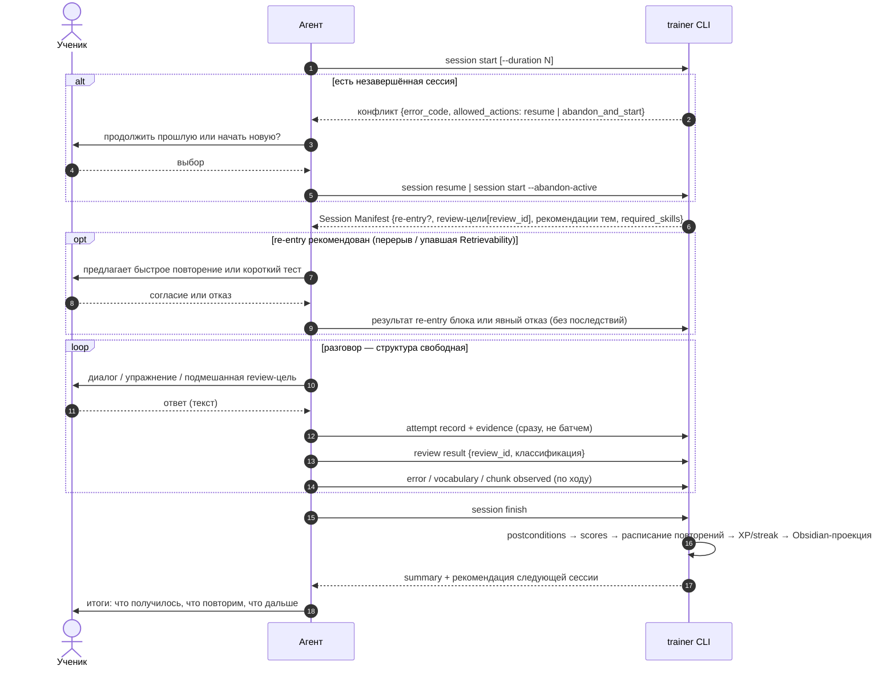

# Flow: учебная сессия

> **Status**: current
> **Last updated**: 2026-07-19
> **Sources**: [[../product/learning-model]] · `docs/design-direction.md` §1 · Concept Gate 2026-07-19 (три развилки, [PD-2026-07-19]) · концепт одобрен («ок»)
> **Роль**: спинной сценарий (roadmap 0.8). Выводит межмодульные контракты для 0.3–0.5 и 0.7. Flow не владеет поведением: полные правила фиксируются в спеках модулей, здесь — сценарий и выведенные требования.

---

## Решения этого flow [PD-2026-07-19]

1. **Конфликт активной сессии**: `start` при существующей незавершённой сессии возвращает конфликт с вариантами — `resume` или закрыть старую как `ABANDONED` и начать новую. Выбор делает ученик через агента; CLI сам ничего не бросает и не продолжает.
2. **Finish-postconditions средние**: каждый записанный attempt финализирован; каждая review-цель манифеста имеет явный исход (выполнена / отклонена учеником / не успели → `INSUFFICIENT_EVIDENCE` с причиной); summary создан. Выполнять все цели не обязательно — обязательно честно зафиксировать исход каждой.
3. **CLI-именование**: `trainer session ...` (не `lesson` из брифа) — консистентно с [[../glossary]]. Бриф и build-prompt в этой части superseded.

## Участники

- **Ученик** — ведёт разговор, выполняет задания, принимает решения (resume/abandon, согласие на re-entry).
- **Агент** — ведёт сессию по Session Manifest, генерит упражнения по policies, фиксирует всё через CLI.
- **Движок (`trainer` CLI)** — выдаёт манифест, валидирует и записывает evidence, единолично меняет состояние.

## Состояния сессии

`STARTED` (создана, манифест выдан) → `IN_PROGRESS` (первая фиксация) → `FINISHED` | `ABANDONED`. Полный lifecycle — в спеке `modules/lessons` (0.5). `ABANDONED` сохраняет и учитывает всё зафиксированное: закрытие брошенной сессии запускает тот же пересчёт scoring, но без полного summary.

## Сценарий

## Правила сценария

- **MUST**: агент фиксирует attempt через CLI сразу после завершения задания/проверки — инкрементальность даёт устойчивость к потере чата (сессия остаётся `IN_PROGRESS`, продолжение — отдельный flow `continuation`).
- **MUST**: Session Manifest содержит `required_skills` с версиями; агент не полагается на implicit invocation.
- **MUST**: каждая review-цель к моменту finish имеет исход; «просто не дошли» оформляется как `INSUFFICIENT_EVIDENCE` с причиной — это вход для планирования следующей сессии, не штраф.
- **MUST**: отказ от re-entry и невыполнение рекомендаций ничего не блокируют ([[../product/learning-model]] §7).
- **MUST**: finish отклоняется только из-за нечестной фиксации (нефинализированный attempt, review-цель без исхода, нет summary) — с `error_code`, списком причин и `next_action`.
- **MUST NOT**: агент меняет scores, состояния тем или расписание — только записывает факты; пересчёт делает движок на finish/abandon.

## Выведенные контракты (фиксируются в спеках модулей)

| Модуль (спека) | Обязан предоставить |
|---|---|
| `lessons` (0.5) | lifecycle сессии с `ABANDONED`; конфликт start → allowed_actions; проверка finish-postconditions; summary |
| `scheduler` (0.4) | детект re-entry условия; выдача due review-целей в манифест; назначение интервалов на finish |
| `evidence` (0.4) | запись attempt с idempotency key; классификация review-результатов; фиксация error/vocabulary/chunk |
| `scoring` (0.4) | пересчёт на finish и на abandon по зафиксированному evidence |
| `curriculum` (0.3) | рекомендации тем с флагом recommended/early для манифеста |
| `learner` | начисление XP, обновление streak на finish |
| `memory` (0.6) | обновление Obsidian-проекции на finish |
| `cli` (0.7) | `trainer session start/resume/finish`, `attempt record`, `review record`; JSON-контракт, `error_code` + `allowed_actions` + `next_action` |
| `adapters`/skills (0.7) | session-skill, обязанный следовать этому flow; протокол фиксации |

## Открытые вопросы

Нет новых. Численные пороги re-entry — в OPEN-1 (контракт 0.4).

## История изменений

- **2026-07-19**: создан по Concept Gate: конфликт start через выбор, средние finish-postconditions, CLI-именование `session`. Все решения [PD-2026-07-19].
