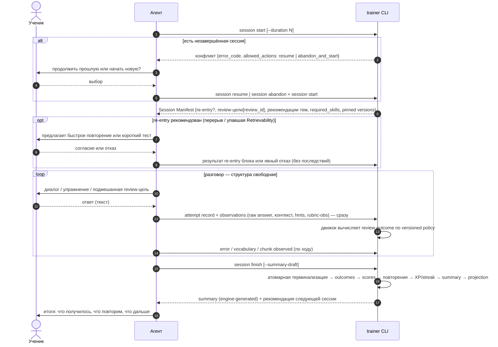

# Flow: учебная сессия

> **Status**: current
> **Last updated**: 2026-07-19
> **Sources**: [[../product/learning-model]] · `docs/design-direction.md` §1 · Concept Gate 2026-07-19 (три развилки, [PD-2026-07-19]) · концепт одобрен («ок»)
> **Роль**: спинной сценарий (roadmap 0.8). Выводит межмодульные контракты для 0.3–0.5 и 0.7. Flow не владеет поведением: полные правила фиксируются в спеках модулей, здесь — сценарий и выведенные требования.

---

## Решения этого flow [PD-2026-07-19]

1. **Конфликт активной сессии**: `start` при существующей незавершённой сессии возвращает конфликт с вариантами — `resume` или закрыть старую как `ABANDONED` и начать новую. Выбор делает ученик через агента; CLI сам ничего не бросает и не продолжает.
2. **Finish-postconditions средние**: каждый записанный attempt финализирован; каждая review-цель манифеста имеет явный исход (выполнена / отклонена учеником / не успели → `INSUFFICIENT_EVIDENCE` с причиной); summary создан. Выполнять все цели не обязательно — обязательно честно зафиксировать исход каждой.
3. **CLI-именование**: `trainer session ...` (не `lesson` из брифа) — консистентно с [[../glossary]]. Бриф и build-prompt в этой части superseded.

## Участники

- **Ученик** — ведёт разговор, выполняет задания, принимает решения (resume/abandon, согласие на re-entry).
- **Агент** — ведёт сессию по Session Manifest, генерит упражнения по policies, фиксирует всё через CLI.
- **Движок (`trainer` CLI)** — выдаёт манифест, валидирует и записывает evidence, единолично меняет состояние.

## Состояния сессии

`STARTED` (создана, манифест выдан) → `IN_PROGRESS` (первая фиксация) → `FINISHED` | `ABANDONED`. Переход **`STARTED → ABANDONED` допустим** (только что созданную сессию можно бросить до первой фиксации) [ревью D-4]. Полный lifecycle и Attempt state machine — спека `modules/lessons` (0.5, [[../OPEN]] OPEN-10).

**Терминализация — единая атомарная транзакция** для `FINISHED` и `ABANDONED` [ревью C-2/G-4/G-6]: закрывает все pending attempts и review-цели явными исходами, пересчитывает scores, назначает повторения, обновляет XP/streak и Obsidian-проекцию — согласованно. Различие FINISHED/ABANDONED — только в наличии полного summary и в том, что ABANDONED закрывает недостигнутые цели как `INSUFFICIENT_EVIDENCE(reason=abandoned)`. Обе не оставляют производные (scheduler queue, briefing, projection) в рассогласованном состоянии.

- **MUST**: ABANDONED сохраняет и учитывает уже зафиксированное evidence, но **не даёт обхода** ограничений: недостигнутая review-цель закрывается как `INSUFFICIENT_EVIDENCE(reason=abandoned)`, re-entry блок получает собственный outcome; «две быстрые abandon-сессии» сами по себе не образуют двух независимых сессий для rubric-повторяемости ([[../product/learning-model]] §3, [[../OPEN]] OPEN-7/OPEN-10).

## Сценарий

## Правила сценария

- **MUST — агент фиксирует наблюдения, не оценки** [ревью A-1/C-1]: агент передаёт raw answer, контекст, hints, rubric-observations; итоговый review outcome вычисляет движок по versioned policy. Клиентская готовая классификация запрещена.
- **MUST**: агент фиксирует attempt через CLI сразу после завершения задания/проверки — инкрементальность даёт устойчивость к потере чата (сессия остаётся `IN_PROGRESS`, продолжение — отдельный flow `continuation`).
- **MUST — summary генерирует движок** [ревью E-2]: summary создаётся движком после commit терминализации; агент может передать `--summary-draft` как вход. Postcondition «summary создан» не цикличен: его выполняет сам finish, а не предварительное условие входа.
- **MUST — finalized attempt** [ревью G-9]: attempt имеет состояние; незавершённый (draft) attempt не участвует в scoring. При обрыве между attempt и его завершением resume видит draft и предоставляет идемпотентный finalize/recover (Attempt lifecycle — 0.5, [[../OPEN]] OPEN-10).
- **MUST**: Session Manifest содержит `required_skills` с версиями и **pinned versions** curriculum/policy; агент не полагается на implicit invocation.
- **MUST**: каждая review-цель к моменту finish имеет исход; «просто не дошли» → `INSUFFICIENT_EVIDENCE` с причиной — вход для планирования, не штраф.
- **MUST**: отказ от re-entry и невыполнение рекомендаций ничего не блокируют ([[../product/learning-model]] §7).
- **MUST**: finish отклоняется только из-за нечестной фиксации (нефинализированный attempt, review-цель без исхода) — с `error_code`, списком причин и `next_action`.
- **MUST NOT**: агент меняет scores, состояния тем или расписание — только записывает наблюдения; вычисление и пересчёт делает движок на терминализации.

## Выведенные контракты (фиксируются в спеках модулей)

| Модуль (спека) | Обязан предоставить |
|---|---|
| `lessons` (0.5) | Session + Attempt lifecycle (вкл. `STARTED → ABANDONED`); конфликт start → allowed_actions; атомарная терминализация; engine-generated summary (OPEN-10) |
| `scheduler` (0.4) | детект re-entry; due review-цели в манифест; назначение интервалов (elapsed 24h) на терминализации |
| `evidence` (0.4) | запись attempt + observations с семантической идентичностью (OPEN-7); фиксация error/vocabulary/chunk |
| `scoring` (0.4) | вычисление review outcome и пересчёт на терминализации (finish и abandon) по evidence |
| `curriculum` (0.3) | рекомендации тем с флагом recommended/early; pinned versions в манифест |
| `learner` | XP award-once, streak по локальной дате на терминализации (OPEN-12) |
| `memory` (0.6) | обновление Obsidian-проекции на терминализации |
| `cli` (0.7) | `trainer session start/resume/abandon/finish`, `attempt record`; JSON, `error_code` + `allowed_actions` + `next_action` |
| `adapters`/skills (0.7) | session-skill по этому flow; протокол фиксации наблюдений (не оценок) |

## Открытые вопросы

Механизмы зафиксированных инвариантов — в контрактах ([[../OPEN]]): OPEN-7 (семантическая идентичность evidence, независимость), OPEN-10 (Attempt/Session lifecycle, терминализация, полная таблица переходов), OPEN-9 (pinning версий). Численные пороги re-entry — OPEN-1.

## История изменений

- **2026-07-19 (2)**: red-team триаж — агент фиксирует наблюдения, движок вычисляет классификацию (A-1/C-1); engine-generated summary без цикличности (E-2); атомарная терминализация FINISHED/ABANDONED, закрытие pending целей, запрет обхода (C-2/G-4/G-6); `STARTED → ABANDONED` и команда `session abandon` (D-4/D-5); finalized attempt и recover (G-9); pinned versions в манифесте.
- **2026-07-19**: создан по Concept Gate: конфликт start через выбор, средние finish-postconditions, CLI-именование `session`. Все решения [PD-2026-07-19].
