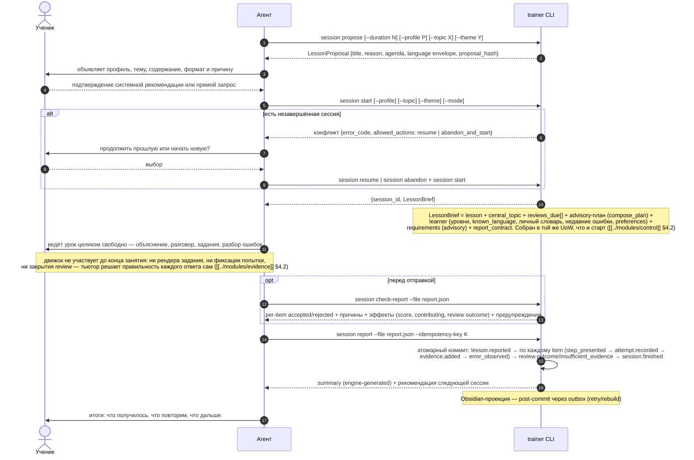

# Flow: учебная сессия

> **Status**: current
> **Last updated**: 2026-09-23
> **Sources**: [[../product/learning-model]] · `docs/design-direction.md` §1 · Concept Gate 2026-07-19 (три развилки, [PD-2026-07-19]) · `staging/concepts/2026-09-23-lesson-brief-report-concept.md` (одобрен, [PD-2026-09-23]) · концепт одобрен («ок»)
> **Роль**: спинной сценарий (roadmap 0.8). Выводит межмодульные контракты для 0.3–0.5 и 0.7. Flow не владеет поведением: полные правила фиксируются в спеках модулей, здесь — сценарий и выведенные требования.

---

## Решения этого flow

1. **Конфликт активной сессии** [PD-2026-07-19]: `start` при существующей незавершённой сессии возвращает конфликт с вариантами — `resume` или закрыть старую как `ABANDONED` и начать новую. Выбор делает ученик через агента; CLI сам ничего не бросает и не продолжает. **`abandon_and_start` — это две независимые идемпотентные команды** (`session abandon`, затем `session start`), не одна атомарная (foundation C-1): crash между ними оставляет старую `ABANDONED` и нет активной сессии; следующий `start` создаёт новую — benign ([[../platform/foundation]] §3.4).
2. **Отчёт закрывает всё атомарно** [PD-2026-09-23, разворачивает средние finish-postconditions от 2026-07-19]: `LessonReport` доводит каждый Attempt до `assessed`, даёт каждой review-цели терминальную диспозицию — по вердикту тьютора, явному skip'у отчёта или, если она не адресована вовсе, `INSUFFICIENT_EVIDENCE(reason=not_attempted)` — и создаёт summary одной транзакцией при коммите ([[../modules/lessons]] §4d). Выполнять все цели по-прежнему не обязательно; обязательно, чтобы отчёт честно закрыл каждую допустимой веткой. Отдельной предпосылки «pending-set пуст», проверяемой до commit отдельной командой `finish`, больше не существует.
3. **CLI-именование**: `trainer session ...` (не `lesson` из брифа) — консистентно с [[../glossary]]. Бриф и build-prompt в этой части superseded.

## Участники

- **Ученик** — ведёт разговор, выполняет задания, принимает решения (resume/abandon, согласие на re-entry).
- **Агент (тьютор)** — объявляет урок по LessonBrief и ведёт его целиком свободно: объясняет, предлагает задания, оценивает каждый ответ своим вердиктом, разбирает ошибки — затем фиксирует всё через один LessonReport.
- **Движок (`trainer` CLI)** — предлагает (brief) и фиксирует (report): выдаёт brief, детерминированно принимает и агрегирует отчёт, единолично меняет состояние. Он не диктует урок шаг за шагом [PD-2026-09-23].

## Состояния сессии

`STARTED` (создана, brief выдан) → `IN_PROGRESS` (тьютор подключился) → `FINISHED` | `ABANDONED`. Переход в `FINISHED` выполняет только `session report` — атомарно, из `STARTED` или `IN_PROGRESS` [PD-2026-09-23]. Переход `STARTED → ABANDONED` допустим (только что созданную сессию можно бросить до отчёта) [ревью D-4]. Полный lifecycle и Attempt state machine — спека `modules/lessons` §2–§4.

**Терминализация — атомарный commit authoritative state** для `FINISHED` и `ABANDONED`. Важное различие двух видов работы:

- **FINISHED** — результат коммита `LessonReport`: все item'ы отчёта дают `assessed` Attempt'ы, все ReviewAssignment получают терминальную диспозицию (по вердикту, явному skip'у или `not_attempted`), summary создан ([[../modules/lessons]] §4).
- **ABANDONED** **атомарно преобразует** оставшиеся ReviewAssignment в явные `INSUFFICIENT_EVIDENCE(reason=abandoned)`; без отчёта Attempt в сессии не было — закрывать, кроме review-целей, нечего.
- В обоих случаях **одной ACID-транзакцией** коммитятся только authoritative state + events + outbox. **Obsidian-проекция обновляется post-commit** через outbox с retry/catch-up и rebuild — файловую projection нельзя включать в ту же ACID-транзакцию (rereview E-R1). Crash после commit не теряет данные: проекция досоздаётся из state.

- **MUST**: `ABANDONED` сохраняет зафиксированное (если отчёт всё же был подан и сессия уже терминальна, второй `report`/`abandon` — стабильная ошибка терминальности), но **не даёт обхода**: «две быстрые abandon-сессии» сами по себе не образуют двух независимых сессий для rubric-повторяемости ([[../product/learning-model]] §3, [[../OPEN]] OPEN-7/OPEN-10).

## Сценарий

## Правила сценария

- **MUST — тьютор решает правильность, движок хранит и агрегирует** [PD-2026-09-23, разворачивает прежнее «агент фиксирует наблюдения, не оценки»]: по каждому item'у отчёта тьютор подаёт вердикт (`correct`/`partial`/`incorrect`), дословный `raw_answer` и, если была ошибка, `{learner_form, correction, cause}`. Движок сам выводит span заявленной ошибки внутри ответа, детерминированно агрегирует и никогда не пересчитывает сам вердикт ([[../modules/evidence]] §4.2). Разворачивает прежнее «клиентская готовая классификация запрещена» ровно для этого канала; rubric-путь placement классификацию по-прежнему считает движком.
- **MUST — AttemptAssessment ≠ ReviewOutcome**: на один `review_id` может ссылаться только один item отчёта (report не повторяет попытки); терминальная диспозиция ReviewAssignment — ровно одна: `ReviewOutcome` по карте вердикта, явному skip'у отчёта, `not_attempted` или `abandon` ([[../modules/evidence]] §4.3).
- **MUST — preflight и согласие** [PD-2026-07-23, уточнено PD-2026-09-23]: до старта агент предъявляет LessonProposal. Прямой выбор темы/профиля учеником уже является согласием; системная рекомендация требует подтверждения. Сверка `--expected-proposal-hash` на `start` удалена: прямой запрос принимается как согласие без неё.
- **MUST — учебная часть занятия невидима движку до отчёта** [PD-2026-09-23]: learner-facing канал никогда не был обязан показывать служебный JSON; теперь движок и вовсе не участвует в предъявлении заданий и объяснений — ни рендера упражнения, ни фиксации попытки, ни закрытия review посреди урока не существует. Тьютор ведёт занятие полностью по своему усмотрению внутри advisory-плана из brief'а (может отклониться от него — движок это не гейтит) и фиксирует всё одним `LessonReport` в конце.
- **MUST — восстановление обрыва идёт через `resume`, без локального черновика** [PD-B]: между `start` и `report` ничего не сохраняется инкрементально — нет промежуточных чекпойнтов. Если чат оборвался до отчёта, `session resume` возвращает **тот же** пересобранный LessonBrief; продолжение — обычный flow `continuation`. Если чат оборвался уже после `session report` (сессия `FINISHED`), возобновлять нечего — сессия завершена.
- **MUST — summary генерирует движок** [ревью E-2]: summary берётся из `LessonReport.summary` внутри атомарного коммита отчёта — тьютор его формулирует как часть отчёта, движок не пишет прозу сам.
- **MUST**: Session Manifest содержит `required_skills` с версиями и **pinned versions** curriculum/evidence/lessons/scoring/scheduler/control; агент не полагается на implicit invocation. [PD-2026-09-23] `rubric@1` больше не пинится сессией — только для placement.
- **MUST**: каждая review-цель к моменту `FINISHED` имеет терминальную диспозицию — ReviewOutcome либо, исторически (replay старых сессий), `CANCELLED`; в новом протоколе `CANCELLED` недостижим — мид-сессионного `replan`, который его порождал, не существует.
- **MUST**: отказ от re-entry и невыполнение рекомендаций ничего не блокируют ([[../product/learning-model]] §7).
- **MUST — отчёт отклоняется целиком, не частично** [PD-2026-09-23]: если хотя бы один item не проходит приём (`unknown_target`, `bad_verdict`, `learner_form_not_in_answer`, … — [[../modules/evidence]] §4.2a), `session report` не пишет ничего. Отдельно — lifecycle/concurrency/idempotency ошибки: сессия уже терминальна, несуществующая/чужая сессия, key collision; identical retry возвращает cached result, не ошибку. Неадресованная тема или повторение brief'а — только предупреждение, не причина отказа (PD-G). Все — с `error_code`, причинами и `next_action`.
- **MUST NOT**: тьютор меняет агрегатное состояние напрямую (Mastery, уровень, расписание) — он подаёт вердикт по конкретному ответу, вычисление и пересчёт делает движок при коммите отчёта.

## Выведенные контракты (фиксируются в спеках модулей)

| Модуль (спека) | Обязан предоставить |
|---|---|
| `lessons` (0.5) | Session lifecycle (`STARTED → IN_PROGRESS → FINISHED \| ABANDONED`, переход в FINISHED — только отчёт); конфликт start → allowed_actions; атомарная терминализация; LessonBrief/LessonReport (§4c/§4d) |
| `scheduler` (0.4) | детект re-entry; due review-цели в brief; назначение интервалов (elapsed 24h) на терминализации |
| `evidence` (0.4) | builders LessonReport: вердикт → assessment, вывод span, семантическая идентичность (OPEN-7), закрытие review по карте вердикта |
| `scoring` (0.4) | вычисление review outcome и пересчёт на терминализации (report и abandon) по evidence |
| `curriculum` (0.3) | рекомендации тем с флагом recommended/early; pinned versions в манифест |
| `scoring` | XP award-once и streak по локальной дате на терминализации ([[../modules/scoring]] §7) |
| `control` | advisory-план (`compose_plan`) внутри LessonBrief; композиция без CAS ([[../modules/control]] §4.2) |
| `memory` (0.6) | обновление Obsidian-проекции на терминализации |
| `cli` (0.7) | `trainer session propose/start/resume/check-report/report/abandon/status`; JSON, `error_code` + `allowed_actions` + `next_action` |
| `adapters`/skills (0.7) | session-skill по этому flow; протокол «brief в начале, один отчёт в конце» |

## Открытые вопросы

Механизмы этого flow закрыты в принятых контрактах: evidence identity/observations, Attempt/Session lifecycle, session fence, active safety overlay при композиции и re-entry scheduler. Точный триггер `STARTED → IN_PROGRESS` (подключение тьютора против первого отчёта) уточняется по ходу реализации brief/report протокола (W2) — целевая форма перехода описана в [[../modules/lessons]] §2. Остаточных OPEN у flow нет.

## История изменений

- **2026-09-23**: [PD-2026-09-23] переход на протокол «задание → отчёт»: сценарий переписан — один `LessonBrief` в начале, один `LessonReport` в конце; пошаговая доставка (`peek → next → exercise rendered → attempt record`) удалена; тьютор решает правильность каждого ответа, движок хранит и агрегирует; отчёт закрывает всё атомарно (заменяет средние finish-postconditions); восстановление обрыва — через `resume` без локального черновика (PD-B); отчёт отклоняется целиком, а не частично; неадресованные advisory-требования brief'а — предупреждение, не отказ (PD-G).
- **2026-09-22**: [PD-2026-09-22] нормативный порядок шага сокращён до `session next → exercise rendered → показ → attempt record [observations] [--close-review]`: `peek` — после `resume`/конфликта, `prepare`/`render-prepared` — MAY, `finalize`/`review close` — fallback. *(Историческое: весь пошаговый протокол ретайрен [PD-2026-09-23].)*
- **2026-07-24**: [PD-2026-07-24] learner bridge скрывает служебные payload; private exercise variants готовятся параллельно объяснению и материализуются только после выдачи совпавшего шага. *(Историческое: private preparation ретайрена [PD-2026-09-23].)*
- **2026-07-23**: [PD-2026-07-23] добавлены LessonProposal/consent, TeachingSegment и точный delivery order `peek → next → render → display → attempt`.
- **2026-07-21**: flow сведён к исполнимому `peek → next(expected plan_version) → attempt --step → signal → replan(expected plan_version)`; finish принимает `ReviewOutcome | CANCELLED`.
- **2026-07-20 (4)**: foundation-review — `abandon_and_start` уточнён как две независимые идемпотентные команды с benign recovery (C-1).
- **2026-07-19 (3)**: rereview — FINISHED требует пустой pending-set, ABANDONED преобразует pending (A-R2); Obsidian post-commit через outbox, не в ACID (E-R1); AttemptAssessment vs terminal ReviewOutcome (A-R1); причины отклонения finish разделены на бизнес vs lifecycle/concurrency (G-R2); safety при доставке production из live-манифеста (G-R1).
- **2026-07-19 (2)**: red-team триаж — агент фиксирует наблюдения, движок вычисляет классификацию (A-1/C-1); engine-generated summary без цикличности (E-2); атомарная терминализация FINISHED/ABANDONED, закрытие pending целей, запрет обхода (C-2/G-4/G-6); `STARTED → ABANDONED` и команда `session abandon` (D-4/D-5); finalized attempt и recover (G-9); pinned versions в манифесте.
- **2026-07-19**: создан по Concept Gate: конфликт start через выбор, средние finish-postconditions, CLI-именование `session`. Все решения [PD-2026-07-19].
