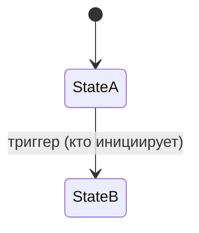

# Модуль: <имя>

> **Status**: draft | current | verified
> **Last updated**: YYYY-MM-DD
> **Sources**: <откуда факты — docs/*, journal, [PD-…], код (файл.py::символ)>
> **Bounded context**: `src/english_trainer/<name>/`

> Спека — **target** (финальное состояние). Фазы — тегами `[mvp]` / `[post-mvp]` на элементах. Читается целиком, без прыжков (Принцип 2). Термины — по имени из [[glossary]]; поведение — полностью inline (Принцип 3).

---

## 1. Назначение

Зачем модуль существует, какую ценность несёт, кто им пользуется (ученик через агента / движок / другой модуль). 2–4 предложения, без технических деталей.

## 2. Сущности и состояния

Что модуль **владеет** (его данные). Источник полей — контракт или код, не из головы.

| Сущность | Назначение | Ключевые поля |
|---|---|---|
| `<Entity>` | … | … |

Если есть lifecycle — state machine здесь:

## 3. Публичный API и события

Что модуль предоставляет другим модулям и что публикует/слушает. Внутренности не описываются — только контракт.

| Операция / Событие | Тип | Что делает | Фаза |
|---|---|---|---|
| `<operation>` | API | … | `[mvp]` |
| `<EVENT_NAME>` | publishes | … | `[mvp]` |

## 4. Поведение

Ключевые правила модуля. **MUST / SHOULD / MAY / OPEN.** Где MVP упрощает target — оба состояния inline:

- **MUST**: … `[mvp]`
- **Правило X**:
  - Target `[post-mvp]`: …
  - MVP `[mvp]`: … (упрощение)

## 5. CLI-поверхность

Команды `trainer …`, принадлежащие модулю: контракт JSON-ответа, exit codes, ошибки с `error_code` и `next_action`. Если модуль не имеет CLI-поверхности — написать «нет».

| Команда | Что делает | Ответ |
|---|---|---|
| `trainer <…> --format json` | … | … |

## 6. Границы

- **depends on**: `<module>`, `<module>`
- **events published**: `<EVENT>`
- **events consumed**: `<EVENT>` (← кто публикует)

## 7. Открытые вопросы

Дублируются в [[OPEN]] (единый реестр). Указывать, что блокирует.

- **OPEN-N**: … → блокирует …

## История изменений

- **YYYY-MM-DD**: … (почему)
