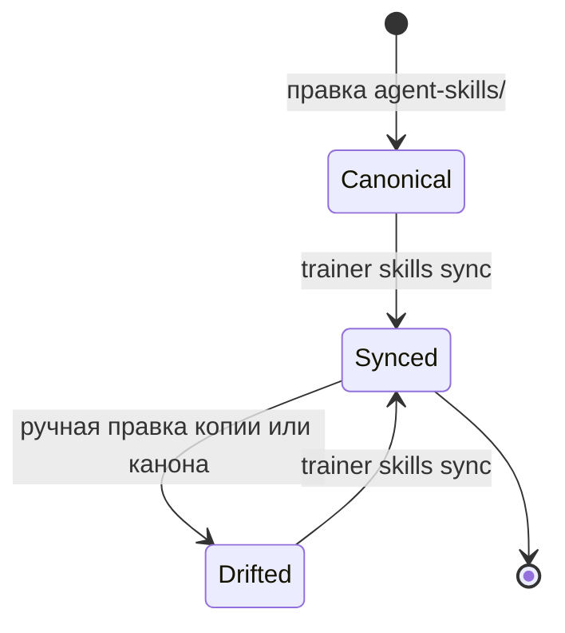

# Модуль: adapters

> **Status**: current
> **Last updated**: 2026-09-23
> **Sources**: `docs/english-memory-trainer-build-prompt.md` §11 (Agent Skills), §12 · `CLAUDE.md` (канонические skills в `agent-skills/`, deterministic copies, без MCP) · [[cli]] (реестр команд) · [[lessons]] (Session Manifest, `required_skills`, LessonBrief/LessonReport) · [[scoring]] §5 (Tutor Compliance) · `staging/concepts/2026-09-23-lesson-brief-report-concept.md` (одобрен, [PD-2026-09-23]) · все решения [PD-2026-07-20]
> **Bounded context**: `src/english_trainer/adapters/`

> Спека — **target**. Одна цель продукта, без фазовых тегов (Принцип 4). Термины — по [[../glossary]].

---

## 1. Назначение

Модуль делает тьютора сменной деталью. Он владеет каноническим набором Agent Skills, раскладывает их в форматы конкретных сред (Codex, Claude Code) и проверяет, что смена тьютора не меняет того, что происходит с учеником.

Ключевая идея — **skill это подсказка, а не механизм принуждения**. Агент может проигнорировать инструкцию, недопонять её или выполнить наполовину. Поэтому корректность обеспечивает движок через [[cli]], а skills лишь повышают вероятность, что агент поведёт себя хорошо. Насколько он ей следовал — измеряется постфактум (Tutor Compliance), а не предполагается.

## 2. Сущности и состояния

| Сущность | Назначение | Ключевые поля |
|---|---|---|
| `SkillPackage` | канонический пакет в `agent-skills/<name>/` | active `SKILL.md`, `references/**`, immutable `versions/<version>/<content_hash>/**` |
| `SkillSyncManifest` | что и куда разложено | `skill_name`, `version`, `content_hash`, `targets[]`, `synced_at` |
| `AdapterProfile` | описание среды-тьютора | `id` (`codex` \| `claude-code`), `skills_dir`, `format_notes` |
| `ParityFixture` | сценарий для сравнения адаптеров | `id`, `given_state`, `agent_input`, `expected_effects` |

Канонический набор: `run-english-session`, `run-placement-assessment`, `run-spaced-review`, `run-drill-block`, `teach-english-topic`, `coach-english-conversation`, `correct-learner-output`, `assess-english-gate`, `finish-english-session`, `audit-english-tutor`, `maintain-english-curriculum`.

## 3. Публичный API и события

| Операция / Событие | Тип | Что делает |
|---|---|---|
| `sync(targets)` | API | раскладывает канонические skills детерминированными копиями |
| `validate()` | API | проверяет структуру skills, разрешимость `cli_calls`, отсутствие drift |
| `compare(fixtures)` | API | прогоняет фикстуры на адаптерах и сравнивает наблюдаемые эффекты |
| `resolve(skill, version, content_hash?)` | API | отдаёт exact active/archive SkillPackage; используется до start и resume mutation |
| `capture_user_turn(provider, provider_message_id, session_id, raw_content, span, expected_session_revision)` | API | фиксирует untrusted пользовательскую реплику на provider boundary |
| `report_skill(session_id, skill, version, status, expected_session_revision)` | API | принимает недоверенный самоотчёт агента о ходе skill |
| `SKILL_REQUIRED` | publishes | манифест сессии затребовал skill определённой версии |
| `USER_TURN_CAPTURED` | publishes | полный локальный raw text, SHA-256 и проверенный UTF-8 byte span; `trust=untrusted` |
| `SKILL_STARTED` / `SKILL_COMPLETED` / `SKILL_FAILED` | publishes | ход исполнения skill, как его сообщил агент |

- **MUST — события skill'ов не доверенные** [P0-Q3]: `SKILL_STARTED`/`COMPLETED`/`FAILED` сообщает агент. Они **не являются evidence**, не влияют на Mastery и **сами по себе не закрывают obligation** Tutor Compliance: obligation засчитывается только при наличии наблюдаемых движком эффектов — вызовов [[cli]] и доменных событий ([[scoring]] §5). Ценность самоотчёта — в корреляции и аудите: `SKILL_COMPLETED` без доменных эффектов означает, что агент отчитался о работе, которой не было, и это само по себе диагностический сигнал.
- **MUST — provider ingress [PD-2026-07-22]**: до learner-facing мутации bridge вызывает `capture_user_turn`. Локальное событие хранит полный raw text, `sha256`, проверяемые границы UTF-8 byte span и `(provider, provider_message_id)`. Идентификатор уникален глобально внутри provider: точный повтор идемпотентен, тот же id с другим содержимым даёт `PROVIDER_MESSAGE_CONFLICT`. Capture разделяет trust-контур, но никогда не создаёт evidence и не влияет на scoring.
- **MUST — pinned skill snapshot**: `SKILL_REQUIRED` и Session Manifest несут точную тройку `(skill_name, version, content_hash)` и разрешённые `cli_calls`; obligations проверяются против этого снапшота, а не против текущего изменившегося файла. `resolve()` сначала допускает только точное совпадение active package, затем ищет immutable archive той же тройки; совпадения лишь имени и версии недостаточно.

## 4. Поведение

### 4.1 Канон и раскладка

- **MUST — один источник**: канон живёт в `agent-skills/`. `.agents/skills/` (Codex) и `.claude/skills/` (Claude Code) — **производные**, их не правят руками.
- **MUST — детерминированные копии, не симлинки**: симлинки ломаются на Windows и в архивах. Sync рекурсивно копирует active `SKILL.md`, `references/**` и `versions/**`; копия сопровождается `SkillSyncManifest` с package `content_hash`.
- **MUST — идемпотентный sync**: повторный `sync` без изменений канона не меняет ни одного байта. Иначе drift-check станет шумом, и его перестанут читать.
- **MUST — exact package mirror**: файл, удалённый из канонического package, считается stale drift и удаляется следующей `skills sync`; старый reference не может тихо оставаться видимым провайдеру.
- **MUST — `validate` не чинит**: обнаружив drift, `trainer skills validate` сообщает о нём и завершается с ненулевым кодом, но не синхронизирует. Чинит только `sync` ([[cli]] §4.4).
- **MUST — drift в обе стороны**: расхождение фиксируется и когда правили копию, и когда правили канон без последующего sync. Второе опаснее: копия, которую читает агент, тихо отстаёт от канона, который читает человек.
- **MUST NOT — без MCP**: интеграция только через файлы skills и вызовы [[cli]]. MCP-сервер не вводится (`CLAUDE.md`).

### 4.2 Версии и закрепление

- **MUST — версия иммутабельна**: содержимое `SkillPackage` определённой версии не меняется. До изменения active-пакета его точный снимок архивируется как `versions/<version>/<content_hash>/`; правка active-канона получает **новую версию**. Старый снимок остаётся разрешимым, пока на него ссылается хоть один Session Manifest.
- **MUST — манифест пинит skills**: Session Manifest несёт `required_skills` с версиями ([[lessons]]). Сессия, возобновлённая через неделю, получает тот skill, под который начиналась, — иначе поведение тьютора внутри одной сессии поменяется на середине.
- **MUST — не полагаться на implicit invocation**: требуемые skills объявляются в манифесте явно. Расчёт на то, что среда «сама подхватит» нужный skill по описанию, делает поведение невоспроизводимым между средами.
- **MUST — safety не пинится**: закрепление версии skill не закрепляет safety-правила; `production_eligible` всегда проверяется по active policy (safety-overlay, [[../OPEN]] OPEN-14).

### 4.3 Структура skill

- **MUST — короткий SKILL.md**: `name`, точный `description`, обязательные inputs, steps, **forbidden actions**, вызовы [[cli]], outputs, postconditions. Подробности и изменяемые автором методические правила — в `references/`; они входят в package hash и pinned snapshot.
- **MUST — методика отделена от состояния** [PD-2026-07-23]: правила preflight, полноты объяснения и профилей уроков редактируются как Markdown в каноническом skill-пакете. Они не являются learner state и не требуют заранее генерировать тексты всех уроков.
- **MUST — валидация детерминизмом, а не длиной промпта**: то, что можно проверить кодом, проверяется кодом. Раздувание инструкции ради надёжности — замена механизма уговорами.
- **MUST — `cli_calls` разрешимы**: каждая упомянутая команда существует в `command_registry()` ([[cli]] §3). Skill, зовущий несуществующую команду, не проходит `validate`. Это ловит рассинхрон skills и CLI при переименованиях.
- **MUST — forbidden actions явные**: у каждого skill перечислено запрещённое: не редактировать состояние в обход CLI, не завершать сессию иначе чем через `trainer session report`/`trainer session abandon`, не подавать в отчёте ответ, которого ученик не писал дословно ([[evidence]] §4.2). [PD-2026-09-23] «Не выставлять оценки» из этого списка убрано и развёрнуто: тьютор **обязан** подать вердикт по каждому item'у отчёта — движок его не пересчитывает. Движок всё равно не позволит того, что запрещено, но явный запрет снижает число попыток и делает нарушение видимым в аудите.

### 4.4 Паритет адаптеров

Здесь главная трудность: два LLM никогда не выдадут одинаковый текст, поэтому паритет нельзя определять как совпадение вывода.

- **MUST — сравниваются наблюдаемые эффекты, не проза**: `trainer adapters compare` сравнивает по фикстуре (а) множество и порядок вызовов [[cli]], (б) итоговое состояние ученика, (в) множество и типы порождённых доменных событий. Формулировки объяснений, стиль и длина реплик **не сравниваются** — они и должны различаться.
- **MUST — нормализация перед сравнением**: из сравнения исключаются недетерминированные поля (идентификаторы, метки времени, `correlation_id`). Сравнение идёт по канонической форме, иначе паритет не пройдёт никогда.
- **MUST — критерий паритета**: фикстура задаёт `expected_effects` в виде обязательных эффектов и запрещённых. Адаптер проходит, если **все обязательные** наступили и **ни один запрещённый** — нет. Требование побайтового совпадения двух прогонов невыполнимо и было бы ложной строгостью.
- **MUST — compare диагностический**: команда сообщает расхождения и код возврата, но ничего не меняет и никого не «чинит».
- **MUST — минимальный набор фикстур**, по контракту брифа: правильный триггер skill; неправильный триггер; попытка перескочить prerequisite; [PD-2026-09-23] отчёт с вердиктом тьютора, дающий сохранённое evidence и ожидаемый score (заменяет прежнюю «попытка агента самостоятельно выставить score» — вердикт тьютора теперь ожидаемое поведение, [[evidence]] §4.2, не нарушение); незавершённое обязательное review (не адресовано и не отмечено skip'ом в отчёте → `INSUFFICIENT_EVIDENCE(reason=not_attempted)`); отчёт с объяснением вместо сохранённого ответа ученика (не evidence, [[evidence]] §4.2); одинаковое поведение Codex и Claude Code на общем сценарии.
- **SHOULD**: фикстуры покрывают и отказные пути — агент обязан корректно обработать `CONFLICT` и `PRECONDITION_FAILED`, а не зациклиться на повторах.

### 4.5 Отношение к принуждению

- **MUST — движок не полагается на соблюдение skill**: ни один инвариант обучения не держится на том, что агент прочитал инструкцию. Prerequisite'ы рекомендательные по продукту, а не потому, что их некому проверить; персистентность evidence при финише обеспечивает [[lessons]], а не абзац в промпте.
- **MUST — соблюдение измеряется**: Tutor Compliance ([[scoring]] §5) считается из расхождения между тем, что skill предписывал, и тем, что видно в событиях. Это метрика тьютора, **не ученика**: она никогда не влияет на Mastery, уровень и XP.

## 5. CLI-поверхность

| Команда | Что делает | Ответ |
|---|---|---|
| `trainer skills sync --format json` | раскладывает канон в `.agents/skills/` и `.claude/skills/`, пишет манифест | список изменённых файлов, хеши |
| `trainer skills validate --format json` | структура skills, разрешимость `cli_calls`, drift | список нарушений. Коды по [[cli]] §4.2: `3 INVALID_INPUT` — сломанная структура skill или неразрешимый `cli_call`; `6 PRECONDITION_FAILED` + `next_action: skills.sync` — drift. Drift **не** `5 CONFLICT`: это не гонка состояний и повтором `validate` не лечится, требуется другое действие |
| `trainer adapters compare --format json` | прогон фикстур по адаптерам | по фикстуре: пройдено/расхождения |
| `trainer adapters capture-turn --session ID --provider P --provider-message-id M --expected-session-revision R --input FILE --format json` | сохраняет untrusted user turn | capture id/hash/span + новая session revision |
| `trainer skills report --session ID --skill NAME --version V --status started\|completed\|failed --expected-session-revision R --format json` | недоверенный самоотчёт исполнения | event id + новая session revision |

## 6. Границы

- **depends on**: [[cli]] (реестр команд), [[lessons]] (Session Manifest), storage (манифест синка)
- **events published**: `SKILL_REQUIRED`, `SKILL_STARTED`, `SKILL_COMPLETED`, `SKILL_FAILED`, `USER_TURN_CAPTURED`
- **events consumed**: `SESSION_STARTED` (← [[lessons]]) — **пост-фактум аудит** уже обеспеченного инварианта. Сама разрешимость проверяется синхронно через `resolve()` до commit ([[lessons]] §4b, P0-Q1)

Модуль не знает, чему учат: он не содержит методики. Методика — в содержимом skills и в policies ([[curriculum]], П.3).

## 7. Открытые вопросы

- **OPEN-14 закрыт**: safety-overlay и `production_eligible` определяют, что skill вправе предъявить ученику.
- **OPEN-24**: протокол исполнения фикстур паритета — как прогоняется реальный агент в проверке (запись/воспроизведение сессии против живого вызова), и что делать с недетерминизмом LLM между двумя прогонами **одного** адаптера → блокирует автоматизацию `adapters compare` в CI.

## История изменений

- **2026-09-23**: [PD-2026-09-23] переход на протокол «задание → отчёт»: forbidden actions больше не включают «не выставлять оценки» — тьютор обязан подавать вердикт по item'у отчёта, запрет развёрнут; фикстура паритета «попытка самостоятельно выставить score» заменена фикстурой принятого отчёта с вердиктом.
- **2026-09-22**: [PD-2026-09-22] `run-drill-block` внесён в канонический набор skills (пакет существовал с профиля `drill`, но в перечне не значился).
- **2026-07-23**: [PD-2026-07-23] Skill расширен до рекурсивного SkillPackage; введены точные архивы `(name, version, content_hash)`, package hash для `references/**` и детерминированный sync active/reference/version файлов.
- **2026-07-22 (2)**: [PD-2026-07-22] добавлены provider ingress с полным локальным raw text/hash/UTF-8 span, provider-global dedup/conflict, untrusted skill-report channel и pinned `content_hash`/`cli_calls` required-skill.
- **2026-07-22**: фазовые теги `[mvp]`/`[post-mvp]` сняты [PD-2026-07-22]: спека описывает одну цель продукта, порядок и статус — только в roadmap (Принцип 4).
- **2026-07-20**: спека создана (0.7). Skill объявлен подсказкой, а не механизмом принуждения; события skill'ов не доверены и не являются evidence; версия skill иммутабельна и пинится манифестом сессии; паритет определён над наблюдаемыми эффектами, а не над текстом, с нормализацией и критерием «все обязательные, ни одного запрещённого»; `validate` не чинит drift. Заведён OPEN-24.
