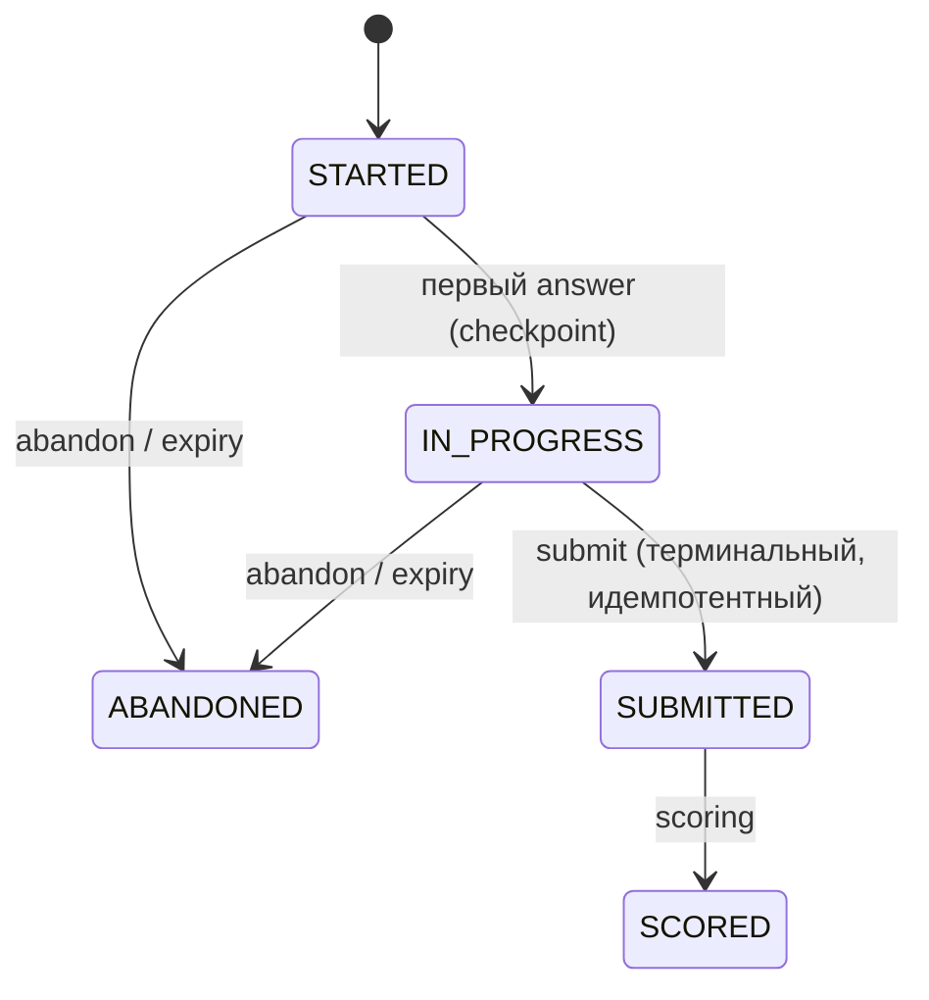

# Модуль: assessments

> **Status**: current
> **Last updated**: 2026-09-22
> **Sources**: [[../flows/placement]] · [[../product/learning-model]] §6 · [[scoring]] §4/§4b/§4c · [[curriculum]] §2f · [[lessons]] · Concept Gate 0.5 2026-07-20 ([PD-2026-07-20]) · реальные placement-формы `staging/handoff/2026-09-22-placement-forms-spec.md` ([PD-2026-09-22]) · часть контракта 0.5
> **Bounded context**: `src/english_trainer/assessments/`

> Спека — **target**. Термины — [[../glossary]]. Часть контракта 0.5 (lessons + assessments). Закрывает OPEN-17.

---

## 1. Назначение

Модуль владеет **диагностикой**: версионируемыми формами placement, их жизненным циклом (checkpoint/resume/submit/scoring) и историей предъявления items (exposure). Оценку считает [[scoring]]; здесь — проведение и целостность процедуры.

## 2. Placement lifecycle [OPEN-17]



- **MUST**: ответы фиксируются инкрементально (`answer --checkpoint`), placement **resume**-абелен с сохранённой секции.
- **MUST — окно resume и истечение** [PD-2026-07-20]: resume доступен в пределах `placement_resume_window` (*tunable*, дефолт 48 ч от `last_activity_at`). По истечении placement терминализуется как `ABANDONED` — **append-only событием** `PLACEMENT_EXPIRED {placement_id, boundary_at, last_activity_at, pinned_assessments_policy}` с детерминированным `boundary_at`, **не** по wall-clock replay'я (тот же паттерн, что `SESSION_STALE_ABANDONED`/`OVERDUE_AT_RISK_TRIGGERED`). Обоснование: диагностика должна быть связной по времени — ответы с разрывом в неделю не одно измерение.
- **MUST**: `abandon` доступен из `STARTED`/`IN_PROGRESS`; **после `SUBMITTED`/`SCORED` запрещён**.
- **MUST**: `submit` идемпотентен и терминален (один на форму); scoring допустим только в `SUBMITTED`; повтор возвращает прежний результат.
- **MUST**: отказ (`decline`) фиксируется событием, ничего не блокирует; пишет `self_reported_level` отдельно ([[scoring]] §4).

## 3. Формы и exposure

### Сущности

| Сущность | Назначение | Ключевые поля |
|---|---|---|
| `PlacementForm` | версионируемая авторская форма placement; curriculum-данные, не Python-embedded | `form_version` (тот же токен — deterministic seed), `title`, `target_minutes`, `sections`, `passages`, `items` |
| `PlacementPassage` | собственный текст reading-секции формы, показывается один раз перед своими вопросами | `passage_id`, `cefr`, `title`, `text` |

- **MUST — формы это curriculum-данные, не embedded Python** [PD-2026-09-22]: placement-формы живут в `curriculum/assessments/placement-<name>.yaml`, версионируются и хэшируются вместе со снапшотом curriculum наравне с темами/лексиконом/текстами ([[curriculum]] §2f — та спека владеет расположением/loader'ом/снапшотом, не схемой содержимого). Минимум **две** формы обязательны (§ ниже, ротация). Прежний Python-embedded набор (`src/english_trainer/assessments/forms.py`) остаётся **только тестовой fixture** для механизма lifecycle — не источником реального содержимого предъявления.
- **MUST — схема формы** [PD-2026-09-22]: `schema_version`, `form_version`, `title`, `target_minutes`, `sections` (подмножество core skills grammar/vocabulary/reading/writing), `passages[]` (`passage_id`, `cefr`, собственный `text` — постоянный запрет сторонних excerpts, [[curriculum]] §3.1/§5), `items[]`. Каждый item несёт `item_id` (уникален в пределах формы, паттерн `<section-initial>-<band-lowercase>-<nn>`), `section`, `band` (`A1…C1`; `C2` placement не проверяет), `kind`, `target_ref` (существующая тема grammar/reading/writing или LexicalItem — vocabulary), `dimension` (`recognition`/`controlled_production` у objective items, `spontaneous_production` у writing), `prompt` и kind-специфичные поля ниже.
- **MUST — item kinds закрыты**: `choice` — 4 опции, ровно один правильный `answer_key` (текст опции); `cloze` — типизированный ответ, `answer_key` перечисляет каждый допустимый вариант, включая стяжения; `true_false` — `answer_key` ∈ {"true","false"}; `writing` — rubric-задание с `rubric_ref`, `min_words`, `max_words`.
- **MUST — валидация формы** [PD-2026-09-22]: `item_id` уникален и матчит паттерн; `section` ∈ core skills; `band` ∈ `A1…C1`; `target_ref` разрешается тем же способом, что остальной curriculum ([[curriculum]] §5); `dimension` соответствует kind; reading item ссылается на существующий `passage_id` этой же формы; американский английский; без реальных людей/компаний; без фазовых меток.
- **MUST — coverage floors предупреждают, не блокируют** [PD-2026-09-22]: валидатор сверяет число различных тем на пару (секция, band) с измеримостной таблицей автора формы (по каждой секции — минимум различных тем этого band'а, нужный правилу измеренного уровня §4c) и выдаёт **warning**, не ошибку валидации, при недоборе — тот же паттерн, что незаполненное тело темы более высокого уровня ([[curriculum]] §5). Измеримость желательна, но одна недостающая тема не блокирует активацию версии curriculum.
- **MUST**: генерация форм на лету запрещена (сравнимость результатов между формами и повторными прохождениями); item объявляет свой target/dimension ([[evidence]] §4.1 precedence).
- **MUST — form selection rule** [PD-2026-09-22]: `assessments.forms.select_form` (`src/english_trainer/assessments/forms.py`) резолвит форму из активного curriculum snapshot: форма с наименьшим `form_version`, ещё не показанная этому ученику; если показаны все — ротация по наименее недавно виденной с учётом `form_cooldown_days` (`assessments@1`, тот же tunable, что ниже). При равенстве критериев побеждает меньший `form_version` в каноническом порядке — выбор детерминирован.
- **MUST — exposure history** [OPEN-17]: движок хранит историю предъявленных items/форм с `item_exposure_id`. При повторном прохождении: rotation/cooldown (`form_cooldown_days`, *tunable*), а **вес повторно увиденных items понижается или обнуляется** — заученную форму нельзя сдать повторно как свежий evidence.
- **MUST**: exposure-решение (применённый вес) **захватывается в evidence-событие** (`capture-into-event`, [[evidence]] §4.5) — иначе replay не воспроизведёт вклад.
- **MUST — grading acceptance rules** [PD-2026-09-22]: `choice` принимает букву (a–d) или точный текст выбранной опции; `cloze` нормализуется существующим механизмом (`_normalize_answer`) — регистр/пробелы/пунктуация игнорируются, любой вариант из `answer_key` допустим; `true_false` принимает `yes`/`no`/`true`/`false`/`да`/`нет` регистронезависимо, нормализуясь к `true`/`false`. Objective evidence и exposure вычисляются как сегодня — движком, по `answer_key`.
- **MUST — writing observations и rubric-assessment** [PD-2026-09-22]: `placement answer --input FILE` для writing-секции принимает `{"section": "writing", "answers": {...}, "observations": {"<item_id>": [...]}}` — span-ссылочные rubric-observations по `rubric@1`, никогда готовый вердикт ([[evidence]] §4.1). На `submit` движок вычисляет rubric-assessment (`compute_rubric_assessment`) с `rubric_step_type: spontaneous_production` по pinned `rubric@1`, записывает evidence `origin=placement`, `assessment_basis: rubric`, **provisional** — единичный fragment письма даёт только provisional writing-уровень (learning-model §6, [[scoring]] §4b); полный writing CEFR-band по-прежнему требует ≥2 независимых non-placement items. Item без observations фиксируется non-contributing (как и в обычной сессии сегодня), не как ошибка ученика.
- **MUST**: evidence из placement несёт `origin=placement`; scoring применяет потолок `ACTIVE`, никогда `MASTERED` ([[scoring]] §4b).

## 4. Публичный API и события

| Операция / Событие | Тип | Что делает |
|---|---|---|
| `start(form_selector?)` | API | выбирает форму (seed, версия, pinned), создаёт placement |
| `answer(placement_id, section, answers)` | API | инкрементальная фиксация + checkpoint |
| `resume(placement_id)` | API | состояние + следующая секция (в пределах окна) |
| `submit(placement_id)` | API | идемпотентный терминальный submit |
| `abandon(placement_id)` / `decline(self_assessment?)` | API | терминализация / отказ. `self_assessment` — **объект по core-skill ID**, не скаляр (R-5) |
| `PLACEMENT_STARTED / CHECKPOINT / RESUMED / SUBMITTED / SCORED / DECLINED / ABANDONED / EXPIRED` | publishes | lifecycle-факты |

## 5. CLI-поверхность

| Команда | Что делает |
|---|---|
| `trainer placement start --format json` | выбирает форму, возвращает её секциями: passages (`cefr`, текст), items (`kind`, `prompt`, `choice`-опции a–d, `min_words`/`max_words` у writing) — **без** `answer_key`/rubric-эталона ни при каком kind |
| `trainer placement answer --input FILE` | инкрементальная фиксация секции; для writing принимает `observations` — span-ссылочные rubric-наблюдения по `rubric@1`, не вердикт |
| `trainer placement resume --format json` | продолжение в пределах окна |
| `trainer placement submit` | терминальный идемпотентный submit; скорит objective-секции и считает rubric-assessment письма; per-skill level/confidence/basis читаются только через `trainer status` ([[scoring]] §4c/§8), не из ответа `submit` |
| `trainer placement abandon` / `decline [--self-assessment JSON]` | терминализация / отказ |

**Schema самооценки** [R-5], `schema_version: 1` — объект по core-skill ID; **скаляр запрещён**, broadcast одного значения на все навыки не подразумевается:

```json
{"schema_version": 1, "levels": {"grammar": "A2", "vocabulary": "A2", "reading": "B1", "writing": "A1"}}
```

Частичный объект допустим: отсутствующий навык остаётся `unknown` и **не** получает значение по умолчанию. Каждое значение пишется в `self_reported_level` **своего** навыка и полностью перекрывается первым допустимым evidence по нему ([[../flows/placement]]). Один скаляр на четыре навыка канон не допускает: из `A2` реализация иначе могла бы записать либо четыре A2, либо одну общую оценку.

## 6. Границы

- **depends on**: kernel (idempotency, UoW, outbox), curriculum (адресуемость target/LexicalItem, pinned versions), evidence (запись attempts/evidence), scoring (оценка, потолок, confidence).
- **events published**: см. §4.
- **consumed by**: lessons (re-entry/связка с сессией), learner (уровни/confidence), memory, audit.

## 7. Открытые вопросы

Закрывает **OPEN-17** (lifecycle, resume/expiry, терминальный submit, exposure/cooldown). Остаётся калибровка `placement_resume_window`, `form_cooldown_days` и состав форм (наполнение фазы П).

## История изменений

- **2026-09-22**: [PD-2026-09-22] реальные placement-формы (Д15): §3 переписан — `PlacementForm`/`PlacementPassage` как curriculum-данные (не embedded Python, прежний stub → тестовая fixture), полная схема формы (item kinds, band'ы, target resolution, coverage floors как warning), form selection rule (`select_form` по наименьшему непоказанному `form_version`, иначе ротация по `form_cooldown_days`), grading acceptance rules, writing observations на `answer` + rubric-assessment на `submit` (provisional, `rubric_step_type: spontaneous_production`); §5 CLI-поверхность уточнена (`start` без answer_key, `submit` без готового уровня — только через `trainer status`).
- **2026-07-22**: фазовые теги `[mvp]`/`[post-mvp]` сняты [PD-2026-07-22]: спека описывает одну цель продукта, порядок и статус — только в roadmap (Принцип 4).
- **2026-07-20**: создан (контракт 0.5, часть 2). Placement lifecycle с окном resume и `PLACEMENT_EXPIRED` как replayable-событием [PD-2026-07-20]; терминальный идемпотентный submit; exposure/cooldown с capture-into-event; origin=placement и потолок ACTIVE. Закрывает OPEN-17.
