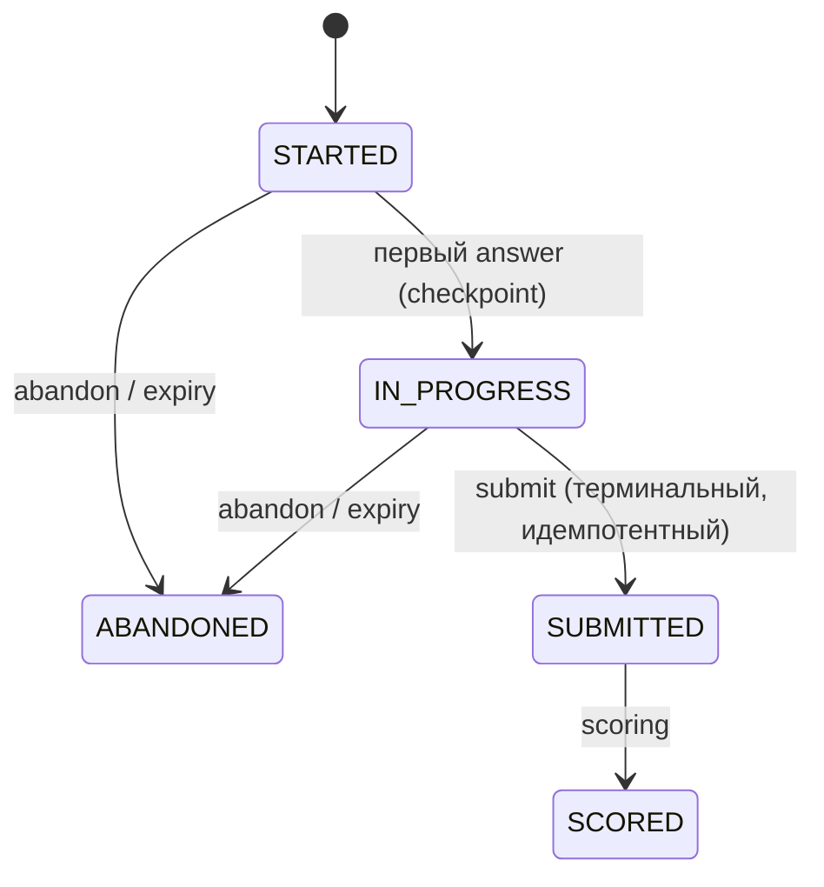

# Модуль: assessments

> **Status**: current
> **Last updated**: 2026-07-20
> **Sources**: [[../flows/placement]] · [[../product/learning-model]] §6 · [[scoring]] §4/§4b · [[lessons]] · Concept Gate 0.5 2026-07-20 ([PD-2026-07-20]) · часть контракта 0.5
> **Bounded context**: `src/english_trainer/assessments/`

> Спека — **target**. Термины — [[../glossary]]. Часть контракта 0.5 (lessons + assessments). Закрывает OPEN-17.

---

## 1. Назначение

Модуль владеет **диагностикой**: версионируемыми формами placement, их жизненным циклом (checkpoint/resume/submit/scoring) и историей предъявления items (exposure). Оценку считает [[scoring]]; здесь — проведение и целостность процедуры.

## 2. Placement lifecycle [OPEN-17]

- **MUST**: ответы фиксируются инкрементально (`answer --checkpoint`), placement **resume**-абелен с сохранённой секции.
- **MUST — окно resume и истечение** [PD-2026-07-20]: resume доступен в пределах `placement_resume_window` (*tunable*, дефолт 48 ч от `last_activity_at`). По истечении placement терминализуется как `ABANDONED` — **append-only событием** `PLACEMENT_EXPIRED {placement_id, boundary_at, last_activity_at, pinned_assessments_policy}` с детерминированным `boundary_at`, **не** по wall-clock replay'я (тот же паттерн, что `SESSION_STALE_ABANDONED`/`OVERDUE_AT_RISK_TRIGGERED`). Обоснование: диагностика должна быть связной по времени — ответы с разрывом в неделю не одно измерение.
- **MUST**: `abandon` доступен из `STARTED`/`IN_PROGRESS`; **после `SUBMITTED`/`SCORED` запрещён**.
- **MUST**: `submit` идемпотентен и терминален (один на форму); scoring допустим только в `SUBMITTED`; повтор возвращает прежний результат.
- **MUST**: отказ (`decline`) фиксируется событием, ничего не блокирует; пишет `self_reported_level` отдельно ([[scoring]] §4).

## 3. Формы и exposure

- **MUST**: формы — фиксированные авторские версионируемые наборы items с deterministic seed; генерация на лету запрещена (сравнимость). Item объявляет свой target/dimension ([[evidence]] §4.1 precedence).
- **MUST — exposure history** [OPEN-17]: движок хранит историю предъявленных items/форм с `item_exposure_id`. При повторном прохождении: rotation/cooldown (`form_cooldown_days`, *tunable*), а **вес повторно увиденных items понижается или обнуляется** — заученную форму нельзя сдать повторно как свежий evidence.
- **MUST**: exposure-решение (применённый вес) **захватывается в evidence-событие** (`capture-into-event`, [[evidence]] §4.5) — иначе replay не воспроизведёт вклад.
- **MUST**: evidence из placement несёт `origin=placement`; scoring применяет потолок `ACTIVE`, никогда `MASTERED` ([[scoring]] §4b).

## 4. Публичный API и события

| Операция / Событие | Тип | Что делает | Фаза |
|---|---|---|---|
| `start(form_selector?)` | API | выбирает форму (seed, версия, pinned), создаёт placement | `[mvp]` |
| `answer(placement_id, section, answers)` | API | инкрементальная фиксация + checkpoint | `[mvp]` |
| `resume(placement_id)` | API | состояние + следующая секция (в пределах окна) | `[mvp]` |
| `submit(placement_id)` | API | идемпотентный терминальный submit | `[mvp]` |
| `abandon(placement_id)` / `decline(self_assessment?)` | API | терминализация / отказ | `[mvp]` |
| `PLACEMENT_STARTED / CHECKPOINT / RESUMED / SUBMITTED / SCORED / DECLINED / ABANDONED / EXPIRED` | publishes | lifecycle-факты | `[mvp]` |

## 5. CLI-поверхность

| Команда | Что делает |
|---|---|
| `trainer placement start --format json` | форма (seed, версия) |
| `trainer placement answer --input FILE` | инкрементальная фиксация |
| `trainer placement resume --format json` | продолжение в пределах окна |
| `trainer placement submit` | терминальный идемпотентный submit |
| `trainer placement abandon` / `decline --self-assessment X` | терминализация / отказ |

## 6. Границы

- **depends on**: kernel (idempotency, UoW, outbox), curriculum (адресуемость target/LexicalItem, pinned versions), evidence (запись attempts/evidence), scoring (оценка, потолок, confidence).
- **events published**: см. §4.
- **consumed by**: lessons (re-entry/связка с сессией), learner (уровни/confidence), memory, audit.

## 7. Открытые вопросы

Закрывает **OPEN-17** (lifecycle, resume/expiry, терминальный submit, exposure/cooldown). Остаётся калибровка `placement_resume_window`, `form_cooldown_days` и состав форм (наполнение фазы П).

## История изменений

- **2026-07-20**: создан (контракт 0.5, часть 2). Placement lifecycle с окном resume и `PLACEMENT_EXPIRED` как replayable-событием [PD-2026-07-20]; терминальный идемпотентный submit; exposure/cooldown с capture-into-event; origin=placement и потолок ACTIVE. Закрывает OPEN-17.
