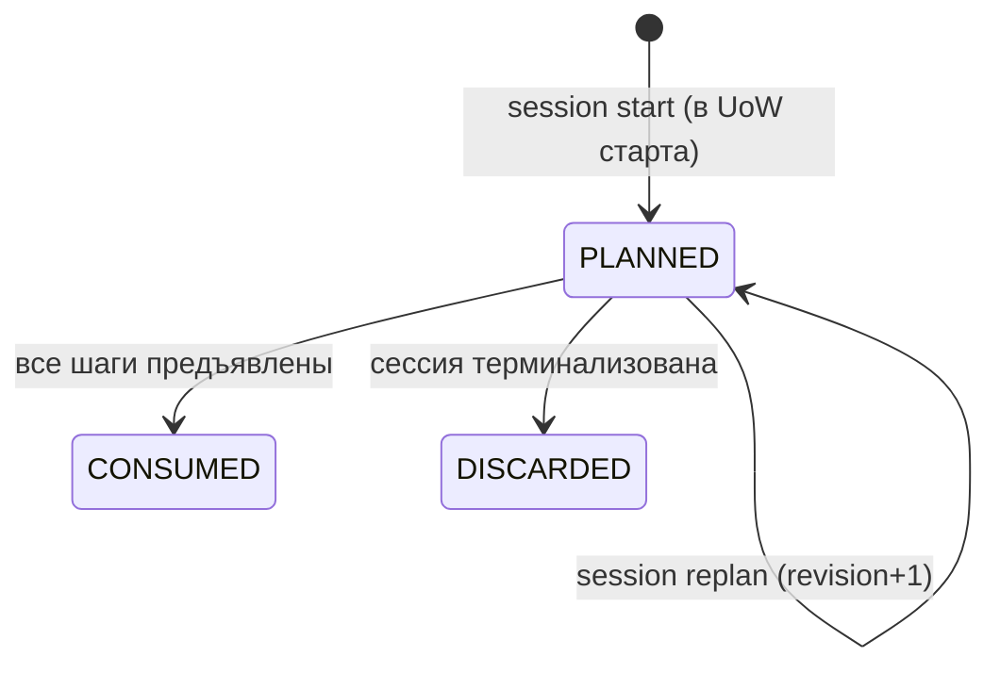

# Модуль: control

> **Status**: current
> **Last updated**: 2026-07-20
> **Sources**: концепт `staging/journal/2026-07-20-concept-0.12-learning-control.md` (Concept Gate, 6 развилок) · red-team ревью 0.12 `staging/reviews/2026-07-20-control-review-codex.md` (5 BLOCKER, триаж) · [[scheduler]], [[scoring]], [[evidence]], [[lessons]], [[learner]], [[gates]] · контракт 0.12
> **Bounded context**: `src/english_trainer/control/`

> Спека — **target**. Фазы — тегами `[mvp]` / `[post-mvp]`. Термины — по [[../glossary]]. Все численные значения §3 — **конкретные авторские дефолты**, не диапазоны: policy обязана быть исполнимой, калибровка приходит позже.

---

## 1. Назначение

Остальные контракты отвечают, одинаков ли результат при одинаковом входе. Этот отвечает, хорош ли выбранный вход. Модуль решает, **что попадёт в занятие и в какой пропорции**, измеряет качество собственных решений и предоставляет механизм безопасной подстройки. Знание он не измеряет и менять не вправе.

## 2. Сущности и состояния

| Сущность | Назначение | Ключевые поля |
|---|---|---|
| `SessionPlan` | сохранённый состав занятия | `session_id`, `composition_revision`, `steps[]`, `budget`, `pinned_control_policy`, `created_at` |
| `PlannedStep` | один шаг занятия | `step_id`, `bucket`, `target_ref?`, `step_type`, `expected_seconds`, `is_first_exposure`, `urgency_class?`, `decision_id` |
| `SessionBudget` | распределение времени | `total_seconds`, `allocated{review, growth, integration, choice}`, `mode` |
| `UrgencyClass` | класс review-кандидата | `critical \| important \| normal \| maintenance \| deferrable` |
| `SaturationState` | признаки перепоказа цели | `target_ref`, `exposures_in_window`, `consecutive_independent_successes`, `distinct_contexts`, `last_transfer_check_at` |
| `AvailabilityProfile` | ритм занятий | `declared{...}`, `observed{...}`, `divergence`, `updated_at` |
| `LearnerControlSignal` | сигнал ученика (discriminated union, §4.6) | `signal_id`, `kind`, payload по kind, `expires_at?`, `superseded_by?` |
| `DecisionTrace` | основание решения | `decision_id`, `step_id`, `reasons{}`, `pinned_versions{}` |
| `TunableParameter` | строка каталога настроек | §4.9 |
| `PolicyMetric` | определение метрики (§4.10) | `id`, `inputs[]`, `cohort`, `formula`, `window`, `missing_data_rule` |

`SessionBudget.mode` — `balanced` (по умолчанию) · `maintenance` · `re_entry`. Только в двух последних допустимо занятие без нового материала.



## 3. `control_policy` — versioned и исполнимая

Регистрируется в реестре политик kernel ([[../platform/foundation]] §3.6) наравне с curriculum/scoring/scheduler и пинится в Session Manifest ([[lessons]] §4b).

```yaml
control_policy:
  version: 1
  budget:
    default_total_minutes: 30
    min_total_minutes: 10
    expected_seconds_by_step_type:      # оценка стоимости шага
      recognition_check: 30
      controlled_production: 120
      spontaneous_production: 360
      transfer_task: 480
      new_material_intro: 300
      integration_task: 420
      gate_item: 180
      free_conversation: 300
    shares:                              # доли от total_seconds
      review_max: 0.45
      growth_min: 0.25
      integration_min: 0.15
      choice_min: 0.10
  classification:
    critical_floor_retrievability: 0.50
    maintenance_floor_retrievability: 0.85
    recurring_error_window_sessions: 3
    recurring_error_min_occurrences: 2
    prereq_leverage_min_dependents: 2
  starvation:
    reserved_steps_per_session: 1
    deferrals_to_qualify: 3
  saturation:
    exposure_window_sessions: 5
    max_exposures_in_window: 3
    consecutive_success_threshold: 3
    min_distinct_contexts: 2
    transfer_check_staleness_days: 30
  diversity:
    max_steps_per_topic: 2
    max_consecutive_same_mode: 2
    max_similar_items: 2
  availability:
    divergence_tolerance: 0.30
    divergence_window_sessions: 6
  alerts:
    review_share_high: 0.42
    review_share_high_consecutive: 3
    growth_rate_low: 0.10
    growth_rate_low_consecutive: 3
```

- **MUST — policy тотальна и исполнима** `[mvp]`: каждая ветка §4 имеет конкретное значение здесь. Диапазонов нет; `allowed_range` живёт в каталоге (§4.9) и ограничивает будущие версии, а не заменяет значение.
- **MUST — выполнимость долей** `[mvp]`: `growth_min + integration_min + choice_min ≤ 1 − 0` и `review_max + growth_min ≤ 1`. Версия, нарушающая это, не активируется. При v1: `0.25 + 0.15 + 0.10 = 0.50`, `0.45 + 0.25 = 0.70` — выполнимо.
- **MUST — время в целых секундах** `[mvp]`: все расчёты бюджета — целые секунды; доли применяются как `floor(total_seconds × share)`. Никаких float. Это исключает расхождение реализаций на округлении.

## 4. Поведение

### 4.1 Инварианты

- **MUST — `due` это кандидат, а не право** `[mvp]`: наступление срока не даёт цели места в занятии. Невзятое остаётся в backlog и ошибкой не является.
- **MUST — защищённый минимум роста** `[mvp]`: в режиме `balanced` корзина `growth` заполняется **первой** (§4.4) и не может быть занята повторениями. Занятие целиком из повторений возможно только в режимах `maintenance`/`re_entry`, выбранных явно.
- **MUST — доступность влияет на нагрузку, никогда на знание** `[mvp]`: `AvailabilityProfile` не входит ни в одну формулу [[scoring]]. Реальное время забывания не подделывается.
- **MUST — self-report запускает проверку, а не пишет оценку** `[mvp]`: см. §4.7.
- **MUST — каждое решение несёт trace** `[mvp]`: §4.8.
- **MUST — подчинение safety-overlay** `[mvp]`: единица, ставшая `avoid`/`obsolete` по **active** policy, исключается из плана независимо от класса. `SESSION_COMPOSED` фиксирует `active_safety_version`, использованную при исключении, — safety при этом **не** становится pinned policy ([[../OPEN]] OPEN-14).
- **MUST — калибровка не ретроактивна** `[mvp]`: §4.9.

### 4.2 Жизненный цикл композиции [CTRL-2]

- **MUST — композиция происходит в UoW старта** `[mvp]`: `lessons.start` синхронно вызывает `compose_session` **до** commit, в той же транзакции сохраняет `SessionPlan` с `composition_revision = 1` и включает его в Session Manifest. `SESSION_COMPOSED` публикуется через outbox той же UoW. Крэш между стартом и композицией невозможен: их нет как двух шагов.
- **MUST — `session next` остаётся read-only** `[mvp]`: команда возвращает следующий непредъявленный шаг из сохранённого `SessionPlan`. Она ничего не вычисляет и ничего не публикует ([[cli]] §4.4).
- **MUST — переплан только явной командой** `[mvp]`: `trainer session replan` — **мутирующая** идемпотентная команда с CAS по `composition_revision`. Она создаёт `revision + 1`, публикует новый `SESSION_COMPOSED` и не отменяет уже предъявленные шаги. Триггеры, при которых агенту следует её звать: сигнал ученика, изменивший relevance; исчерпание плана до конца бюджета; safety-исключение при доставке.
- **MUST — ровно один действующий план** `[mvp]`: на сессию в любой момент действует план последней ревизии; `SESSION_COMPOSED` может быть несколько, но `(session_id, composition_revision)` уникален. Идемпотентность `replan` — по этому ключу.
- **MUST — `step_id` стабилен** `[mvp]`: `step_id` не меняется между ревизиями для сохранённых шагов; `decision_id` ссылается на trace, породивший шаг.

### 4.3 Корзины образуют разбиение [CTRL-1]

- **MUST — каждый шаг ровно в одной корзине** `[mvp]`: `bucket ∈ {review, growth, integration, choice}`, взаимоисключающе и исчерпывающе. `sum(allocated) ≤ total_seconds`.
- **MUST — определения корзин** `[mvp]`:

  | Корзина | Что попадает |
  |---|---|
  | `review` | шаг по цели из due-backlog, классифицированной §4.5 |
  | `growth` | шаг по цели с `is_first_exposure = true` |
  | `integration` | задание, требующее одновременно новую и ранее изученную цель |
  | `choice` | свободный разговор или тема, выбранная учеником |

- **MUST — `is_first_exposure` определяется по факту доставки** `[mvp]`: цель считается новой, если по ней **нет ни одного** `STEP_PRESENTED` (§4.6). `knowledge_state = NEW` для этого не годится: предъявление и объяснение не являются evidence, и цель остаётся `NEW` после нескольких показов.
- **MUST — доли считаются по корзинам** `[mvp]`: `review_share = allocated.review / total_seconds`; `growth_rate = allocated.growth / total_seconds`. `integration` и `choice` не входят ни в одну из этих двух долей — двойного учёта нет.
- **MUST — вклад integration в цели** `[mvp]`: шаг `integration` может дать evidence нескольким целям, но с dedup и cap по [[evidence]] §4.1. На бюджет он относится целиком к своей корзине.

### 4.4 Канонический конвейер сборки [CTRL-12]

Детерминирован целиком; два корректных исполнения дают побайтово равный `SessionPlan`.

1. **Кандидаты.** `review` — due/overdue от [[scheduler]] §5. `growth` — рекомендации [[curriculum]], отфильтрованные по `is_first_exposure`. `integration` — пары (новая цель, освоенная цель). `choice` — цели из `goals[]`/личного словаря [[learner]] и рекомендация гейта от [[gates]], если она есть.
2. **Исключение по safety** — по active policy; исключённое фиксируется в trace.
3. **Классификация** review-кандидатов — §4.5.
4. **Сортировка внутри класса** — `(retrievability asc, stake_rank asc, deferral_count desc, expected_seconds asc, target_id asc, dimension_id asc)`.
5. **Заполнение полов** в фиксированном порядке: `growth` → `integration` → `choice`, каждая до своего `*_min`.
6. **Резерв против голодания** — §4.5.
7. **Review** по классам `critical → important → normal → maintenance`, пока не достигнут `review_max` или бюджет.
8. **Добор остатка** теми же правилами, не нарушая ни одного потолка.
9. **Квоты разнообразия** — §4.6, применяются как **фильтр при добавлении**, а не постобработкой: шаг, нарушающий квоту, пропускается, берётся следующий по порядку.
10. **Порядок предъявления** — чередование modes при равных прочих, затем `step_id asc`.

- **MUST — first-fit, не best-fit** `[mvp]`: шаг, не помещающийся в остаток корзины, **пропускается**, и берётся следующий кандидат в каноническом порядке. Best-fit запрещён: он даёт другой набор при том же входе.
- **MUST — неразрешимый бюджет** `[mvp]`: если `total_seconds < min_total_minutes × 60`, композиция отклоняется ошибкой `BUDGET_TOO_SMALL` с `next_action`. План из нуля шагов не создаётся.

### 4.5 Классификация: тотальная упорядоченная таблица [CTRL-4]

Область — **только review-кандидаты** (due или overdue). Правила применяются по порядку, **первое совпавшее выигрывает**; таблица тотальна.

| # | Условие | Класс |
|---|---|---|
| 1 | `saturated` (§4.6) | `deferrable` |
| 2 | `retrievability ≥ maintenance_floor_retrievability` | `maintenance` |
| 3 | `risk ∧ stake` | `critical` |
| 4 | `risk ∧ ¬stake` | `important` |
| 5 | иначе | `normal` |

**`risk`** = `knowledge_state = AT_RISK` **∨** повторяющаяся ошибка (≥ `recurring_error_min_occurrences` в последних `recurring_error_window_sessions`) **∨** `retrievability < critical_floor_retrievability`.

**`stake`** определён для обоих видов `LearningTarget` [CTRL-4]:

| Вид цели | `stake` истинно, если |
|---|---|
| `LexicalItem` | `curriculum_priority_band ∈ {CORE, HIGH}` ∨ leverage ∨ relevance |
| `Topic` | leverage ∨ relevance |

где **leverage** = цель является `strong`-prerequisite не менее чем `prereq_leverage_min_dependents` тем, **relevance** = цель связана с активной `goal` или записью личного словаря ([[learner]] §4). У `Topic` поля `curriculum_priority_band` нет, и вводить его сюда не требуется: для тем ставка выражается через leverage.

- **MUST — резерв против голодания** `[mvp]` [CTRL-7]: до заполнения review-корзины по классам в план **безусловно** включается до `reserved_steps_per_session` целей, отложенных системой не менее `deferrals_to_qualify` раз подряд, в порядке `deferral_count desc`. Это даёт **верхнюю границу ожидания**, а не только бонус к приоритету: прежняя формулировка «рост приоритета с потолком» гарантии не давала — при постоянном притоке более важных целей периферийная проигрывала бы бесконечно.
- **MUST — `deferral_count` считается только по системным отказам** `[mvp]`: перенос по решению ученика (`snooze`) его не увеличивает.

### 4.6 Доставка, насыщение, разнообразие [CTRL-6]

- **MUST — факт доставки** `[mvp]`: `STEP_PRESENTED {step_id, session_id, target_ref?, presented_at}` публикуется, когда шаг **фактически выдан** ученику. `SESSION_COMPOSED` — план, не факт: в брошенной или перепланированной сессии шаг мог не показываться, и считать его предъявлением нельзя.
- **MUST — `SaturationState` строится из событий** `[mvp]`: входы — `STEP_PRESENTED` (число показов, контексты), `ATTEMPT_ASSESSED`/`REVIEW_OUTCOME` из [[evidence]] (успех, independence). Поэтому control **потребляет** события evidence (§6).
- **MUST — предикат `saturated`** `[mvp]`: `exposures_in_window ≥ max_exposures_in_window` **∨** (`consecutive_independent_successes ≥ consecutive_success_threshold` **∧** `distinct_contexts < min_distinct_contexts`). Устойчивый успех в одном и том же контексте — признак знакомости, а не владения.
- **MUST — насыщение не равно владению** `[mvp]`: понижение класса меняет только план; состояние знания меняет исключительно [[scoring]].
- **MUST — квоты разнообразия** `[mvp]`: `max_steps_per_topic`, `max_consecutive_same_mode`, `max_similar_items`. «Похожие» = единицы, делящие `lemma`/базовый глагол phrasal-verb либо один `topic`.

### 4.7 Сигналы ученика и пробы [CTRL-9, CTRL-10]

- **MUST — discriminated union по `kind`** `[mvp]`:

  | `kind` | Обязательный payload | Срок |
  |---|---|---|
  | `too_easy` | `target_ref` | одноразовый |
  | `too_repetitive` | `target_ref?` | `expires_at` = +`exposure_window_sessions` |
  | `need_more_practice` | `target_ref` | `expires_at` = +3 сессии |
  | `not_relevant_now` | `target_ref` \| `domain` | `expires_at` обязателен |
  | `snooze` | `target_ref`, `until` | `until` |
  | `prefer_different_context` | `target_ref`, `avoid_context` | `expires_at` = +3 сессии |

- **MUST — precedence и supersede** `[mvp]`: при конфликте более поздний сигнал того же `kind` на ту же цель замещает предыдущий (`superseded_by`). Истёкший сигнал перестаёт влиять и не удаляется — история сохраняется для аудита.
- **MUST — сигналы не evidence** `[mvp]`: в Mastery, уровень и XP не входят никогда.
- **MUST — probe как отдельный origin** `[mvp]` [CTRL-10]: `too_easy` порождает `PROBE_REQUESTED {target_ref, requested_difficulty, avoid_context}`. Потребитель — агент, который через [[evidence]] фиксирует attempt с `origin = control_probe`.
- **MUST — no-negative для probe** `[mvp]`: evidence с `origin = control_probe` **не может** дать `REGRESSION` и не понижает knowledge state; успех засчитывается обычным порядком. Это добровольная проверка выше требуемого уровня: наказание за неё научило бы ученика не сообщать о лёгкости, и инструмент честной картины начал бы её искажать. Прежняя формулировка «не штрафует, но с обычными последствиями» была внутренне противоречивой — обычные последствия включают понижение.
- **MUST — бюджет проб** `[mvp]`: не более одного probe-шага на цель в сессии; probe относится к корзине `review`.

### 4.8 Decision trace

- **MUST — trace у каждого шага** `[mvp]`: `decision_id`, сработавшие правила классификации с их номерами, значения `risk`/`stake` сигналов, retrievability, класс, состояние насыщения, применённые квоты, занятость корзин, `pinned_versions` (включая `control_policy`) и `active_safety_version`.
- **MUST — доступен по команде** `[mvp]`: `trainer why --step ID`.
- **MUST — поля разрешимы** `[mvp]`: каждое поле trace либо разрешается в строку каталога (§4.9), либо помечено как вычисленный вход.

### 4.9 Каталог tunables и калибровка

```yaml
parameter_id: control.budget.shares.review_max
owner: 0.12 control
scope: global
default: 0.45
allowed_range: [0.30, 0.60]
carried_by: control_policy@1
observed_by: [review_share, growth_rate]
change_mode: propose_confirm
trace_field: review_max
```

- **MUST — реестр, не хранилище** `[mvp]`: значения живут в pinned policy у владельца; каталог хранит метаданные. Два хранилища одного числа разъедутся.
- **MUST — полнота в обе стороны** `[mvp]`: каждый *tunable* любой спеки имеет строку каталога и наоборот; проверяется валидатором — механизм тот же, что `cli_calls` → `command_registry()` и `source_refs` → объявленные артефакты.
- **MUST — потолок автономии: propose_confirm** `[PD-2026-07-20]`: ни один параметр не объявляет режим выше. Автоприменение запрещено: при одном ученике шум неотличим от сигнала.
- **MUST — применение делегируется владельцу** `[PD-2026-07-20]` [CTRL-Q2]: control владеет **только** workflow «предложил → подтвердили». Активацию новой версии выполняет **API модуля-владельца** параметра, с его CAS и его событием; control не мутирует чужой aggregate и не становится вторым владельцем policy. `CALIBRATION_APPLIED` фиксирует подтверждение и связан `causation_id` с событием активации у владельца.

### 4.10 Метрики качества политики [CTRL-13]

Каждая — `PolicyMetric` с формулой, окном и правилом отсутствующих данных. Значения ниже — v1.

| id | Формула | Окно | Нет данных |
|---|---|---|---|
| `calibration_error` | среднее \|прогноз Retrievability на момент выдачи − факт (1 успех / 0 неуспех)\| по всем `REVIEW_OUTCOME` | 200 исходов | `no-data` при < 50 |
| `review_share` | `allocated.review / total_seconds`, среднее по сессиям | 10 сессий | `no-data` при < 3 |
| `growth_rate` | `allocated.growth / total_seconds`, среднее по сессиям | 10 сессий | `no-data` при < 3 |
| `backlog_age_p90` | 90-й процентиль `now − first_due_at` по незакрытым due | текущий срез | `no-data` при пустом backlog |
| `max_deferrals` | максимум `deferral_count` среди целей backlog | текущий срез | `0` |
| `lapse_rate_after_mastered` | доля целей, получивших REGRESSION в течение 90 дней после MASTERED | 90 дней | `no-data` при < 10 |
| `transfer_gap` | успех на знакомом шаблоне − успех в новом контексте | 50 исходов каждого | `no-data` |

- **MUST — прогноз фиксируется в момент выдачи** `[mvp]`: `calibration_error` сравнивает Retrievability, **записанную в trace при композиции**, с фактическим исходом. Пересчёт прогноза задним числом запрещён — иначе метрика измеряла бы себя.
- **MUST — две аварии** `[mvp]`: `review_share ≥ review_share_high` подряд `review_share_high_consecutive` сессий **или** `growth_rate ≤ growth_rate_low` подряд `growth_rate_low_consecutive` — признак долговой спирали. Пороги входа и выхода — параметры каталога, не прилагательные.
- **MUST — реакция: сообщить, не притормаживать** `[PD-2026-07-20]` [CTRL-Q1]: при аварии система **сообщает** и предлагает выбор (режим `maintenance`, больше времени, отказ от части целей). Автоматическое снижение притока нового материала **не вводится**: скрытое изменение программы без ведома ученика противоречит принципу «движок объясняет, а не решает молча».
- **MUST — честность о статистике** `[mvp]`: при одном ученике большинство метрик долго остаются шумом; `no-data` — легитимный результат, а не ноль.

## 5. CLI-поверхность

| Команда | Владелец | Мутирует | Что делает |
|---|---|---|---|
| `trainer why --step ID` | control | нет | `DecisionTrace` шага |
| `trainer signal KIND --target ID [payload]` | control | да | сигнал ученика; `too_easy` → `PROBE_REQUESTED` |
| `trainer availability show` \| `set` | control | `set` — да | ритм: объявленный, наблюдаемый, расхождение |
| `trainer tunables list [--owner X]` | control | нет | каталог настроек |
| `trainer metrics` | control | нет | метрики + аварии |
| `trainer calibration list` \| `confirm ID` | control | `confirm` — да | предложения; применение делегируется владельцу |

`trainer session start --mode balanced\|maintenance\|re_entry` и `trainer session replan` принадлежат [[lessons]]; их поведение определяется здесь (§4.2).

## 6. Границы

- **depends on**: [[scheduler]] (backlog, retrievability), [[scoring]] (состояния, прогнозы), [[curriculum]] (priority band, prerequisites, рекомендации), [[learner]] (`goals`, личный словарь → relevance), [[gates]] (рекомендация гейта как кандидат `choice`), [[lessons]] (UoW старта)
- **events published**: `SESSION_COMPOSED`, `STEP_PRESENTED`, `LEARNER_SIGNAL_RECORDED`, `PROBE_REQUESTED`, `AVAILABILITY_UPDATED`, `CALIBRATION_PROPOSED`, `CALIBRATION_APPLIED`
- **events consumed**: `REVIEW_SCHEDULED`, `OVERDUE_AT_RISK_TRIGGERED` (← scheduler), `STATE_TRANSITION` (← scoring), `ATTEMPT_ASSESSED`, `REVIEW_OUTCOME` (← evidence, для saturation и метрик), `SESSION_STARTED`/`FINISHED` (← lessons)

Модуль не меняет Mastery, Stability, knowledge state, CEFR и интервалы; содержимое заданий генерирует П.3.

## 7. Открытые вопросы

- **OPEN-27**: эмпирическая калибровка значений §3. Все они **существуют и исполнимы**; открыта только их проверка данными → не блокирует реализацию.
- **OPEN-29**: `AvailabilityProfile` в v1 несёт `sessions_per_week`, `typical_minutes`, `next_available_at?` и `blackout_until?`. Полная календарная модель (дни недели, исключения) → `[post-mvp]`; до неё обещание «перенести на ближайшее занятие» опирается на `next_available_at`, а при его отсутствии — на статистическую оценку.
- **OPEN-14**: safety-overlay определяет допустимое к предъявлению.

## История изменений

- **2026-07-20 (2)**: переписан после red-team ревью (5 BLOCKER). Введена исполнимая `control_policy@1` с конкретными значениями (CTRL-5); корзины сделаны разбиением с независимым признаком `is_first_exposure` (CTRL-1); композиция происходит в UoW старта, `session next` остался read-only, переплан — отдельная мутирующая команда с CAS (CTRL-2); `control_policy` заведена в реестр политик и Manifest (CTRL-3); классификатор заменён тотальной упорядоченной таблицей с определением `stake` для обоих видов LearningTarget (CTRL-4); добавлен факт доставки `STEP_PRESENTED` и потребление событий evidence (CTRL-6); голодание получило резерв мест вместо необеспеченного обещания (CTRL-7); снято ошибочное утверждение, что `STARTED→FINISHED` измеряет учебное время (CTRL-8); сигналы стали discriminated union со сроками (CTRL-9); probe получил отдельный origin и правило no-negative (CTRL-10); зафиксирован канонический конвейер сборки с first-fit (CTRL-12); метрики получили формулы, окна и правила отсутствующих данных (CTRL-13); learner и gates добавлены в зависимости (CTRL-14). Развилки [PD-2026-07-20]: при долговой спирали система **сообщает**, а не притормаживает приток; калибровку чужого параметра применяет **владелец**, control владеет только workflow подтверждения.
- **2026-07-20**: создан (контракт 0.12) после Concept Gate.
