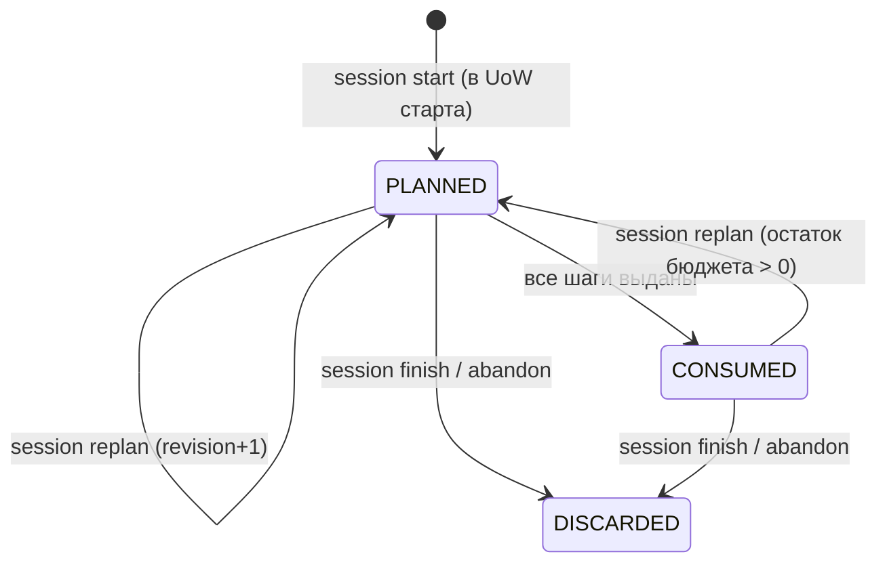

# Модуль: control

> **Status**: current
> **Last updated**: 2026-07-22
> **Sources**: концепт `staging/journal/2026-07-20-concept-0.12-learning-control.md` (Concept Gate, 6 развилок) · red-team ревью 0.12 `staging/reviews/2026-07-20-control-review-codex.md` (5 BLOCKER, триаж) · [[scheduler]], [[scoring]], [[evidence]], [[lessons]], [[learner]], [[gates]] · контракт 0.12
> **Bounded context**: `src/english_trainer/control/`

> Спека — **target**. Одна цель продукта, без фазовых тегов (Принцип 4). Термины — по [[../glossary]]. Все численные значения §3 — **конкретные авторские дефолты**, не диапазоны: policy обязана быть исполнимой, калибровка приходит позже.

---

## 1. Назначение

Остальные контракты отвечают, одинаков ли результат при одинаковом входе. Этот отвечает, хорош ли выбранный вход. Модуль решает, **что попадёт в занятие и в какой пропорции**, измеряет качество собственных решений и предоставляет механизм безопасной подстройки. Знание он не измеряет и менять не вправе.

## 2. Сущности и состояния

| Сущность | Назначение | Ключевые поля |
|---|---|---|
| `SessionPlan` | сохранённый состав занятия | `session_id`, `composition_revision`, `plan_version`, `steps[]`, `budget`, `pinned_control_policy`, `created_at` |
| `PlannedStep` | один шаг занятия — **tagged union по `kind`** (§4.3a) | общие: `step_id`, `decision_id`, `kind`, `bucket`, `step_type`, `expected_seconds`, `order_index`, `presented_at?`, `generation_directive?`, `bank_item_id?`, `lexicon_first?` |
| `SessionBudget` | session-level бюджет + **непредъявленный остаток** текущей ревизии | immutable `total_seconds`, `mode`; mutable `planned{review, growth, integration, choice}` только по непредъявленным шагам; `sum(planned) ≤ DeliveryLedger.remaining_seconds` |
| `DeliveryLedger` | **накопительный** факт занятия, один на сессию и единственный источник факта | `presented_seconds`, `presented{review, growth, integration, choice}`, `remaining_seconds = SessionBudget.total_seconds − presented_seconds`; история планов живёт в `SESSION_COMPOSED`, не дублируется здесь |
| `UrgencyClass` | класс review-кандидата | `critical \| important \| normal \| maintenance \| deferrable` |
| `SaturationState` | признаки перепоказа | ключ **`(target_ref, dimension)`** [RR2-13], `exposures_in_window`, `consecutive_independent_successes`, `distinct_contexts`, `last_transfer_check_at` |
| `AvailabilityProfile` | ритм занятий | `declared{...}`, `observed{...}`, `divergence`, `updated_at` |
| `LearnerControlSignal` | сигнал ученика (discriminated union, §4.7) | `signal_id`, `kind`, payload по kind, `expires_at?`, `expires_after_session_seq?`, `superseded_by?` |
| `DecisionTrace` | основание решения | `decision_id`, `step_id`, `reasons{}`, `pinned_versions{}` |
| `TunableParameter` | строка каталога настроек | §4.9 |
| `PolicyMetric` | определение метрики (§4.10) | `id`, `inputs[]`, `cohort`, `formula`, `window`, `missing_data_rule` |

`SessionBudget.mode` — `balanced` (по умолчанию) · `maintenance` · `re_entry`. Только в двух последних допустимо занятие без нового материала.



Переход `CONSUMED → PLANNED` нужен, потому что план может кончиться раньше бюджета; без него исчерпанное занятие нельзя было бы продолжить. Терминализация допустима из обоих состояний.

## 3. `control_policy` — versioned и исполнимая

Регистрируется в реестре политик kernel ([[../platform/foundation]] §3.6) наравне с curriculum/scoring/scheduler и пинится в Session Manifest ([[lessons]] §4b).

```yaml
control_policy:
  version: 1
  budget:
    default_total_minutes: 30
    min_total_minutes: 10
    expected_seconds_by_step_type:      # оценка стоимости шага
      recognition_check: 30
      controlled_production: 120
      spontaneous_production: 360
      transfer_task: 480
      new_material_intro: 300
      integration_task: 420
      gate_item: 180
      free_conversation: 300
    # Доли — целые basis points (1 bp = 1/10000). Двоичный float запрещён
    # на всём пути: allocation = floor(total_seconds * bp / 10000) [R-12].
    shares_bp_by_mode:
      balanced:    {review_max: 4500, growth_min: 2500, integration_min: 1500, choice_min: 1000}
      maintenance: {review_max: 10000, growth_min: 0, integration_min: 0, choice_min: 1000}
      re_entry:    {review_max: 8000, growth_min: 0, integration_min: 0, choice_min: 2000}
  classification:                        # вероятности — целые ppm (1e-6), не float
    critical_floor_retrievability_ppm: 500000
    maintenance_floor_retrievability_ppm: 850000
    recurring_error_window_sessions: 3
    recurring_error_min_occurrences: 2
    prereq_leverage_min_dependents: 2
  starvation:
    reserved_steps_per_session: 1
    deferrals_to_qualify: 3
  signals:
    default_effect_sessions: 3
  saturation:
    exposure_window_sessions: 5
    max_exposures_in_window: 3
    consecutive_success_threshold: 3
    min_distinct_contexts: 2
    transfer_check_staleness_days: 30
  diversity:
    max_steps_per_topic: 2
    max_consecutive_same_mode: 2
    max_similar_items: 2
  availability:
    divergence_tolerance_ppm: 300000
    divergence_window_weeks: 6
    min_observed_sessions: 3
    reentry_critical_boost_bp: 1000
  alerts:                                # только для mode=balanced [R-8]
    review_share_enter_bp: 4200
    review_share_exit_bp: 3500
    review_share_consecutive: 3
    growth_rate_enter_bp: 1000
    growth_rate_exit_bp: 1800
    growth_rate_consecutive: 3
```

- **MUST — policy тотальна и исполнима**: каждая ветка §4 имеет конкретное значение здесь. Диапазонов нет; `allowed_range` живёт в каталоге (§4.9) и ограничивает будущие версии, а не заменяет значение.
- **MUST — выполнимость долей проверяется на каждый mode**: для любого режима `growth_min + integration_min + choice_min ≤ 10000` и `review_max + growth_min ≤ 10000`. Версия, нарушающая это хотя бы в одном режиме, не активируется.
- **MUST — дискретная достижимость полов** [RR2-5]: алгебра долей не доказывает, что план собирается. Для каждого режима, каждого ненулевого пола и каждого значения `total_seconds` от `min_total_minutes` до `default_total_minutes` валидатор проверяет, что существует хотя бы один допустимый для корзины `step_type` с `expected_seconds ≤ total_seconds`. Размер самого пола **не** обязан покрывать шаг: это противоречило бы следующему правилу и делало бы дефолт `integration_min = 1500 bp` невалидным при 30 минутах.
- **MUST — неделимый шаг разрешено превысить резерв** [RR2-5]: следующий шаг, которым корзина впервые достигает или пересекает ненулевой остаточный пол, допускается целиком, даже если его стоимость больше оставшейся ёмкости пола, при условии что он помещается в общий `DeliveryLedger.remaining_seconds`. После него пол считается закрытым; последующие шаги подчиняются обычному first-fit. Пол — гарантия **попытки**, а не потолок.
- **MUST — целочисленная арифметика на всём decision-пути** [R-12, RR2-12]: **каждое** поле policy, влияющее на решение, хранится целым: доли — basis points, вероятности и допуски — ppm (1e-6), время — секунды. Аллокация — `floor(total_seconds * share_bp // 10000)`; сравнение с порогом — над Retrievability, приведённой к ppm тем же правилом округления, что и [[scoring]] §2.1. Валидатор **отвергает YAML-float в любом decision-bearing поле**, а не только в долях: на граничной Retrievability разные преобразования float меняли бы класс, и replay переставал бы быть побитовым.

## 3b. Публичный API и события

| Операция / Событие | Тип | Что делает |
|---|---|---|
| `compose_session(session_id, mode, total_seconds)` | API (sync, в UoW старта) | собирает `SessionPlan` с `composition_revision = 1`, `plan_version = 1`; ошибки `BUDGET_TOO_SMALL`, `NO_CANDIDATES` |
| `replan(session_id, expected_plan_version, idempotency_key)` | API (mutating, CAS) | новая композиционная ревизия и версия плана; закрывает или переносит assignments (§4.2) |
| `claim_next_step(session_id, expected_plan_version, idempotency_key)` | API (mutating, CAS) | атомарно помечает следующий шаг предъявленным, обновляет ledger и публикует `STEP_PRESENTED` |
| `peek_next_step(session_id)` | API (read-only) | возвращает следующий шаг и текущий `plan_version`, ничего не предъявляет |
| `classify(candidates)` | API (pure) | `UrgencyClass` по §4.5; детерминирована, без побочных эффектов |
| `record_signal(signal, session_id?, idempotency_key)` | API | только записывает сигнал; для активной сессии возвращает требуемое действие §4.7 |
| `explain(step_id)` | API | `DecisionTrace` |
| `availability_get()` / `availability_set(declared)` | API | §4.7a |
| `metrics()` / `catalogue()` | API | §4.10, §4.9 |
| `propose_calibration()` / `confirm_calibration(id)` | API | §4.9; активацию делает владелец параметра |
| `SESSION_COMPOSED {session_id, composition_revision, plan_version, steps[], budget, pinned_versions, active_safety_version}` | publishes | план создан или пересобран |
| `STEP_PRESENTED {step_id, session_id, composition_revision, plan_version, review_assignment_id?, targets[]:{target_ref, dimension}, context_id, step_type, generation_directive_hash?, bank_item_id?, predicted_retrievability?, presented_at, active_safety_version}` | publishes | шаг **фактически выдан тьютору**; `targets[]` пуст только у target-less choice; текст упражнения всё ещё требует `EXERCISE_RENDERED` до предъявления ученику |
| `LEARNER_SIGNAL_RECORDED`, `SIGNAL_CONSUMED` | publishes | сигнал зафиксирован / израсходован |
| `PROBE_REQUESTED {probe_id, target_ref, dimension, requested_difficulty, avoid_context}` | publishes | запрошена проба; `probe_id` выдаёт **движок** |
| `AVAILABILITY_UPDATED`, `CALIBRATION_PROPOSED`, `CALIBRATION_APPLIED` | publishes | — |

## 4. Поведение

### 4.1 Инварианты

- **MUST — `due` это кандидат, а не право**: наступление срока не даёт цели места в занятии. Невзятое остаётся в backlog и ошибкой не является.
- **MUST — защищённый минимум роста**: в режиме `balanced` корзина `growth` заполняется **первой** (§4.4) и не может быть занята повторениями. Занятие целиком из повторений возможно только в режимах `maintenance`/`re_entry`, выбранных явно.
- **MUST — доступность влияет на нагрузку, никогда на знание**: `AvailabilityProfile` не входит ни в одну формулу [[scoring]]. Реальное время забывания не подделывается.
- **MUST — self-report запускает проверку, а не пишет оценку**: см. §4.7.
- **MUST — каждое решение несёт trace**: §4.8.
- **MUST — подчинение safety-overlay**: единица, ставшая `avoid`/`obsolete` по **active** policy, исключается из плана независимо от класса. `SESSION_COMPOSED` фиксирует `active_safety_version`, использованную при исключении, — safety при этом **не** становится pinned policy ([[../OPEN]] OPEN-14).
- **MUST — калибровка не ретроактивна**: §4.9.

### 4.2 Жизненный цикл композиции [CTRL-2]

- **MUST — композиция происходит в UoW старта**: `lessons.start` синхронно вызывает `compose_session` **до** commit, в той же транзакции сохраняет `SessionPlan` с `composition_revision = 1`, `plan_version = 1`; неизменяемый Session Manifest получает `session_plan_id` и стартовый снимок версии. Живой plan/ledger не встраивается как изменяемая часть Manifest. `SESSION_COMPOSED` публикуется через outbox той же UoW.
- **MUST — две версии имеют разные назначения**: `composition_revision` увеличивается только при успешном `replan` и идентифицирует состав; `plan_version` увеличивается на 1 при **каждой** успешной мутации плана — `next` или `replan` — и служит CAS-токеном. Ни одна успешная мутация не сохраняет прежний `plan_version`.
- **MUST — выдача шага это мутация** [R-1]: `trainer session next` **мутирующая** и идемпотентная. В одной UoW она при совпавшем `expected_plan_version` помечает следующий непредъявленный шаг выданным, **вычитает** его `expected_seconds` из `SessionBudget.planned[bucket]`, прибавляет ту же величину в `DeliveryLedger.presented[bucket]`, пересчитывает totals/remaining, увеличивает `plan_version`, публикует `STEP_PRESENTED` и возвращает шаг с новой версией. Так `effective = presented + planned` не удваивает выданный шаг. Повтор с тем же `--idempotency-key` отдаёт сохранённый ответ до проверки CAS.
- **MUST — просмотр без выдачи**: `trainer session peek` — read-only, показывает следующий шаг и текущий `plan_version`, ничего не помечая и ничего не публикуя. Полученный токен передаётся в следующий `next` либо `replan`.
- **MUST — live safety перед выдачей** [П.3]: в UoW `next` сначала читает active safety-policy, затем выполняет единый условный commit с предикатом `plan_version = expected_plan_version ∧ production_eligible`. `production_eligible` учитывает active usage_policy, currency, allowed_contexts, `dated` recognition-only default и запрет production для opaque/recognition-only. Недопустимый шаг не предъявляется, версия и ledger не меняются; ответ — `PRECONDITION_FAILED {reason: safety_changed, current_plan_version, next_action: session.replan}`, и при изменении состояния эмитится доменное событие `LIVE_STEP_SAFETY_REJECTED`. Replan затем закрывает выпавший непредъявленный review-assignment как `CANCELLED`, а не outcome.
- **MUST — выдача под CAS, наблюдаемый исход гонок** [RR2-7]: `claim_next_step` принимает `expected_plan_version`; CAS берётся по `(session_id, plan_version)`, а `step_id` может быть заклеймён ровно один раз. Область уникальности идемпотентного ключа — `(session_id, operation, idempotency_key)`; сохранённый ответ включает версию, на которой команда была применена. Исходы гонок заданы, а не оставлены реализации:

| Гонка | Результат |
|---|---|
| один ключ дважды | тот же шаг из кэша, второго `STEP_PRESENTED` нет |
| два **разных** ключа с одним `expected_plan_version` одновременно | один успешен; второй получает `CONFLICT {current_plan_version}`; после `peek` и повтора с **новым** ключом он может получить следующий шаг |
| после успешной выдачи план кончился | следующий вызов с актуальной версией получает `PRECONDITION_FAILED` + `next_action: session.replan` |
| `next` против `replan` с одной ожидаемой версией | побеждает первый закоммитившийся; проигравший получает `CONFLICT {current_plan_version}` и заново читает план |

  Два одновременных агента маловероятны (ученик один, [[../flows/session]]), но слово «атомарно» без наблюдаемого исхода гонки контрактом не является.
- **MUST — переплан только явной командой**: `trainer session replan` — мутирующая идемпотентная команда с CAS по `expected_plan_version`. В одной UoW создаёт `composition_revision + 1`, увеличивает `plan_version`, публикует новый `SESSION_COMPOSED`, применяет активные сигналы §4.7 и не отменяет уже предъявленные шаги. Идемпотентный повтор возвращает сохранённый ответ до проверки CAS.
- **MUST — replan не оставляет сирот и не порождает долга** [R-3, RR2-4]: непредъявленный review-шаг, выпавший из новой ревизии, **в той же UoW** закрывается через `evidence.cancel_review(review_id, replanned)` и событие `REVIEW_ASSIGNMENT_CANCELLED` ([[evidence]] §4.3). Это терминальная отмена, а **не** ReviewOutcome: scheduler не назначает retry, scoring не меняет состояние, метрика исходов не загрязняется. Предъявленные шаги сохраняются со своими assignments.
- **MUST — ровно один действующий план**: действует последняя композиционная ревизия; `(session_id, composition_revision)` уникален. Конкурирующие мутации сериализуются `plan_version`, идемпотентность каждой команды — отдельным ключом операции.
- **MUST — новая ревизия получает только остаток** [RR2-6]: `remaining_seconds = total_seconds − presented_seconds`. Выданные шаги в новую ревизию не переносятся и в её `planned` не входят — они уже учтены в `DeliveryLedger`. Полный бюджет на каждой ревизии позволил бы занятию превысить свою длительность во столько раз, сколько было пересборок.
- **MUST — доли режима применяются к накопительному итогу** [RR2-6]: для корзины `b` величина `effective[b] = DeliveryLedger.presented[b] + SessionBudget.planned[b]` текущей ревизии. `review_max` и полы проверяются только по `effective`, а не по одной ревизии. Остаточный пол при replan равен `max(0, floor(total_seconds × min_bp / 10000) − presented[b])`; остаточная ёмкость review равна `max(0, floor(total_seconds × review_max_bp / 10000) − presented.review)`. `sum(effective) ≤ total_seconds`, а `sum(SessionBudget.planned) ≤ DeliveryLedger.remaining_seconds`.
- **MUST — один источник для метрик занятия** [RR2-6]: метрика занятия читается из `DeliveryLedger`, а не из какого-то `SESSION_COMPOSED`. При нескольких ревизиях вопрос «какую брать» не возникает.
- **MUST — `step_id` стабилен**: `step_id` не меняется между ревизиями для сохранённых шагов; `decision_id` ссылается на trace, породивший шаг.

### 4.3 Корзины образуют разбиение [CTRL-1]

- **MUST — каждый шаг ровно в одной корзине**: `bucket ∈ {review, growth, integration, choice}`, взаимоисключающе и исчерпывающе. Для действующего плана `sum(DeliveryLedger.presented) + sum(SessionBudget.planned) ≤ total_seconds`.
- **MUST — определения корзин**:

  | Корзина | Что попадает |
  |---|---|
  | `review` | шаг по цели из due-backlog, классифицированной §4.5 |
  | `growth` | шаг по цели с `is_first_exposure = true` |
  | `integration` | задание, требующее одновременно новую и ранее изученную цель |
  | `choice` | свободный разговор или тема, выбранная учеником |

- **MUST — `is_first_exposure` определяется по факту доставки**: цель считается новой, если по ней **нет ни одного** `STEP_PRESENTED` (§4.6). `knowledge_state = NEW` для этого не годится: предъявление и объяснение не являются evidence, и цель остаётся `NEW` после нескольких показов.
- **MUST — не более одного growth-шага на цель в плане** [R-13]: иначе оба шага получили бы `is_first_exposure = true` при композиции, а после выдачи первого второй стал бы ложно считаться новым и в бюджете, и в телеметрии. Повторное обращение к той же цели в том же занятии — шаг `integration` или `review`, не `growth`.

### 4.3a Схема `PlannedStep` — tagged union [R-3]

Общие поля: `step_id`, `decision_id`, `kind`, `bucket`, `step_type`, `expected_seconds`, `order_index`, `presented_at?`, `generation_directive?`, `bank_item_id?`, `lexicon_first?`.

- **MUST — источник упражнения явный** [П.3]: у выданного шага ровно одно из `bank_item_id` или `generation_directive`. `bank_item_id` означает reuse принятого, ре-валидированного по active safety банк-item'а. `generation_directive` — каноничные данные для тьютора, рендерящего упражнение под pinned `generation@1`; сам текст фиксируется отдельно как `EXERCISE_RENDERED`.
- **MUST — банк-item не evidence** [П.3]: выбор или рендер банк-item'а не создаёт evidence. Evidence по-прежнему требует сохранённого ответа ученика через [[evidence]].

| `kind` | Обязательные поля |
|---|---|
| `review` | `review_assignment_id`, `target_ref`, `dimension`, `criteria_ref`, `urgency_class` |
| `growth` | `target_ref`, `dimension`, `is_first_exposure: true` |
| `integration` | `targets[]` из `{target_ref, dimension, role: new \| learned}`, минимум по одному каждой роли |
| `choice` | `target_ref?` либо `topic_hint` |
| `gate` | `gate_scope`, `scope_ref` |
| `probe` | `probe_id` (выдан движком), `target_ref`, `dimension`, `requested_difficulty`, `avoid_context?` |

- **MUST — `kind → bucket` тотален**: `review → review`, `growth → growth`, `integration → integration`, а `choice | gate | probe → choice`. Иных пар нет.
- **MUST — допустимые `step_type` по `kind`** [RR2-5]: без этой матрицы одна реализация назвала бы integration заданием на 420 секунд, другая — на 120, и планы разошлись бы при одинаковом входе.

| `kind` | Допустимые `step_type` |
|---|---|
| `review` | `recognition_check`, `controlled_production`, `spontaneous_production`, `transfer_task` |
| `growth` | `new_material_intro`, `controlled_production` |
| `integration` | `integration_task`, `transfer_task` |
| `choice` | `free_conversation`, `spontaneous_production` |
| `gate` | `gate_item` |
| `probe` | `transfer_task`, `spontaneous_production` |

- **MUST — review-шаг несёт `review_assignment_id`**: без него выданное задание невозможно корректно закрыть через `trainer review close`, а `finish` не может проверить пустоту pending-set.
- **MUST — integration выражает пару**: одиночный `target_ref` не способен описать задание «новая цель поверх освоенной», ради которого корзина и введена.
- **MUST — три раздельные величины: ревизия, эффективный состав и факт** [RR2-6, RR2-11]: `revision_planned_review_share` — диагностическая доля текущей ревизии; `effective_review_share = (ledger.presented.review + budget.planned.review) / total_seconds` — единственная величина для проверки `review_max` и полов; `presented_review_share` — факт из `DeliveryLedger` для метрик и аварий (§4.10). `integration` и `choice` не входят в review ни в одной величине.
- **MUST — вклад integration в цели**: шаг `integration` может дать evidence нескольким целям, но с dedup и cap по [[evidence]] §4.1. На бюджет он относится целиком к своей корзине.

### 4.4 Канонический конвейер сборки [CTRL-12]

Детерминирован целиком; два корректных исполнения дают побайтово равный `SessionPlan`.

1. **Кандидаты.** `review` — due/overdue от [[scheduler]] §5, включая review LexicalItem'ов. `growth` — рекомендации [[curriculum]], отфильтрованные по `is_first_exposure`, плюс lexicon-first micro lane из `generation@1` для learner-requested / observed-error / due-review / CORE-HIGH safe unlinked-единиц (advisory: не более одного growth item за сбалансированную сессию, кроме maintenance или явного vocabulary-запроса). `integration` — пары (новая цель, освоенная цель). `choice` — цели из `goals[]`/личного словаря [[learner]] и рекомендация гейта от [[gates]], если она есть.
2. **Исключение по safety** — по active policy; исключённое фиксируется в trace.
3. **Классификация** review-кандидатов — §4.5.
3a. **Активные сигналы** — фильтры и сдвиги §4.7 применяются после базовой классификации.
3b. **Свободный разговор — безусловный кандидат** `choice` [RR2-14]: он не требует цели, поэтому доступен всегда и `NO_CHOICE_CANDIDATE` при `choice_min > 0` возникнуть не может. `topic_hint` берётся из активной `goal`, иначе пуст.
4. **Каноническая сортировка.** Review внутри класса: `(retrievability asc, stake_rank asc, deferral_count desc, expected_seconds asc, target_id asc, dimension_id asc, candidate_id asc)`. Growth: `(curriculum_priority_rank asc, learner_relevance desc, target_id asc, dimension_id asc, step_type_rank asc, candidate_id asc)`. Integration: `(new_target growth-key, learned_target_id asc, learned_dimension_id asc, step_type_rank asc, candidate_id asc)`. Choice: `(source_rank asc, target_id_or_empty asc, step_type_rank asc, candidate_id asc)`, где `source_rank`: probe `0`, явный выбор ученика `1`, active goal `2`, личный словарь `3`, gate `4`, free conversation `5`. `step_type_rank`: `new_material_intro 0`, `recognition_check 1`, `controlled_production 2`, `spontaneous_production 3`, `transfer_task 4`, `integration_task 5`, `gate_item 6`, `free_conversation 7`. `candidate_id` обязателен и стабилен в нормализованном входе.
5. **Резервирование остаточных полов** в фиксированном порядке `growth → integration → choice` до величин из §4.2. Пол — **резервируемая ёмкость, а не обязательная загрузка** [R-2]: пересекающий пол шаг может превысить остаточную ёмкость по §3. Если кандидатов нет, фиксируется `NO_<BUCKET>_CANDIDATE`; если после добавлений кандидаты закончились ниже пола — `<BUCKET>_CANDIDATES_EXHAUSTED`; если кандидаты есть, но ни один не помещается в общий остаток после предыдущих корзин, — `NO_<BUCKET>_STEP_FITS`. Во всех трёх случаях незанятый резерв переходит следующей корзине. Это делает исполнимыми первое занятие (нет integration-пар), короткие бюджеты с неделимыми шагами и режимы `maintenance`/`re_entry`, где `growth_min = 0`.
6. **Резерв против голодания** — §4.5.
6a. **Pending probe** — если probe не был выбран при заполнении choice-пола, он first-fit пытается занять общий остаток теперь; при успехе сигнал атомарно расходуется, при неуспехе применяется `PROBE_BUDGET_UNAVAILABLE` §4.7.
6b. **Availability-boost** — §4.7a; только после starvation-reserve, чтобы не отменить его гарантию.
7. **Review** по классам `critical → important → normal → maintenance`, пока не достигнут `review_max` или бюджет.
8. **Добор остатка** после review — фиксированными проходами `growth → integration → choice`; каждая корзина исчерпывает свой канонически отсортированный список first-fit, затем управление переходит следующей. Второго цикла нет. Ни один потолок или правило «не более одного growth на цель» не нарушается.
9. **Квоты разнообразия** — §4.6, применяются как **фильтр при добавлении**, а не постобработкой: шаг, нарушающий квоту, пропускается, берётся следующий по порядку.
10. **Порядок предъявления** — чередование modes при равных прочих, затем `step_id asc`.

- **MUST — first-fit, не best-fit**: после разрешённого первого overshoot шага §3 кандидат, не помещающийся в доступную ёмкость корзины или общий `remaining_seconds`, **пропускается**, и берётся следующий кандидат в каноническом порядке. Best-fit запрещён: он даёт другой набор при том же входе.
- **MUST — неразрешимый бюджет**: если `total_seconds < min_total_minutes × 60`, композиция отклоняется ошибкой `BUDGET_TOO_SMALL`.
- **MUST — пустой план это ошибка, а не результат** [R-2]: если после waiver'ов не набрался ни один шаг, композиция отклоняется `NO_CANDIDATES` с `next_action`. Сессия с планом из нуля шагов не создаётся.
- **MUST — waiver виден в телеметрии**: доля занятия, отданная по waiver другой корзине, попадает в trace и в метрики. Иначе систематическая невозможность набрать новый материал выглядела бы как здоровое занятие.

### 4.5 Классификация: тотальная упорядоченная таблица [CTRL-4]

Область — **только review-кандидаты** (due или overdue). Правила применяются по порядку, **первое совпавшее выигрывает**; таблица тотальна.

| # | Условие | Класс |
|---|---|---|
| 1 | `risk ∧ stake` | `critical` |
| 2 | `risk ∧ ¬stake` | `important` |
| 3 | `saturated` (§4.6) | `deferrable` |
| 4 | `retrievability ≥ maintenance_floor_retrievability` | `maintenance` |
| 5 | иначе | `normal` |

**Риск проверяется первым** [R-4]. В прежнем порядке `saturated` стояло первым, и три показа с тремя **провалами** удовлетворяли предикату насыщения, отправляя критичную цель в `deferrable`; а повторяющаяся живая ошибка при Retrievability `900000 ppm` попадала в `maintenance` раньше проверки риска — то есть ровно тот сигнал, который вводился для исправления ошибочного прогноза модели, этим прогнозом и подавлялся.

**`risk`** = `knowledge_state = AT_RISK` **∨** повторяющаяся ошибка (≥ `recurring_error_min_occurrences` в последних `recurring_error_window_sessions`) **∨** `retrievability < critical_floor_retrievability`.

**`stake`** определён для обоих видов `LearningTarget` [CTRL-4]:

| Вид цели | `stake` истинно, если |
|---|---|
| `LexicalItem` | `curriculum_priority_band ∈ {CORE, HIGH}` ∨ leverage ∨ relevance |
| `Topic` | leverage ∨ relevance |

где **leverage** = цель является `strong`-prerequisite не менее чем `prereq_leverage_min_dependents` тем, **relevance** = цель связана с активной `goal` или записью личного словаря ([[learner]] §4). У `Topic` поля `curriculum_priority_band` нет, и вводить его сюда не требуется: для тем ставка выражается через leverage.

- **MUST — резерв против голодания** [CTRL-7]: до заполнения review-корзины по классам в план **безусловно допускается** до `reserved_steps_per_session` целей, достигших `deferrals_to_qualify`, в порядке §4.5. Admission означает наличие шага в хотя бы одной зафиксированной ревизии сессии; это не обещание `STEP_PRESENTED`.
- **MUST — `stake_rank` закрыт** [R-4]: `0` — relevance (цель связана с активной `goal` или личным словарём); `1` — `curriculum_priority_band ∈ {CORE, HIGH}` (LexicalItem) либо leverage ≥ `prereq_leverage_min_dependents` (любой вид цели); `2` — ставки нет. Сортировка по возрастанию. Без закрытого enum порядок внутри класса снова зависел бы от реализации.
- **MUST — жизненный цикл `deferral_count`** [R-6]: счётчик меняется **не более одного раза за сессию**, при её `FINISHED`/`ABANDONED`. Он увеличивается на 1, если цель была eligible review-кандидатом хотя бы одной ревизии этой сессии, не была admitted ни в одну её зафиксированную ревизию именно из-за системного отбора и не была исключена сигналом ученика. Несколько replan одной сессии не дают несколько инкрементов. `STEP_PRESENTED` по цели обнуляет счётчик. Порядок резерва — `(qualified_at_session_seq asc, deferral_count desc, retrievability asc, target_id asc, dimension_id asc)`; новые qualification-эпизоды не обгоняют уже открытые.
- **MUST — эпизод qualification**: достижение порога открывает один qualification-эпизод и фиксирует `qualified_at_session_seq`; первое последующее admission закрывает его. Без `STEP_PRESENTED` новый эпизод может открыться только после нового системного deferral в более поздней терминализованной сессии. Поэтому уже admitted, но не показанная цель не захватывает резерв бесконечно.
- **MUST — граница ожидания и её предпосылка** [R-6, RR2-8]: для конечного множества открытых эпизодов `Q` на старте отсчёта все цели из `Q` admitted не позже чем через `ceil(|Q| / reserved_steps_per_session)` **последующих qualifying sessions**; от нулевого счётчика граница равна `deferrals_to_qualify + ceil(|Q| / reserved_steps_per_session)`. Qualifying session — сессия, в которой после защищённых ненулевых полов помещается хотя бы один допустимый шаг старейшей зарезервированной цели; недостаточно длинная сессия не расходует эпизод и фиксирует `STARVATION_STEP_DOES_NOT_FIT`. Если шаг помещается, он вытесняет последний незарезервированный review-шаг, иначе последний незарезервированный шаг добора, не нарушая ненулевые полы. Admission не гарантирует presentation.

### 4.6 Доставка, насыщение, разнообразие [CTRL-6]

- **MUST — факт выдачи это граница до тьютора, а не до ученика** [RR2-2]: `STEP_PRESENTED` фиксирует, что шаг **выдан тьютору** и стал его обязательством. Экран ученика движок не наблюдает. Утверждать «показан ученику» значило бы приписать движку ненаблюдаемый факт: между commit и репликой в чате возможны крэш, обрыв и смена агента.
- **MUST — что из этого следует**: exposure, saturation и сброс `deferral_count` считаются от выдачи тьютору; идемпотентный повтор с тем же ключом возвращает тот же шаг и **не** создаёт второй факт. Если сессия брошена сразу после выдачи, факт остаётся — это честная плата за то, что доставку подтвердить нечем, и она названа здесь, а не замаскирована.
- **MUST — план не равен выдаче**: `SESSION_COMPOSED` — намерение; в брошенной или перепланированной сессии шаг мог не выдаваться вовсе.
- **MUST — `SaturationState` строится из существующих событий** [R-5]: входы — `STEP_PRESENTED` (число показов и `context_id`), `EVIDENCE_ADDED` и `REVIEW_OUTCOME` из [[evidence]] §3 (успех, independence), `ERROR_OBSERVED` (повторяющаяся живая ошибка для предиката `risk`). Событие с именем `ATTEMPT_ASSESSED` в каноне отсутствует и здесь не используется. Reducer применяет события в порядке канонического `sequence`, дедуп — по `event_id`.
- **MUST — цели, `context_id` и источник упражнения в факте доставки** [R-5; П.3]: `STEP_PRESENTED.targets[]` перечисляет все пары `(target_ref, dimension)` шага, включая обе роли integration, а `context_id` идентифицирует смысловой контекст (домен + тип задания). Событие также несёт `step_type`, `active_safety_version` и ровно одно из `bank_item_id` / `generation_directive_hash`. Reducer обновляет saturation для каждой пары; `review_assignment_id` обязателен для kind=review и делает разрешимой корреляцию §4.10.
- **MUST — предикат `saturated`** [RR2-13]: считается **per-dimension**; `exposures_in_window ≥ max_exposures_in_window` **∨** (`consecutive_independent_successes ≥ consecutive_success_threshold` **∧** `distinct_contexts < min_distinct_contexts` **∧** `last_transfer_check_at != null` **∧** `now − last_transfer_check_at ≤ transfer_check_staleness_days`). При `last_transfer_check_at = null` вторая конъюнкция ложна. Ключ по цели без dimension позволил бы частым проверкам узнавания заглушить слабое производство той же цели. Если transfer давно не проверялся или не проверялся вообще, устойчивый успех в знакомом шаблоне **не** считается насыщением.
- **MUST — насыщение не равно владению**: понижение класса меняет только план; состояние знания меняет исключительно [[scoring]].
- **MUST — квоты разнообразия**: `max_steps_per_topic`, `max_consecutive_same_mode`, `max_similar_items`. «Похожие» = единицы, делящие `lemma`/базовый глагол phrasal-verb либо один `topic`.

### 4.7 Сигналы ученика и пробы [CTRL-9, CTRL-10]

- **MUST — discriminated union по `kind`**:

  | `kind` | Обязательный payload | Срок |
  |---|---|---|
  | `too_easy` | `target_ref` | одноразовый |
  | `too_repetitive` | `target_ref?` | `expires_after_session_seq = current_session_seq + exposure_window_sessions` |
  | `need_more_practice` | `target_ref` | `expires_after_session_seq = current_session_seq + default_effect_sessions` |
  | `not_relevant_now` | `target_ref` \| `domain` | `expires_at` обязателен |
  | `snooze` | `target_ref`, `until` | `until` |
  | `prefer_different_context` | `target_ref`, `avoid_context` | `expires_after_session_seq = current_session_seq + default_effect_sessions` |

- **MUST — два раздельных типа истечения** [R-11, RR2-9]: `expires_at` — UTC-метка времени только для `snooze`/`until` и `not_relevant_now`; `expires_after_session_seq` — целый номер сессии для срока в занятиях. `session_seq` монотонно назначается ученику в UoW старта. Сигнал активен для композиции с `session_seq ≤ expires_after_session_seq`; после этого номера не влияет. Если сигнал записан вне активной сессии, `current_session_seq` означает номер последней начатой сессии, либо `0`, если их ещё не было.
- **MUST — запись сигнала не меняет действующий план**: `record_signal` идемпотентно сохраняет сигнал и публикует `LEARNER_SIGNAL_RECORDED`. Для `too_easy` движок также создаёт стабильный `probe_id` и публикует `PROBE_REQUESTED`, но `PlannedStep` появляется только при следующем `compose_session` либо **явном** `replan`. При активной сессии ответ содержит `next_action: session.replan`, `session_id`, `current_plan_version` и `probe_id`; агент не вправе вставить пробу сам.
- **MUST — параметры probe выводимы**: для `too_easy` движок берёт `dimension`, `avoid_context` и базовый `step_type` из последнего по `sequence` события `STEP_PRESENTED`, чьи `targets[]` содержат эту цель (сначала в активной сессии, иначе вообще); если в одном событии цель встречается с несколькими dimensions, берётся `dimension_id asc`. Если события нет, команда отклоняется `PRECONDITION_FAILED {reason: no_presented_step}`. `requested_difficulty` — закрытый enum `spontaneous_production | transfer_task`: после `new_material_intro`/`recognition_check`/`controlled_production`/`gate_item` запрашивается `spontaneous_production`; после `spontaneous_production`/`integration_task`/`free_conversation`/`transfer_task` — `transfer_task`. `avoid_context` равен контексту исходного шага.
- **MUST — одноразовый сигнал расходуется атомарно**: `too_easy` закрывается `SIGNAL_CONSUMED` в той же UoW, в которой композиция действительно добавила `PlannedStep{kind: probe, probe_id}`. Если probe не помещается в `remaining_seconds` или уже достигнут лимит, trace получает `PROBE_BUDGET_UNAVAILABLE`, сигнал не расходуется и остаётся для следующей композиции.
- **MUST — precedence и точные преобразования** [R-11]: сначала выполняется базовая классификация §4.5, затем активные сигналы применяются от сильного к слабому:

  1. `snooze` / `not_relevant_now` исключают цель;
  2. `need_more_practice` сдвигает класс на одну ступень `deferrable → maintenance → normal → important`; `important`/`critical` не меняются;
  3. `prefer_different_context` исключает кандидаты с `context_id = avoid_context`; если вариантов не осталось, фиксируется `NO_ALLOWED_CONTEXT` и цель в этой композиции пропускается;
  4. `too_repetitive` применяется только при `risk = false` и сдвигает `normal → maintenance → deferrable`; остальные классы не меняются;
  5. `too_easy` класс не меняет и создаёт probe по предыдущим правилам.

  Более поздний сигнал того же `kind` и scope замещает предыдущий (`superseded_by`). Сигнал на конкретную цель замещает противоречащий сигнал уровня `domain`; непротиворечащие эффекты складываются в указанном порядке. Истёкший сигнал не влияет, но не удаляется.
- **MUST — сигналы не evidence**: в Mastery, уровень и XP не входят никогда.
- **MUST — `origin` выводится движком, а не заявляется агентом** [R-7]: Attempt ссылается на `step_id`; если выданный шаг имеет `kind = probe`, движок проставляет `origin = control_probe`, иначе — обычный origin по [[evidence]]. CLI параметра `--origin` не имеет. Агент не может превратить обычный провал в probe.
- **MUST — no-negative покрывает все отрицательные эффекты** [R-7]: evidence с `origin = control_probe` не может дать `REGRESSION`, не понижает knowledge state, **не уменьшает Mastery и Stability и не сдвигает расписание в сторону сокращения интервала**. Успех засчитывается обычным порядком в пределах общих cap'ов. Прежняя формулировка запрещала только смену состояния и оставляла отрицательную дельту возможной — то есть наказание всё равно наступало, просто тише.
- **MUST — probe в своей корзине** [R-7]: `too_easy` не требует, чтобы цель была due, поэтому probe-шаг **не** относится к `review` (та определена через due-backlog). Probe занимает `choice`: это шаг, инициированный учеником.
- **MUST — бюджет проб**: не более одного probe-шага на цель в занятии.

### 4.7a Availability — алгоритм v1 [R-9]

Сущность §2 без правил вычисления не задавала поведения; часть значений policy не использовалась ни одной веткой.

- **MUST — целочисленная схема** [RR2-10, RR2-12]: `declared{sessions_per_week_milli, typical_minutes, next_available_at?, blackout_until?}` и `observed{sessions_per_week_milli, typical_minutes, median_interval_seconds?}`. `1000` milli = одна сессия в неделю; все числовые поля — целые, YAML-float запрещён. Профиль задаётся `trainer availability set`.
- **MUST — источник `observed`**: окно — `[start_of_week(now) − (divergence_window_weeks − 1) недель, now]`, то есть текущая неполная и предшествующие полные недели, всего ровно `divergence_window_weeks` календарных корзин. `start_of_week` — понедельник 00:00 в `LearnerProfile.timezone`, а использованные `now` и timezone захватываются в trace. Если в окне не менее `min_observed_sessions` терминализованных сессий, `observed.sessions_per_week_milli = floor(count × 1000 / divergence_window_weeks)`, а `typical_minutes` — lower median их `SessionBudget.total_seconds // 60`. Иначе оба поля получают `no-data`. `median_interval_seconds` — lower median разностей соседних `SESSION_STARTED.started_at` при наличии минимум трёх стартов; иначе `null`. Длительность `STARTED→FINISHED` не используется.
- **MUST — precedence бюджета**: `total_seconds` берётся первым из непустого: `--duration-minutes × 60` → `declared.typical_minutes × 60` → `observed.typical_minutes × 60` → `default_total_minutes × 60`. Порядок фиксирован.
- **MUST — расхождение**: если `declared.sessions_per_week_milli` отсутствует либо observed = `no-data`, результат `no-data` и предложение не создаётся. Иначе `divergence_ppm = floor(abs(declared_milli − observed_milli) × 1_000_000 / max(declared_milli, 1000))`. При `divergence_ppm > divergence_tolerance_ppm` система предлагает уточнить и не переписывает declared без подтверждения; `AVAILABILITY_UPDATED` публикуется только после принятого изменения.
- **MUST — предикат длинного перерыва**: он истинен, если `blackout_until > now`, либо одновременно заданы `next_available_at > now` и `median_interval_seconds`, причём `next_available_at − now > median_interval_seconds`. При `median_interval_seconds = null` одно лишь `next_available_at` усиление не включает; blackout включает всегда.
- **MUST — детерминированное влияние на состав**: при длинном перерыве после резервирования остаточных полов §4.4 вычисляется `critical_boost_capacity = min(floor(total_seconds × reentry_critical_boost_bp / 10000), residual_review_capacity, unplanned_remaining_seconds)`. До обычного review и до добора growth сверх его пола в эту ёмкость first-fit отбираются `critical`-шаги в порядке §4.4; overshoot для boost не разрешён. Если подходящих `critical` нет, trace получает `NO_CRITICAL_AVAILABILITY_CANDIDATE`, ёмкость возвращается обычному добору. `review_max` и growth-пол не нарушаются; Availability никогда не входит в scoring (§4.1).

### 4.8 Decision trace

- **MUST — trace у каждого шага**: `decision_id`, сработавшие правила классификации с их номерами, значения `risk`/`stake` сигналов, retrievability, класс, состояние насыщения, применённые квоты, занятость корзин, `pinned_versions` (включая `control_policy`) и `active_safety_version`.
- **MUST — доступен по команде**: `trainer why --step ID`.
- **MUST — поля разрешимы**: каждое поле trace либо разрешается в строку каталога (§4.9), либо помечено как вычисленный вход.

### 4.9 Каталог tunables и калибровка

```yaml
parameter_id: control.budget.shares.review_max
owner: 0.12 control
scope: global
unit: basis_points
default: 4500
allowed_range: [3000, 6000]
carried_by: control_policy@1
observed_by: [presented_review_share, presented_growth_rate]
change_mode: propose_confirm
trace_field: review_max
```

- **MUST — реестр, не хранилище**: значения живут в pinned policy у владельца; каталог хранит метаданные. Два хранилища одного числа разъедутся.
- **MUST — каталог это обязательство реализации, а не существующий артефакт** [R-10]: строк каталога в каноне ровно столько, сколько показано примером. Реализация обязана создать versioned catalogue-артефакт со строкой на **каждый** параметр `control_policy@1` и на ранее объявленные tunables соседей, и валидатор обязан проверять полноту в обе стороны. До появления артефакта запрет активации вне `allowed_range` **не действует** — проверять его нечем, и утверждать обратное было бы тем же over-claim, что и в OPEN-27.
- **MUST — потолок автономии: propose_confirm** `[PD-2026-07-20]`: ни один параметр не объявляет режим выше. Автоприменение запрещено: при одном ученике шум неотличим от сигнала.
- **MUST — применение делегируется владельцу** `[PD-2026-07-20]` [CTRL-Q2]: control владеет **только** workflow «предложил → подтвердили». Активацию новой версии выполняет **API модуля-владельца** параметра, с его CAS и его событием; control не мутирует чужой aggregate и не становится вторым владельцем policy. `CALIBRATION_APPLIED` фиксирует подтверждение и связан `causation_id` с событием активации у владельца.

### 4.10 Метрики качества политики [CTRL-13]

Каждая — `PolicyMetric` с формулой, окном и правилом отсутствующих данных. Значения ниже — v1.

| id | Формула | Окно | Нет данных |
|---|---|---|---|
| `calibration_error` | среднее \|прогноз Retrievability на момент выдачи − факт (1 успех / 0 неуспех)\| по всем `REVIEW_OUTCOME` | 200 исходов | `no-data` при < 50 |
| `presented_review_share` | `ledger.presented.review / ledger.presented_seconds`, среднее по терминализованным сессиям | 10 сессий | `no-data` при < 3 |
| `presented_growth_rate` | `ledger.presented.growth / ledger.presented_seconds`, среднее | 10 сессий | `no-data` при < 3 |
| `backlog_age_p90` | 90-й процентиль `now − first_due_at` по незакрытым due; метод — **nearest-rank**, ties разводятся `(target_id, dimension_id)` | текущий срез | `no-data` при пустом backlog |
| `max_deferrals` | максимум `deferral_count` среди целей backlog | текущий срез | `0` |
| `lapse_rate_after_mastered` | доля целей, получивших REGRESSION в течение 90 дней после MASTERED | 90 дней | `no-data` при < 10 |
| `transfer_gap` | успех на знакомом шаблоне − успех в новом контексте | 50 исходов каждого | `no-data` |

- **MUST — связь прогноза с исходом** [RR2-11]: `calibration_error` соотносит `STEP_PRESENTED.predicted_retrievability` **последнего выданного** шага данного `review_assignment_id` с терминальным исходом этого assignment. Один исход агрегирует несколько попыток, поэтому без явного правила пара «прогноз ↔ факт» была бы неоднозначной. Отменённые (`CANCELLED`) assignment в выборку не входят.
- **MUST — прогноз фиксируется в `STEP_PRESENTED`, а не при композиции** [R-8]: `predicted_retrievability` записывается в момент **фактической выдачи**. Композиция и выдача расходятся во времени (сессию можно возобновить через день), а Retrievability убывает по реальному времени — сравнение с прогнозом из плана приписывало бы политике ошибку, созданную устаревшим планом. Пересчёт задним числом запрещён.
- **MUST — разметка исходов** [R-8]: в `calibration_error` `CONFIRMED` и `PROGRESS` → `1`; `REGRESSION` → `0`; `RECOVERED` → `1`; `INSUFFICIENT_EVIDENCE` → **исключается** из выборки, а не считается нулём. Исход из пяти значений нельзя молча свести к булеву.
- **MUST — аварии считаются по факту и только по `balanced`-занятиям** [R-8, RR2-11]: входы аварий — `presented_*` из `DeliveryLedger`; в режимах `maintenance`/`re_entry` нулевой рост законен, и включение их в окно давало бы ложную тревогу после трёх нормальных поддерживающих занятий.
- **MUST — раздельные пороги входа и выхода**: авария включается при пересечении `*_enter_bp` подряд `*_consecutive` занятий и выключается только при пересечении `*_exit_bp` — гистерезис не даёт метрике мигать у порога. Пороги — параметры каталога, а не прилагательные «устойчиво» и «близок».
- **MUST — реакция: сообщить, не притормаживать** `[PD-2026-07-20]` [CTRL-Q1]: при аварии система **сообщает** и предлагает выбор (режим `maintenance`, больше времени, отказ от части целей). Автоматическое снижение притока нового материала **не вводится**: скрытое изменение программы без ведома ученика противоречит принципу «движок объясняет, а не решает молча».
- **MUST — честность о статистике**: при одном ученике большинство метрик долго остаются шумом; `no-data` — легитимный результат, а не ноль.

## 5. CLI-поверхность

| Команда | Владелец | Мутирует | Что делает |
|---|---|---|---|
| `trainer why --step ID` | control | нет | `DecisionTrace` шага (§4.8) |
| `trainer signal KIND --target ID [payload]` | control | да | сигнал ученика; `too_easy` → `PROBE_REQUESTED` |
| `trainer availability show` \| `set` | control | `set` — да | ритм: объявленный, наблюдаемый, расхождение |
| `trainer tunables list [--owner X]` | control | нет | каталог настроек |
| `trainer metrics` | control | нет | метрики + аварии |
| `trainer calibration list` \| `confirm ID` | control | `confirm` — да | предложения; применение делегируется владельцу |

`trainer session start --mode`, `trainer session next --expected-plan-version V` (мутирующая, §4.2), `trainer session peek` (read-only, возвращает `plan_version`) и `trainer session replan --expected-plan-version V` принадлежат [[lessons]]; их поведение определяется здесь.

## 6. Границы

- **depends on**: [[scheduler]] (backlog, retrievability), [[scoring]] (состояния, прогнозы), [[evidence]] (исходы, наблюдённые ошибки, ReviewAssignment), [[curriculum]] (priority band, prerequisites, рекомендации), [[learner]] (`goals`, личный словарь → relevance), [[gates]] (рекомендация гейта как кандидат `choice`), [[lessons]] (UoW старта, терминализация)
- **events published**: `SESSION_COMPOSED`, `STEP_PRESENTED`, `LEARNER_SIGNAL_RECORDED`, `SIGNAL_CONSUMED`, `PROBE_REQUESTED`, `AVAILABILITY_UPDATED`, `CALIBRATION_PROPOSED`, `CALIBRATION_APPLIED`
- **events consumed**: `REVIEW_SCHEDULED`, `OVERDUE_AT_RISK_TRIGGERED` (← [[scheduler]]), `STATE_TRANSITION` (← [[scoring]]), `EVIDENCE_ADDED`, `REVIEW_OUTCOME`, `ERROR_OBSERVED` (← [[evidence]] §3 — saturation, recurring-error, метрики), `SESSION_STARTED`/`FINISHED`/`ABANDONED` (← [[lessons]])

Модуль не меняет Mastery, Stability, knowledge state, CEFR и интервалы; содержимое заданий генерирует П.3.

## 7. Открытые вопросы

- **OPEN-27**: эмпирическая калибровка значений §3. Все они **существуют и исполнимы**; открыта только их проверка данными → не блокирует реализацию.
- **OPEN-29**: `AvailabilityProfile` в v1 несёт `sessions_per_week_milli`, `typical_minutes`, `next_available_at?` и `blackout_until?`. Полная календарная модель (дни недели, исключения) — нерешённое расширение этого же вопроса; до неё обещание «перенести на ближайшее занятие» опирается на `next_available_at`, а при его отсутствии — на статистическую оценку.
- **OPEN-14**: safety-overlay определяет допустимое к предъявлению.

## История изменений

- **2026-07-22**: фазовые теги `[mvp]`/`[post-mvp]` сняты [PD-2026-07-22]: спека описывает одну цель продукта, порядок и статус — только в roadmap (Принцип 4). calibration-API — часть цели (порядок в roadmap); календарная модель — нерешённое расширение OPEN-29.
- **2026-07-21**: после подтверждающего red-team устранены структурные дефекты: введён CAS-токен `plan_version`, связанный с каждой мутацией; бюджет текущей ревизии отделён от накопительного ledger через `effective`; валидатор полов согласован с разрешённым overshoot; fairness считает deferral один раз за сессию и гарантирует admission через `ceil`; сигналы получили точные сроки, преобразования и явный replan-протокол; availability переведена в целочисленные размерности и детерминированный boost. Статус 0.12 остаётся `blocked` до независимого подтверждения.
- **2026-07-20 (4)**: третий прогон ревью — BLOCKER и 11 MAJOR сняты. Семантика `session next` сведена к одной во всех владельцах и во flow [RR2-1]; факт выдачи честно назван границей до тьютора [RR2-2]; `Attempt` получил `step_id`, origin выводит движок [RR2-3]; replan закрывает выпавшую цель как `CANCELLED`, не порождая retry [RR2-4]; добавлены матрица `kind → step_type` и проверка **дискретной** достижимости полов с разрешённым превышением резерва неделимым шагом [RR2-5]; введён `DeliveryLedger`, новая ревизия получает только остаток, доли режима проверяются по накопительному итогу [RR2-6]; выдача идёт под CAS с заданными исходами гонок [RR2-7]; граница ожидания получила `ceil` и различение admission/presentation [RR2-8]; сроки сигналов приведены к `expires_after_session_seq` [RR2-9]; исправлена размерность availability [RR2-10]; метрики и аварии считаются по **факту**, а не по плану, задана связь прогноз↔исход и метод перцентиля [RR2-11]; целочисленный контракт распространён на все decision-пороги (ppm) [RR2-12]; saturation ключуется `(target, dimension)` и наконец использует `transfer_check_staleness_days` [RR2-13]; свободный разговор объявлен безусловным кандидатом `choice` [RR2-14].
- **2026-07-20 (3)**: триаж повторного ревью. Выдача шага стала **мутацией** (`session next` идемпотентно помечает шаг предъявленным и публикует `STEP_PRESENTED`; read-only просмотр вынесен в `session peek`) — прежде переход «непредъявлен → предъявлен» был невыразим [R-1]. Полы бюджета стали **резервируемой ёмкостью с waiver** и получили таблицу долей **по режимам**, иначе первое занятие и `maintenance` были неисполнимы [R-2]. `PlannedStep` стал tagged union с `review_assignment_id` и парой ролей у integration; replan закрывает выпавшие assignments в той же UoW, чтобы `finish` не блокировался сиротами [R-3]. Риск проверяется **раньше** насыщения и maintenance [R-4]. Имена потребляемых событий приведены к существующим, добавлен `context_id` [R-5]. У `deferral_count` появился жизненный цикл, у резерва — предпосылка и формула границы [R-6]. `origin=control_probe` выводится движком по типу шага, no-negative распространён на Mastery/Stability/расписание, probe перенесён в корзину `choice` [R-7]. Прогноз для калибровки фиксируется при выдаче, исходы размечены, аварии считаются только по `balanced` и получили гистерезис [R-8]. Описан алгоритм availability [R-9]. Каталог назван обязательством реализации, а не существующим артефактом [R-10]. Сигналы получили два типа истечения и межвидовую precedence [R-11]. Доли переведены в целые basis points [R-12]. Запрещён второй growth-шаг на цель [R-13]. Возвращён раздел Public API [R-14].
- **2026-07-20 (2)**: переписан после red-team ревью (5 BLOCKER). Введена исполнимая `control_policy@1` с конкретными значениями (CTRL-5); корзины сделаны разбиением с независимым признаком `is_first_exposure` (CTRL-1); композиция происходит в UoW старта, `session next` остался read-only, переплан — отдельная мутирующая команда с CAS (CTRL-2); `control_policy` заведена в реестр политик и Manifest (CTRL-3); классификатор заменён тотальной упорядоченной таблицей с определением `stake` для обоих видов LearningTarget (CTRL-4); добавлен факт доставки `STEP_PRESENTED` и потребление событий evidence (CTRL-6); голодание получило резерв мест вместо необеспеченного обещания (CTRL-7); снято ошибочное утверждение, что `STARTED→FINISHED` измеряет учебное время (CTRL-8); сигналы стали discriminated union со сроками (CTRL-9); probe получил отдельный origin и правило no-negative (CTRL-10); зафиксирован канонический конвейер сборки с first-fit (CTRL-12); метрики получили формулы, окна и правила отсутствующих данных (CTRL-13); learner и gates добавлены в зависимости (CTRL-14). Развилки [PD-2026-07-20]: при долговой спирали система **сообщает**, а не притормаживает приток; калибровку чужого параметра применяет **владелец**, control владеет только workflow подтверждения.
- **2026-07-20**: создан (контракт 0.12) после Concept Gate.
