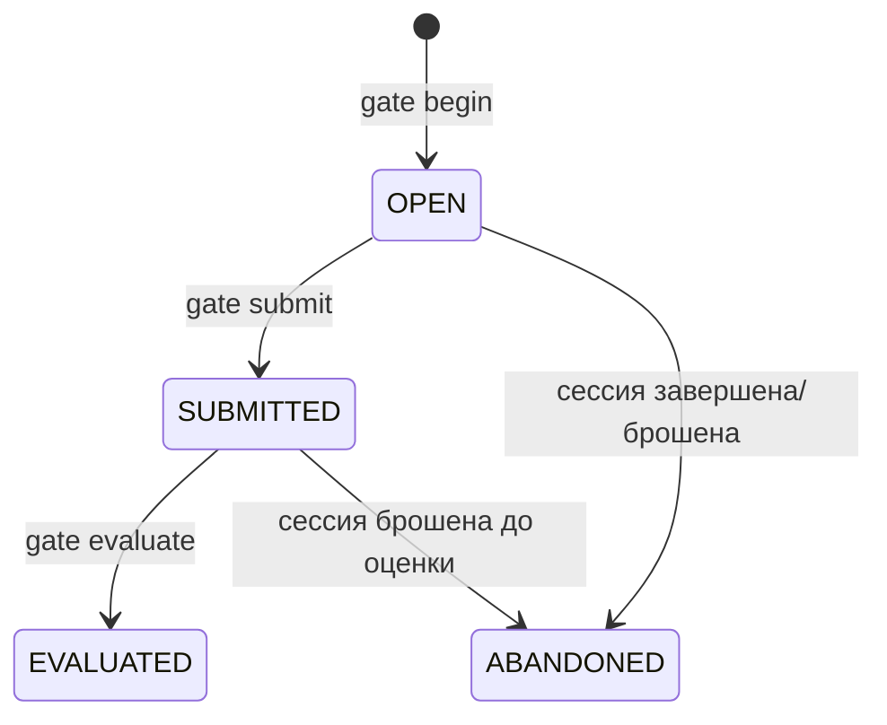

# Модуль: gates

> **Status**: current
> **Last updated**: 2026-07-20
> **Sources**: P0-4/OPEN-25 (контракт отсутствовал) · [[../glossary]] «Gate» (добровольная проверка, не барьер) · `docs/design-direction.md` §1 (обучение — гибкий разговор, без замков) · [[evidence]] (исход гейта как evidence) · [[lessons]] (гейт внутри сессии) · контракт 0.11
> **Bounded context**: `src/english_trainer/gates/`

> Спека — **target**. Фазы — тегами `[mvp]` / `[post-mvp]`. Термины — по [[../glossary]].

---

## 1. Назначение

Гейт — **добровольная формальная проверка готовности** по теме, модулю или границе уровня. Ученик может захотеть убедиться, что действительно владеет разделом, а не просто набрал зачётов по ходу разговора. Гейт даёт такую проверку в собранном виде: несколько заданий подряд, без подсказок, с явным вердиктом.

Ключевое отличие от школьной модели: **гейт ничего не открывает и не закрывает**. Он не меняет доступность тем и не является условием движения дальше. Это зеркало, а не турникет.

## 2. Сущности и состояния

| Сущность | Назначение | Ключевые поля |
|---|---|---|
| `GateAttempt` | один проход гейта | `gate_id`, `scope` (`topic` \| `module` \| `cefr_boundary`), `scope_ref`, `state`, `pinned_versions`, `started_at` |
| `GateCriteria` | что считается пройденным | versioned; порог по required dimensions, минимум независимых заданий, запрет подсказок |
| `GateOutcome` | вердикт прохода | `passed`, `per_dimension_result[]`, `evidence_refs[]`, `evaluated_at` |

## 3. Публичный API и события

| Операция / Событие | Тип | Что делает | Фаза |
|---|---|---|---|
| `begin(scope, scope_ref, session_id)` | API | открывает проход, пинит критерии и версии | `[mvp]` |
| `submit(gate_id, input)` | API | фиксирует ответы ученика как evidence | `[mvp]` |
| `evaluate(gate_id)` | API | вычисляет `GateOutcome` по pinned-критериям | `[mvp]` |
| `GATE_STARTED` / `GATE_SUBMITTED` / `GATE_EVALUATED` | publishes | жизненный цикл прохода | `[mvp]` |

## 4. Поведение

- **MUST NOT — гейт никогда не блокирует** `[mvp]`: непройденный или непройдённый вовсе гейт **не влияет** на доступность тем, на рекомендации curriculum и на состав занятия. Обучение остаётся гибким разговором (`docs/design-direction.md` §1); модель «сдай, чтобы идти дальше» отвергнута продуктово, а не отложена.
- **MUST — вход добровольный, отказ бесплатный** `[mvp]`: агент может предложить гейт, ученик вправе отказаться. Отказ не фиксируется как неуспех и не влияет ни на Mastery, ни на XP.
- **MUST — исход гейта это evidence, а не отдельная оценка** `[mvp]`: ответы проходят через [[evidence]] обычным путём и оцениваются [[scoring]] по pinned policy. Гейт **не** имеет собственной шкалы и не выставляет Mastery напрямую — иначе появился бы второй, неконтролируемый источник оценки.
- **MUST — условия строже обычных** `[mvp]`: внутри гейта подсказки запрещены, задания независимы, и `independence` в evidence проставляется соответственно. Смысл гейта в том, что он проверяет владение, а не узнавание с опорой на подсказку.
- **MUST — критерии versioned и пинятся при `begin`** `[mvp]`: `GateCriteria` фиксируются в момент открытия вместе с версиями curriculum и scoring. Активация новых критериев не меняет вердикт уже открытого прохода — то же правило не-ретроактивности, что и везде ([[curriculum]] §5).
- **MUST — терминализация вместе с сессией** `[mvp]`: незавершённый гейт при `finish`/`abandon` сессии переходит в `ABANDONED`; уже зафиксированные ответы остаются evidence, вердикт не выдумывается. `finish` при открытом гейте отклоняется по общему правилу непустого pending-set ([[lessons]] §4).
- **MUST — идемпотентность** `[mvp]`: `submit` и `evaluate` идемпотентны по `gate_id`; повторный `evaluate` возвращает прежний `GateOutcome`. На один `GateAttempt` ровно один вердикт; коррекция — только correction-событием.
- **MUST — провал не понижает состояние сверх обычных правил** `[mvp]`: неуспех на гейте даёт обычный evidence с обычными последствиями по таблице переходов ([[scoring]] §3). Дополнительного штрафа за «провал экзамена» нет — иначе ученик избегал бы добровольной проверки, и инструмент, созданный для честной картины, начал бы её искажать.
- **MUST — безопасность по active policy** `[mvp]`: содержимое гейта проверяется на `production_eligible` при выдаче ([[../OPEN]] OPEN-14), как и любой другой предъявляемый материал.

## 5. CLI-поверхность

| Команда | Что делает | Ответ |
|---|---|---|
| `trainer gate begin --scope topic --ref ID --session ID --format json` | открывает проход, пинит критерии | `gate_id`, критерии, состав |
| `trainer gate submit --gate ID --input FILE --format json` | фиксирует ответы как evidence | принято, что осталось |
| `trainer gate evaluate --gate ID --format json` | вердикт по pinned-критериям | `GateOutcome` + ссылки на evidence |

Мутирующие; требуют `--idempotency-key` ([[cli]] §4.3).

## 6. Границы

- **depends on**: [[evidence]] (фиксация и оценка ответов), [[curriculum]] (что входит в scope, критерии темы), [[lessons]] (сессия, терминализация), [[scoring]] (последствия evidence)
- **events published**: `GATE_STARTED`, `GATE_SUBMITTED`, `GATE_EVALUATED`
- **events consumed**: `SESSION_FINISHED` / `SESSION_ABANDONED` (← [[lessons]]) — для терминализации открытых проходов

Модуль не решает, когда предлагать гейт: это рекомендация [[control]] и агента.

## 7. Открытые вопросы

- **OPEN-14**: safety-overlay определяет, что допустимо включить в гейт.
- **OPEN-28**: числовые пороги `GateCriteria` (сколько независимых заданий, какой порог по dimension, что считается границей уровня) — авторские значения без калибровки; не блокируют реализацию.

## История изменений

- **2026-07-20**: создан (контракт 0.11, P0-4/OPEN-25). Гейт зафиксирован как зеркало, а не турникет: не блокирует, отказ бесплатен, провал не штрафуется сверх обычных правил. Исход — evidence обычным путём, без собственной шкалы оценки. Критерии пинятся при `begin`.
