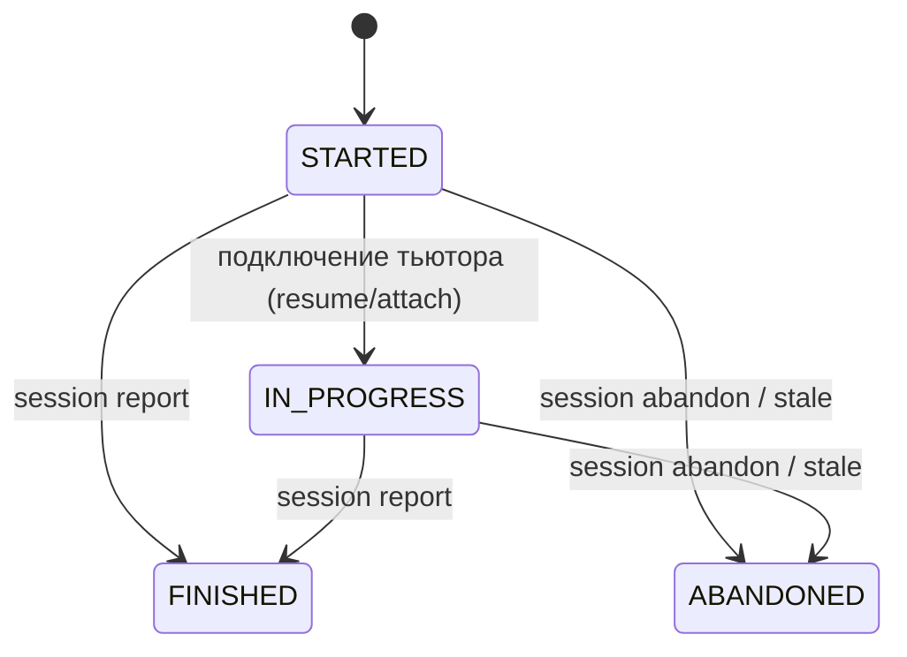
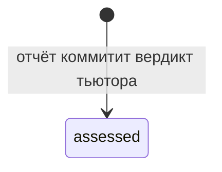

# Модуль: lessons

> **Status**: current
> **Last updated**: 2026-09-23
> **Sources**: [[../flows/session]] · [[../flows/continuation]] · [[evidence]] · [[control]] · [[../platform/foundation]] (UoW, CAS, outbox) · `staging/concepts/2026-09-23-lesson-brief-report-concept.md` (одобрен, [PD-2026-09-23]) · Concept Gate 0.5 2026-07-20 (3 развилки, [PD-2026-07-20]) · часть контракта 0.5
> **Bounded context**: `src/english_trainer/lessons/`

> Спека — **target**. Одна цель продукта, без фазовых тегов (Принцип 4). Термины — [[../glossary]]. Часть контракта 0.5 (lessons + [[assessments]]).

---

## 1. Назначение

Модуль владеет **жизненным циклом занятия**: сессия, LessonBrief, LessonReport, терминализация. Урок целиком ведёт тьютор; движок **предлагает** (brief) и **фиксирует** (report) — он не диктует шаг за шагом [PD-2026-09-23]. Он выдаёт Session Manifest и LessonBrief в начале, принимает единственный атомарный LessonReport в конце и решает, когда сессия завершена. Бизнес-правила поверх kernel-механизмов (UoW, idempotency); scoring и расписание — не здесь.

## 2. Session lifecycle

- **MUST — переход в FINISHED выполняет только отчёт** [PD-2026-09-23]: `session report` коммитит весь LessonReport одной транзакцией и **в ней же** переводит сессию в `FINISHED` — доведение каждого Attempt до `assessed`, терминальная диспозиция каждого ReviewAssignment и сам переход состояния происходят атомарно ([[evidence]] §4.3, §4d ниже). Отдельной команды `session finish` и отдельной предпосылки «pending-set пуст», проверяемой заранее, не существует: по построению отчёт не может закоммититься, оставив цель незакрытой.
- **MUST — отчёт без заданий допускается**: LessonReport с пустым `items[]` принимается **с предупреждением** и всё равно завершает сессию — тьютор мог провести занятие целиком свободным разговором без единого проверяемого задания. Отчёт без items закрывает все pending ReviewAssignment сессии как `INSUFFICIENT_EVIDENCE(reason=not_attempted)`, как и любой не упомянутый в отчёте review.
- **MUST**: конфликт `start` при активной сессии → `{error_code, allowed_actions: resume | abandon_and_start}`; выбор делает ученик. `abandon_and_start` — две независимые идемпотентные команды ([[../flows/session]], foundation §3.4).
- **MUST — stale-сессия как replayable факт** [PD-2026-07-20]: сессия без активности дольше `stale_session_days` (*tunable*, дефолт 7, теперь закреплён `lessons@2`) терминализуется как `ABANDONED`. Переход эмитится **append-only событием** `SESSION_STALE_ABANDONED {session_id, boundary_at, last_activity_at, pinned_lessons_policy}`, где `boundary_at` — детерминированный момент пересечения, **не** wall-clock запуска sweep. Replay применяет событие, а не текущее время. Sweep идемпотентен по `session_id`.
- **MUST**: терминальные состояния окончательны: `report`/`resume`/`abandon` на терминальной сессии — стабильная ошибка; identical retry возвращает cached result (foundation §3.4).
- **MUST — session fence сужен до двух команд** [PD-2026-09-23]: `expected_session_revision` требуют только `resume` и `abandon`. `report` его **не принимает и не требует**: единственность коммита обеспечивают `idempotency-key` вместе с бизнес-правилом «сессия переходит в FINISHED ровно один раз» — второй `report` на уже терминальную сессию получает стабильную ошибку терминальности, а не проверку ревизии. Узкого `plan_version` не существует: план advisory и не CAS-версионируется ([[control]] §3b). `resume` — cold-start исключение: читает текущую ревизию и атомарно увеличивает её вместе с `AGENT_ATTACHED`.
- **MUST — stale threshold versioned**: `stale_session_days` берётся из закреплённой `lessons@2`; принятый дефолт — `7`. Sweep закрывает pending ReviewAssignment и очищает active pointer одной UoW; повтор — no-op.

## 3. Attempt lifecycle [PD-2026-09-23]

- **MUST — единственное состояние**: LessonReport создаёт каждый Attempt сразу `assessed` (`status: assessed`, `assessment.basis: tutor_verdict`) внутри атомарного коммита отчёта — либо весь набор фактов записан, либо ничего (крэш до commit не оставляет черновика). Промежуточные `draft`/`recorded` — команды, которые их производили (`attempt record`, `attempt finalize`), удалены вместе с пошаговой доставкой [PD-2026-09-23]; состояния остаются валидными только для replay сессий, записанных до этого перехода ([[evidence]] §4.2).
- **MUST**: в scoring участвует только `assessed`; отчёт других состояний не производит.

## 4. Терминализация (report / abandon)

- **MUST — отчёт закрывает всё атомарно** [PD-2026-09-23]: в транзакции `session report` каждый Attempt из `items[]`/`blocks[]` фиксируется как `assessed`, каждый ReviewAssignment, на который ссылается отчёт, получает терминальную диспозицию по вердикту (`evidence@2` `review_outcome_by_verdict`, [[evidence]] §4.3), каждый упомянутый в `reviews_skipped` — `INSUFFICIENT_EVIDENCE` с названной причиной, а любой оставшийся pending — `INSUFFICIENT_EVIDENCE(reason=not_attempted)`. Отдельного pending-set-гейта, проверяемого **до** commit, не существует.
- **MUST — ABANDONED преобразует pending**: недостигнутые ReviewAssignment закрываются как `INSUFFICIENT_EVIDENCE(reason=abandoned)`; без отчёта Attempt в сессии не было — закрывать, кроме review-целей, нечего.
- **MUST — closure trigger** [PD-2026-09-23]: терминальная диспозиция ReviewAssignment закрывается ровно одним из триггеров — (1) вердикт отчёта по evidence@2-карте, (2) явный `reviews_skipped` отчёта с причиной, (3) `abandon`. Триггер `replan` (`CANCELLED`) в текущем протоколе недостижим: мид-сессионного перепланирования не существует ([[control]] §4.2). `CANCELLED` остаётся валидной веткой только для replay сессий, записанных под прежним протоколом.
- **MUST — уникальность терминальной диспозиции**: на один ReviewAssignment — ровно одна терминальная ветка (ReviewOutcome либо, исторически, `CANCELLED`). Коррекция — только correction-событием, не вторым outcome.
- **MUST — атомарность**: одной SQLite-транзакцией коммитятся `lesson.reported`, все производные факты отчёта, authoritative state + outbox; `summary` берётся из поля `LessonReport.summary` в той же UoW. **Obsidian-проекция post-commit через outbox** (foundation §3.7).
- **MUST**: терминализация FINISHED и ABANDONED одинаково пересчитывает производные (scores, расписание, XP, проекция) — рассогласованных производных не остаётся.

## 4b. Session Manifest

Манифест — то, что сессия закрепила в момент старта; он делает поведение внутри сессии воспроизводимым, даже если между стартом и завершением активная конфигурация изменилась.

- **MUST — содержимое**: `session_id`, `provider`, `mode`, `pinned_versions` (curriculum, evidence, lessons, scoring, scheduler, control, generation, obligations) — [PD-2026-09-23] **`rubric@1` больше не пинится сессией**: rubric-конвейер применяется только к placement ([[assessments]]), не к обычным занятиям — и **`required_skills[]`** — `{skill_name, version, content_hash, cli_calls[]}`. Manifest дополнительно закрепляет learner-facing `lesson_profile` и central topic. Manifest неизменяем; advisory-план **не** хранится по ссылке как живой CAS-aggregate — он собирается заново при каждом `LessonBrief` (§4c).
- **MUST — композиция в UoW старта**: `start` синхронно вызывает `control.compose_plan` **до** commit и вкладывает результат прямо в возвращаемый `LessonBrief.plan` ([PD-2026-09-23] заменяет прежнюю запись отдельного `SessionPlan`-агрегата). Отдельного шага композиции после старта не существует; `resume` пересобирает план тем же вызовом из текущего состояния.
- **MUST — режим занятия** [CTRL-11]: `start` принимает `mode` (`balanced` по умолчанию). Режимы `maintenance`/`re_entry` — единственный путь к занятию без нового материала ([[control]] §4.1).
- **MUST — `required_skills` явные** [0.7, бриф §11]: требуемые навыки перечисляются в манифесте, а не подбираются средой по описанию.
- **MUST — разрешимость при старте, синхронно до commit** [P0-Q1]: порядок строгий — `resolve` всех `required_skills` → открытие UoW → commit → `SESSION_STARTED`. `start` падает **до** создания сессии, если хоть одна затребованная версия неразрешима ([[adapters]] §4.2).
- **MUST — safety на композиции, не на доставке** [PD-2026-09-23]: `production_eligible` исключает единицы из advisory-плана в момент `compose_plan` — так же, как исключало из прежнего `SessionPlan` ([[control]] §4.1). Отдельной live-проверки перед показом задания больше нет: тьютор ведёт задание в чате свободно, и содержимое, которое он фактически использует, движку видно только постфактум, из `LessonReport.items[].prompt`/`raw_answer`. Это не ослабляет safety-каталог программы — он по-прежнему решает, что войдёт в план и в рекомендации; это честно называет то, что доставку контента вживую движок больше не гейтит, и полагается на постфактум-аудит (`audit-english-tutor`, [[evidence]] §4.2, PD-F).

## 4c. LessonBrief [PD-2026-09-23]

`LessonBrief` (`lesson_brief@1`, `lessons/brief.py::build_brief`) — единственный документ, которым движок открывает занятие. Его возвращают `session start` и `session resume`; `resume` пересобирает **тот же** brief из текущего состояния, а не читает сохранённый черновик — восстановление обрыва чата идёт через контекст Claude Code (`resume`), без локального чекпойнта (PD-B).

- **MUST — состав**: `lesson` (`profile`, `title`, `reason`, `agenda`, `language_envelope`, `duration`) · `central_topic` (`target_ref`, can-do, newness + факты программы для объяснения: `explanation`, `typical_errors`, фреймы с `frame_of`/`carries`, reconstruction text для профиля `drill`) · `reviews_due[]` (`review_id`, `target_ref`, `dimension`, `urgency`, RU-подсказка смысла) · `plan` (advisory шаги `compose_plan`, включая drill-поля) · `learner` (уровни, `known_language`, личный словарь, **реальные** недавние ошибки из `evidence.error_observed`, re-entry статус, сводка последней сессии, предпочтения — поглощает прежний Tutor briefing) · `requirements` (advisory, §4d) · `report_contract` (`report_schema: lesson_report@1`, лимиты из `lessons@2`, `brief_hash`).
- **MUST — `resume` не теряет обязательств**: незакрытые ReviewAssignment брошенной/не отчитанной сессии остаются в `reviews_due` пересобранного brief; они по-прежнему обязаны получить терминальную диспозицию через отчёт или `abandon`.
- **MUST — прямой запрос есть согласие**: явные `--profile`/`--topic`/`--theme` на `start` заменяют системную рекомендацию. [PD-2026-09-23] Проверка `--expected-proposal-hash` удалена вместе со стартом-под-CAS: прямой запрос принимается как согласие без сверки хеша устаревшего предложения, автоматическая рекомендация — как и раньше, объявляется тьютором ученику до старта через `session propose`.

## 4d. LessonReport и его приём [PD-2026-09-23]

`LessonReport` (`lesson_report@1`) — единственный документ, которым тьютор атомарно фиксирует весь урок в конце занятия. Полная схема item'ов, кодов отклонения и builders, которые превращают отчёт в события, — [[evidence]] §4.2; здесь — только session-уровневая оркестрация.

- **MUST — два вызова, не поток**: `session check-report` — read-only прогон ещё не записанного отчёта через тот же протокол приёма без побочных эффектов: по каждому item — `accepted`/`rejected` + причина, проекция эффектов (score, contributing, review outcome) и предупреждения (повторный span, неадресованные advisory-требования). `session report` — тот же протокол приёма, но с записью: атомарный коммит всего отчёта + переход сессии в `FINISHED` (§2, §4). Любой отклонённый item **отклоняет отчёт целиком** — ничего не пишется, `check-report` перед записью не обязателен, но рекомендован скиллом.
- **MUST — commit-последовательность одной UoW** ([[evidence]] §4.2 — точный порядок builders): `lesson.reported` (весь отчёт + `report_hash` + результат валидации — заменяет прежние teaching-снапшоты и session notes как provenance/аудит) → по каждому item в порядке отчёта: `session.step_presented` (`source: lesson_report`) → Attempt-агрегат + `attempt.recorded` (`status: assessed`, `assessment.basis: tutor_verdict`) → `evidence.added` (если contributing) → факты оси `automaticity` → `evidence.error_observed` на каждую ошибку item'а → по referenced review — `review.outcome` (либо явный skip → `INSUFFICIENT_EVIDENCE`) → по блокам — один `attempt.recorded`+`evidence.added` с `form: drill_block` → по `lexicon[]` — `learner.lexicon_entry_added` → `session.finished`.
- **MUST — requirements advisory, не блокирующие** [PD-2026-09-23, PD-G]: `lessons@2.requirements` (адресована ли центральная тема brief'а, адресованы ли назначенные повторения) — **только предупреждения** в ответе `check-report`/`report`. Ни `check-report`, ни `report` не отклоняют отчёт за то, что тема или повторение не были адресованы; единственная причина полного отказа — хотя бы один `rejected` item ([[evidence]] §4.2 — коды отклонения).
- **MUST — без session-revision токена**: `report` не принимает `--expected-session-revision` (§2). Повторный вызов с тем же `--idempotency-key` возвращает кэшированный результат; вызов на уже терминальную сессию — стабильная ошибка терминальности.

## 5. Публичный API и события

| Операция / Событие | Тип | Что делает |
|---|---|---|
| `propose(duration?, profile?, topic?, theme?)` | API (read-only) | возвращает LessonProposal; ничего не резервирует и не меняет |
| `start(duration?, provider, mode?, profile?, topic?, theme?)` | API | создаёт сессию + Session Manifest (pinned versions + `required_skills` + central topic + advisory-план); возвращает `{session_id, brief}` |
| `resume(session_id)` | API | до attach разрешает точные `(skill_name, version, content_hash)`, затем возвращает полное состояние + пересобранный **тот же** LessonBrief ([[../flows/continuation]]) |
| `check_report(session_id, report)` | API (read-only) | прогоняет LessonReport через протокол приёма без записи; per-item accepted/rejected + эффекты + предупреждения (§4d) |
| `report(session_id, report, idempotency_key)` | API (mutating) | атомарный коммит всего LessonReport + `session.finished` (§4d) |
| `abandon(session_id, expected_session_revision)` | API | идемпотентная терминализация без summary |
| `SESSION_STARTED` / `FINISHED` / `ABANDONED` / `SESSION_STALE_ABANDONED` | publishes | lifecycle-факты |
| `lesson.reported` (`LESSON_REPORTED`) | publishes | весь отчёт + `report_hash` + результат валидации; provenance/аудит; заменяет teaching-снапшоты и session notes [PD-2026-09-23] |
| `session.step_presented` (`STEP_PRESENTED`) | publishes | по каждому item'у отчёта, `source: lesson_report`; факт того, что задание дошло до тьютора, зафиксированный постфактум ([[../glossary]]) |
| `attach_agent(session_id, provider, skills)` | API | фиксирует подключение агента к сессии |
| `AGENT_ATTACHED` | publishes | к сессии подключился агент: провайдер, версии skills, момент ([[../flows/continuation]]) |

- **MUST — session facade не второй владелец алгоритма композиции**: `start`/`resume` вызывают `control.compose_plan` за готовым advisory-планом; нормативное поведение композиции (буксеты, классификация, saturation, diversity, availability) живёт только в [[control]].
- **MUST — владелец `AGENT_ATTACHED` — lessons** [P0-5]: событие сессионное, поэтому живёт здесь, а не в audit; audit его только читает.
- **MUST — подключение фиксируется теми же командами, что и вход в сессию** [R-3]: `--provider` обязателен у `session start` и `session resume`, и `attach_agent` вызывается **в той же UoW**, что и сама операция. Отдельной CLI-команды `session attach` **нет** намеренно.
- **MUST — exact skill preflight на resume [PD-2026-07-23]**: до `AGENT_ATTACHED` каждая тройка `(skill_name, version, content_hash)` из Manifest должна разрешиться в active package или immutable archive. Промах не мутирует сессию и направляет к `skills sync`.
- **MUST — предпочтения в brief** [PD-2026-09-22, синхронизировано PD-2026-09-23]: `start` и `resume` включают действующий снимок `LearnerPreferences` как `brief.learner.preferences` ([[learner]] §4a) в том же документе.

## 6. CLI-поверхность

| Команда | Что делает |
|---|---|
| `trainer session propose [--duration-minutes N] [--profile P] [--topic ID] [--theme TEXT] --format json` | read-only название, причина, agenda, language envelope и `proposal_hash` |
| `trainer session start [--duration-minutes N] --provider X [--mode balanced\|maintenance\|re_entry] [--profile P] [--topic ID] [--theme TEXT] --format json` | старт; возвращает `{session_id, brief}`. [PD-2026-09-23] `--expected-proposal-hash` удалён |
| `trainer session resume --session ID --provider X --format json` | состояние + пересобранный LessonBrief; фиксирует `AGENT_ATTACHED` |
| `trainer session check-report --session ID --file report.json --format json` | read-only проверка LessonReport до записи: per-item accepted/rejected + причины + эффекты + предупреждения |
| `trainer session report --session ID --file report.json --idempotency-key K --format json` | атомарная запись всего отчёта + `session.finished`; отклонённый хотя бы один item → отказ целиком, без `--expected-session-revision` |
| `trainer session abandon --session ID --expected-session-revision R` | идемпотентная терминализация |
| `trainer session status --session ID --format json` | read-only снимок активной сессии (`cli/app.py::session_status`) |

[PD-2026-09-23] Удалены (пошаговая доставка): `session next/peek/replan/finish`, `teaching rendered`, `exercise rendered/prepare/render-prepared`, `attempt record/record-block/finalize`, `observed record`, `review close`.

Ошибки: `error_code` + причины + `allowed_actions` + `next_action`; отдельно бизнес-postconditions и lifecycle/concurrency/idempotency ([[../flows/session]]).

## 7. Границы

- **depends on**: kernel (UoW, CAS, idempotency, outbox), evidence (attempt/evidence/review builders отчёта), control (advisory `compose_plan`), scheduler (due-повторения в brief), scoring (пересчёт), curriculum (рекомендации, pinned versions), learner (brief, XP, lexicon).
- **events published**: см. §5.
- **consumed by**: cli, adapters/skills, memory (проекция на терминализации), audit.

## 8. Открытые вопросы

Закрывает **OPEN-10** и **OPEN-11**: Attempt/session lifecycle, терминализация, uniqueness и session fence реализованы под brief/report протоколом. Точный триггер `STARTED → IN_PROGRESS` (подключение тьютора против первого отчёта) и это разбиение реконструируются в ходе реализации (W2) — здесь описана целевая форма перехода, владелец сверит её с кодом после сдачи волны.

## История изменений

- **2026-09-23**: [PD-2026-09-23] переход на протокол «задание → отчёт»: §2–§6 переписаны — жизненный цикл сессии переводит в FINISHED только `LessonReport`; Attempt рождается сразу `assessed`; пошаговая доставка (`next/peek/replan`, teaching/exercise rendering, `attempt record[-block]/finalize`, `observed record`, `review close`) удалена; session fence сужен до `resume`/`abandon`; добавлены §4c LessonBrief и §4d LessonReport; CLI-поверхность заменена на `propose/start/resume/check-report/report/abandon/status`. Requirements объявлены advisory (PD-G). Safety проверяется на композиции плана, не на доставке контента — постфактум-аудит вместо live-гейта.
- **2026-09-22 (3)**: [PD-2026-09-22] §4b дополнен: rubric-facing `step_type` формы, которой нет в `allowed_step_types` закреплённой rubric, разрешается при рендере и сохраняется в `EXERCISE_RENDERED` полем `rubric_step_type` (входит в content hash; отсутствует у форм, которые rubric перечисляет сама). Без него `timed_writing`/`reconstruction` рендерились, но не могли быть оценены. *(Историческое: `EXERCISE_RENDERED` и rubric-resolution занятий ретайрены [PD-2026-09-23].)*
- **2026-09-22 (2)**: [PD-2026-09-22] нормативный порядок шага сокращён до `session next → exercise rendered → показ → attempt record [observations] [--close-review]`: `session peek` обязателен только после `resume`/конфликта, `exercise prepare`/`render-prepared` объявлены MAY, `attempt finalize`/`review close` — fallback. Ответ `session next` дополнен `composition_revision` и `steps_remaining`. *(Историческое: весь пошаговый протокол ретайрен [PD-2026-09-23].)*
- **2026-09-22**: [PD-2026-09-22] добавлены `attempt record --latency-ms`, `attempt record-block` (один Attempt на дрилл-блок по тому же порядку `peek → next → exercise rendered → показ → фиксация`), `briefing.preferences` на start/resume и требование хранить `declared_limit_seconds` timed-формы внутри immutable `EXERCISE_RENDERED`. Профиль `drill` доступен через существующий `session start --profile`.
- **2026-07-24**: [PD-2026-07-24] добавлены private exercise preparation и learner-bridge `turn submit`; draft не меняет learner state и материализуется только после совпавшего delivered candidate. *(Историческое: private preparation ретайрена вместе с рендерингом [PD-2026-09-23].)*
- **2026-07-23**: [PD-2026-07-23] добавлены LessonProposal/LessonArc, `teaching rendered`, возврат актуальной дуги/teaching/known-language в status/resume и нормативный порядок `peek → next → render → display → attempt`.
- **2026-07-22 (3)**: [PD-2026-07-22] принят coarse session fence: все публичные мутации требуют `expected_session_revision`, `next/replan` сохраняют второй `plan_version`; stale threshold вынесен в `lessons@1`.
- **2026-07-22 (2)**: П.5 применена [PD-2026-07-22] — rubric resolution при рендере: explicit/exact-default ref против pinned rubric-версии манифеста, rubric_input_hash в EXERCISE_RENDERED, без active/alias fallback; unrendered conversation — default при assessment.
- **2026-07-22**: фазовые теги `[mvp]`/`[post-mvp]` сняты [PD-2026-07-22]: спека описывает одну цель продукта, порядок и статус — только в roadmap (Принцип 4).
- **2026-07-21**: синхронизированы терминальная диспозиция `ReviewOutcome | CANCELLED` и единый CAS-протокол `plan_version` для `peek → next/replan`.
- **2026-07-20 (0.7)**: добавлен §4b — содержимое Session Manifest и **`required_skills`** с версиями. Поле требовалось брифом §11 и [[adapters]], но нигде не было объявлено: манифест упоминался только как «pinned versions». Без него Tutor Compliance ([[scoring]] §5) не имеет базы для обязательства «вызван нужный skill нужной версии».
- **2026-07-20**: создан (контракт 0.5, часть 1). Attempt `draft→recorded→assessed` и stale-сессия как replayable событие [PD-2026-07-20]; closure trigger, uniqueness поверх CAS, атомарная терминализация с post-commit проекцией.
