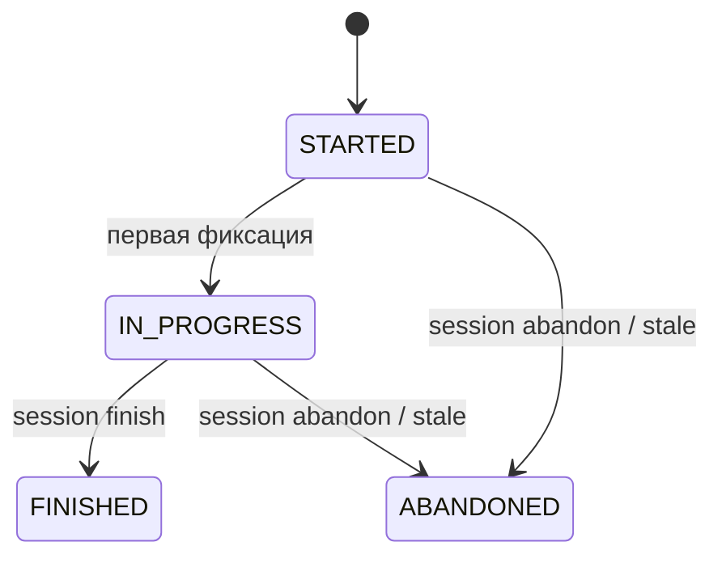
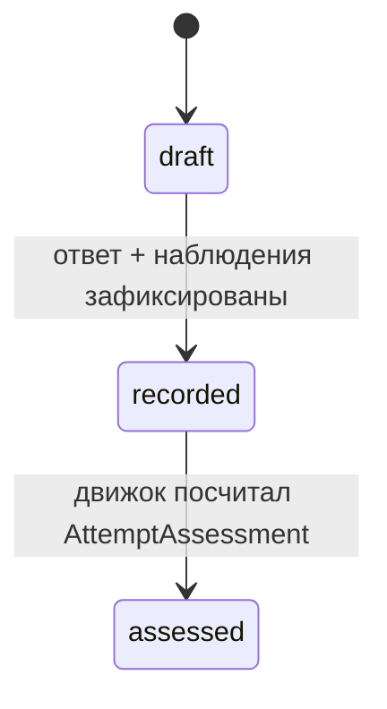

# Модуль: lessons

> **Status**: current
> **Last updated**: 2026-07-20
> **Sources**: [[../flows/session]] · [[../flows/continuation]] · [[evidence]] · [[../platform/foundation]] (UoW, CAS, outbox) · Concept Gate 0.5 2026-07-20 (3 развилки, [PD-2026-07-20]) · часть контракта 0.5
> **Bounded context**: `src/english_trainer/lessons/`

> Спека — **target**. Фазы `[mvp]`/`[post-mvp]`. Термины — [[../glossary]]. Часть контракта 0.5 (lessons + [[assessments]]).

---

## 1. Назначение

Модуль владеет **жизненным циклом занятия**: сессия, Attempt, терминализация. Он выдаёт Session Manifest, принимает фиксации, решает, когда сессия завершена, и атомарно применяет завершение. Бизнес-правила поверх kernel-механизмов (UoW/CAS/idempotency); scoring и расписание — не здесь.

## 2. Session lifecycle

- **MUST**: конфликт `start` при активной сессии → `{error_code, allowed_actions: resume | abandon_and_start}`; выбор делает ученик. `abandon_and_start` — две независимые идемпотентные команды ([[../flows/session]], foundation §3.4).
- **MUST — stale-сессия как replayable факт** [PD-2026-07-20]: сессия без активности дольше `stale_session_days` (*tunable*, дефолт 7) терминализуется как `ABANDONED`. Переход эмитится **append-only событием** `SESSION_STALE_ABANDONED {session_id, boundary_at, last_activity_at, pinned_lessons_policy}`, где `boundary_at` — детерминированный момент пересечения (из `last_activity_at` + порог), **не** wall-clock запуска sweep. Replay применяет событие, а не текущее время. Sweep идемпотентен по `session_id` (сессия терминальна ровно один раз).
- **MUST**: терминальные состояния окончательны: `finish`/`resume`/`abandon` на терминальной сессии — стабильная ошибка; identical retry возвращает cached result (foundation §3.4).

## 3. Attempt lifecycle [PD-2026-07-20]

- **MUST**: три состояния — `draft` (начат, не доведён), `recorded` (raw answer + observations сохранены), `assessed` (движок вычислил AttemptAssessment, [[evidence]]). Разделение `recorded`/`assessed` нужно для recovery: крэш между фиксацией и оценкой различим.
- **MUST**: в scoring участвует только `assessed`; `draft` и `recorded` — нет.
- **MUST — finalize/recover**: `finalize_attempt` идемпотентен; при resume сессия отдаёт незавершённые attempts с их состоянием, и `recover` доводит `draft`→`recorded`→`assessed` без дублей (kernel idempotency, OPEN-11).

## 4. Терминализация (finish / abandon)

- **MUST — FINISHED требует пустой pending-set**: все attempts `assessed`, все ReviewAssignment имеют ReviewOutcome. Иначе finish отклоняется бизнес-ошибкой (это **не** авто-закрытие).
- **MUST — ABANDONED преобразует pending**: недостигнутые ReviewAssignment закрываются как `INSUFFICIENT_EVIDENCE(reason=abandoned)`, re-entry-блок получает свой outcome, `draft`/`recorded` attempts закрываются без вклада в scoring.
- **MUST — closure trigger** [OPEN-10, rereview R-5, P0-2/R-4]: второй триггер закрытия ReviewAssignment (наряду с явным `close_review`) — **`abandon`**, а не терминализация вообще. `finish` целей не закрывает: он требует уже пустой pending-set. Правило закрытия — [[evidence]] §4.3, триггер — здесь.
- **MUST — уникальность терминального outcome** [OPEN-11 бизнес-часть]: на один ReviewAssignment ровно один ReviewOutcome. Правило строится **поверх** kernel-CAS (multi-aggregate expected-revisions, foundation §3.5); два агента не могут записать конфликтующие исходы. Коррекция — только correction-событием, не вторым outcome.
- **MUST — атомарность**: одной SQLite-транзакцией коммитятся authoritative state + events + outbox; `summary` — engine-generated в той же UoW (агент может передать `--summary-draft`); **Obsidian-проекция post-commit через outbox** (foundation §3.7). Различие FINISHED/ABANDONED — только полнота summary и способ закрытия pending.
- **MUST**: терминализация FINISHED и ABANDONED одинаково пересчитывает производные (scores, расписание, XP, проекция) — рассогласованных производных не остаётся.

## 4b. Session Manifest [0.7]

Манифест — то, что сессия закрепила в момент старта; он делает поведение внутри сессии воспроизводимым, даже если между стартом и завершением активная конфигурация изменилась.

- **MUST — содержимое**: `session_id`, `provider`, `pinned_versions` (curriculum, scoring, scheduler, generation, rubric) и **`required_skills[]`** — пары `{skill_name, version}`.
- **MUST — `required_skills` явные** [0.7, бриф §11]: требуемые навыки перечисляются в манифесте, а не подбираются средой по описанию. Implicit invocation делает поведение невоспроизводимым между Codex и Claude Code и лишает [[scoring]] §5 базы для Tutor Compliance: обязательство «вызван нужный skill нужной версии» проверяемо только против явного списка.
- **MUST — разрешимость при старте, синхронно до commit** [P0-Q1]: порядок строгий — `resolve` всех `required_skills` → открытие UoW → commit → `SESSION_STARTED`. `start` падает **до** создания сессии, если хоть одна затребованная версия неразрешима ([[adapters]] §4.2). Post-commit consumer `SESSION_STARTED` в [[adapters]] — только аудит уже обеспеченного инварианта, а не сама проверка: проверка по событию произошла бы после создания сессии и нарушила бы это MUST.
- **MUST — safety не пинится**: манифест закрепляет структуру и scoring, но не safety; `production_eligible` проверяется по active policy при доставке ([[../OPEN]] OPEN-14).

## 5. Публичный API и события

| Операция / Событие | Тип | Что делает | Фаза |
|---|---|---|---|
| `start(duration?, provider)` | API | создаёт сессию + Session Manifest (pinned versions + `required_skills`) | `[mvp]` |
| `resume(session_id)` | API | полное состояние сессии + tutor briefing ([[../flows/continuation]]) | `[mvp]` |
| `abandon(session_id)` | API | идемпотентная терминализация без summary | `[mvp]` |
| `finish(session_id, summary_draft?)` | API | проверка postconditions → атомарная терминализация | `[mvp]` |
| `SESSION_STARTED` / `FINISHED` / `ABANDONED` / `SESSION_STALE_ABANDONED` | publishes | lifecycle-факты | `[mvp]` |
| `ATTEMPT_STATE_CHANGED` | publishes | draft/recorded/assessed | `[mvp]` |
| `attach_agent(session_id, provider, skills)` | API | фиксирует подключение агента к сессии | `[mvp]` |
| `AGENT_ATTACHED` | publishes | к сессии подключился агент: провайдер, версии skills, момент ([[../flows/continuation]]) | `[mvp]` |

- **MUST — владелец `AGENT_ATTACHED` — lessons** [P0-5]: событие сессионное, поэтому живёт здесь, а не в audit; audit его только читает. Flow [[../flows/continuation]] требовал события, но ни один owner его не публиковал — обязательство flow без владельца не исполнимо.
- **MUST — подключение фиксируется теми же командами, что и вход в сессию** [R-3]: `--provider` обязателен у `session start` и `session resume`, и `attach_agent` вызывается **в той же UoW**, что и сама операция. Отдельной CLI-команды `session attach` **нет** намеренно: она позволила бы объявить агента подключённым к сессии, которую он не загрузил, и создать состояние, где `AGENT_ATTACHED` есть, а briefing агент не получал. Смена агента на холодную — это `resume` с новым `--provider`.
- **MUST — session notes untrusted** [P0-5]: заметка агента (`--note` при любой фиксации) — свободный текст с автором и меткой времени; она **не evidence**, не влияет на scoring и не участвует в mastery. Схему и хранение владеет [[evidence]] §3 вместе с attempt; здесь — только факт, что фиксация может её нести.

## 6. CLI-поверхность

| Команда | Что делает |
|---|---|
| `trainer session start [--duration N] [--provider X] --format json` | старт или конфликт с `allowed_actions` |
| `trainer session resume --session ID --provider X --format json` | состояние + briefing + notes; фиксирует `AGENT_ATTACHED` |
| `trainer session abandon --session ID` | идемпотентная терминализация |
| `trainer session finish --session ID [--summary-draft FILE]` | завершение с postconditions |
| `trainer attempt record --session ID --input FILE [--note "..."]` | фиксация attempt + наблюдений; `--note` — untrusted-заметка ([[evidence]] §3) |

Ошибки: `error_code` + причины + `allowed_actions` + `next_action`; отдельно бизнес-postconditions и lifecycle/concurrency/idempotency ([[../flows/session]]).

## 7. Границы

- **depends on**: kernel (UoW, CAS, idempotency, outbox), evidence (attempt/outcome), scheduler (манифест, перепланирование), scoring (пересчёт), curriculum (рекомендации, pinned versions), learner (briefing, XP).
- **events published**: см. §5.
- **consumed by**: cli, adapters/skills, memory (проекция на терминализации), audit.

## 8. Открытые вопросы

Закрывает **OPEN-10** (Attempt machine, closure trigger, терминализация) и бизнес-часть **OPEN-11** (uniqueness). Остаётся калибровка `stale_session_days`.

## История изменений

- **2026-07-20 (0.7)**: добавлен §4b — содержимое Session Manifest и **`required_skills`** с версиями. Поле требовалось брифом §11 и [[adapters]], но нигде не было объявлено: манифест упоминался только как «pinned versions». Без него Tutor Compliance ([[scoring]] §5) не имеет базы для обязательства «вызван нужный skill нужной версии».
- **2026-07-20**: создан (контракт 0.5, часть 1). Attempt `draft→recorded→assessed` и stale-сессия как replayable событие [PD-2026-07-20]; closure trigger, uniqueness поверх CAS, атомарная терминализация с post-commit проекцией.
