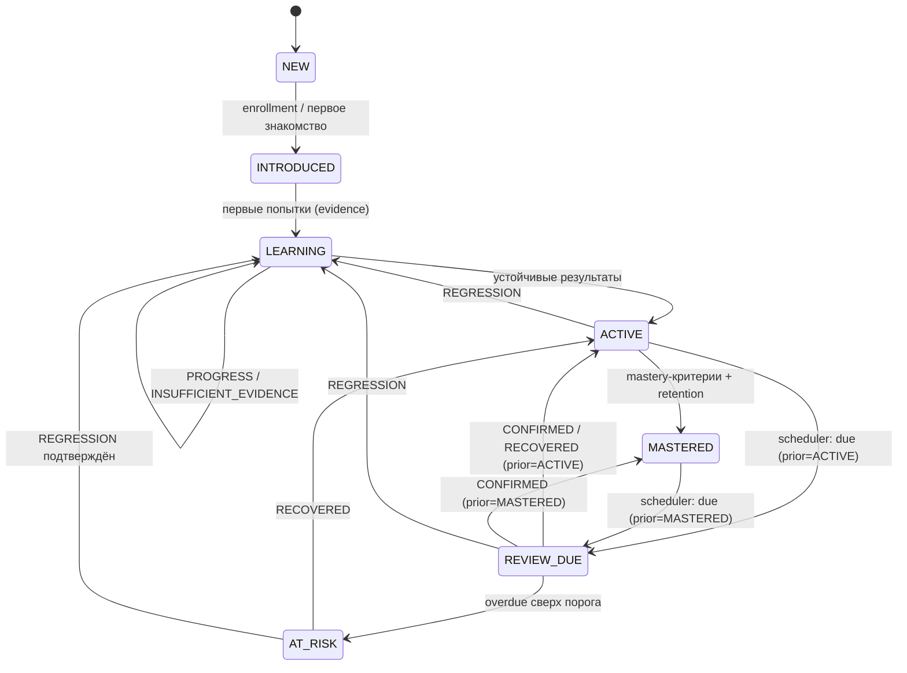

# Learning Model Requirements

> **Status**: current
> **Last updated**: 2026-07-19
> **Sources**: `docs/design-direction.md` (v0.2) · бриф §6–§10 · `staging/journal/2026-07-19-concept-v02-and-wiki.md` и `staging/journal/2026-07-19-concept-review-triage.md` (Concept Gate + red-team триаж, решения [PD-2026-07-19]) · концепт одобрен пользователем («ок») 2026-07-19
> **Роль**: продуктовый контракт учебной модели (roadmap 0.1). Определяет, ЧТО измеряется и подтверждается. Численные формулы — 0.4 (OPEN-1); anti-gaming/coverage/confidence — 0.4 (OPEN-7/8); XP-ledger — 0.4 (OPEN-12); Informal-профиль — 0.4 (OPEN-13); lifecycle/pinning — 0.5/0.2 (OPEN-9/10); содержание программы — фаза П.

> Спека — **target**. Фазы — тегами `[mvp]` / `[post-mvp]`. Термины — по имени из [[../glossary]].

---

## 1. Рамки модели

Обучение — гибкий разговор с носителем, а не школа: движок — навигатор и память, ученик и агент свободны в выборе тем. При этом знание подтверждается только через evidence, а состояние меняет только движок. Эта спека фиксирует систему измерения, которая делает свободный формат честным.

## 2. Модальности и skill dimensions

- **MUST**: MVP покрывает только текстовые модальности: reading, writing, grammar, vocabulary, письменная спонтанная речь (chat-style production).
- **MUST NOT**: выставлять любые оценки по listening и speaking, в том числе прокси-оценки. Непокрытая модальность помечается как «не измеряется», не как ноль.
- **MUST**: каждая тема отслеживается по dimensions:
  - `recognition` — узнавание конструкции/слова в тексте;
  - `controlled_production` — применение в заданном упражнении;
  - `spontaneous_production` — самостоятельное употребление в свободной переписке/разговоре;
  - `transfer` — перенос в новый контекст (другая тема разговора, рабочий сценарий).
- **SHOULD**: программа задаёт required dimensions per topic; не каждой теме нужны все четыре.

## 3. Evidence-модель

- **MUST**: каждая оценка имеет сохранённое evidence: исходный текст ученика, задание/контекст, тип задания, оценка, обоснование, версии policy/rubric, idempotency key.
- **MUST NOT**: считать упоминание темы, пассивное согласие или пересказ правила за evidence.
- **MUST — семантическая идентичность и multi-credit** [PD-2026-07-19, ревью C-3]: idempotency key защищает только транспорт; помимо него evidence имеет семантическую идентичность (hash source-span ответа/цитаты, item-exposure ID упражнения). Один source-span засчитывается **не более чем раз** на пару (LearningTarget, dimension); переотправка того же ответа/цитаты/упражнения с новыми ключами и session ID не создаёт нового evidence. Правила admissibility, независимости (новый prompt/контекст/интервал) и multi-credit allocation — механизм в 0.4/0.2 ([[../OPEN]] OPEN-7).
- **MUST — классификацию считает движок** [ревью A-1/C-1]: агент передаёт только проверяемые наблюдения (raw answer, контекст, hints, rubric-observations); итоговый review outcome вычисляет движок по versioned policy. Клиентская готовая классификация запрещена.
- Источники evidence:
  1. **объективные задания** — проверяются кодом (выбор, трансформация, порядок слов, cloze) `[mvp]`;
  2. **rubric-оценки письма** — агент даёт rubric-observations по versioned rubric; scoring считает движок `[mvp]`;
  3. **подмешанные проверки** (ReviewAssignment) — движок выдаёт в Session Manifest цели с `review_id`, ReviewTarget, dimension и критериями; агент встраивает их в разговор и фиксирует наблюдения `[mvp]`;
  4. **скрытые подтверждения** — агент фиксирует спонтанное корректное/некорректное употребление активной темы через CLI с цитатой; source-span цитаты уникален (см. выше) `[mvp]`.
- **MUST**: результат каждого повторения классифицируется движком: `PROGRESS / CONFIRMED / REGRESSION / RECOVERED / INSUFFICIENT_EVIDENCE` ([[../glossary]]).
- **Правило rubric-оценок [PD-2026-07-19]**:
  - **MUST**: вклад rubric-оценок в Mastery ограничен (cap — численно в 0.4);
  - **MUST**: повышение состояния на основании rubric-evidence требует повторяемости минимум в двух **независимых** сессиях; «разная сессия» сама по себе не доказывает независимость (независимость — по новому контексту/интервалу, ревью C-2, [[../OPEN]] OPEN-7);
  - **MUST**: одна оценка агента не меняет состояние темы и не двигает уровень.

## 4. Mastery, Stability, Retrievability

Принципы (формула — OPEN-1, контракт 0.4):

- **MUST**: `Mastery` 0–100 на тему + score по каждой required dimension; `Stability` в днях; `Retrievability` 0–1 с угасанием со временем.
- **MUST**: прирост Mastery за одну сессию ограничен; одна удачная попытка не переводит тему в MASTERED.
- **MUST**: оценка учитывает сложность, самостоятельность, подсказки, режим (объективное задание / rubric / спонтанное употребление), временной интервал и повторяемость.
- **MUST**: Mastery и уровень не зависят от дисциплины (пропусков, streak) — знание и мотивация разделены.
- **MUST**: scoring детерминирован и воспроизводим replay'ем событий.

### Состояния темы

Knowledge state отражает только знание (определения — [[../glossary]]). Рекомендации движка («стоит ли браться») — отдельный вычисляемый атрибут, не состояние [PD-2026-07-19: замков нет].

**Два раздельных слоя [PD-2026-07-19, ревью D-3]:**
- **knowledge state** — меняется только движком по evidence;
- **review status** (`due`/`overdue`) — служебный scheduling-слой, управляется часами и scheduler. Просрочка — это review status; переход knowledge state в `AT_RISK` из-за долгой просрочки применяет движок по versioned policy (clock-триггер разрешён явно, это не evidence-переход).

`REVIEW_DUE` в диаграмме ниже — knowledge state темы, к которой scheduler выставил review status `due`; при этом сохраняется предыдущее устойчивое состояние (ACTIVE или MASTERED), чтобы подтверждение его восстанавливало.

- **MUST**: переходы knowledge state выполняет только движок; `LOCKED` из брифа исключён — вместо него флаг рекомендации `recommended / early` (раннее знакомство допустимо всегда).
- **MUST — restore-on-confirm** [ревью D-1]: `REVIEW_DUE`, пришедший из `MASTERED`, при `CONFIRMED` возвращается в `MASTERED` (не демотируется). Движок хранит prior steady state.
- **MUST — тотальность** [ревью D-2]: для каждой пары `(knowledge state, review outcome)` определён исход, включая no-op (`INSUFFICIENT_EVIDENCE` обычно оставляет состояние). Полная таблица переходов — контракт 0.4 ([[../OPEN]] OPEN-10); диаграмма показывает основные ветки.
- **MUST — INTRODUCED = enrollment** [ревью D-6]: `INTRODUCED` означает взятие в отслеживание (Mastery 0), не доказательство знания. Enrollment-триггеры (просьба запомнить, пометка «полезно») дают INTRODUCED, но не evidence и не двигают выше.

## 5. Рабочий уровень (CEFR)

- **MUST**: отдельные уровни по core skills (Grammar, Vocabulary, Reading, Writing); общий working estimate вычисляется консервативно — не выше самого слабого core-навыка более чем на полступени.
- **MUST**: уровень меняет только движок по накопленному evidence тем соответствующего уровня.
- **MUST — coverage, не выборка** [PD-2026-07-19, ревью C-4]: повышение CEFR-уровня требует покрытия, а не нескольких лёгких тем: минимальное число независимых тем и ширина dimensions уровня, confidence floor. Непроверенная область трактуется как **unknown**, а не как отсутствие слабости; unknown не поднимает уровень. Матрица покрытия и пороги — контракт 0.4 ([[../OPEN]] OPEN-8).
- **MUST — самооценка отдельно** [PD-2026-07-19, ревью A-2]: самооценка (например при отказе от placement) хранится как `self_reported_level` и даёт только provisional working estimate; измеренный CEFR требует evidence. Самооценка не смешивается с измеренным уровнем и полностью перекрывается первым допустимым evidence.
- **MAY**: добровольный CEFR boundary gate как подтверждение перехода — по инициативе ученика или рекомендации движка; непройденный gate ничего не блокирует, результат идёт в evidence.
- **MUST**: оценка позиционируется как внутренняя CEFR-aligned, не сертификация.
- **MUST — Informal ↔ CEFR** [PD-2026-07-19, ревью C-5/H-1]: evidence помечается `contribution_scope` ([[../glossary]]). Recognition сленга/мемов/жаргона **никогда** не засчитывается в CEFR. Уместное письменное **производство** в реальном рабочем контексте (Slack/GitHub/переписка) может давать компонент writing/transfer через `contribution_scope`, но с dedup и cap — один source-span не засчитывается одновременно в informal-профиль и CEFR сверх cap. Владение informal ведётся отдельным профилем **Informal Online Competence** с собственной шкалой ([[lexical-system]] §3b, механизм — [[../OPEN]] OPEN-13).

## 6. Placement [PD-2026-07-19]

- **SHOULD** `[mvp]`: короткий текстовый placement, целевая медиана ~30–40 минут (time-box/число items — контракт assessments; `~` не проверяемо как MUST, ревью E-9): grammar, vocabulary, reading — объективно; writing — короткий фрагмент по rubric.
- **MUST — потолок** [PD-2026-07-19, ревью D-9]: placement выдаёт объективно проверенным темам максимум `ACTIVE`, **никогда `MASTERED`** (нет retention во времени); writing из одного rubric-фрагмента — только provisional (полный writing-уровень — ≥2 независимых items в сессиях).
- **MUST**: результат — стартовые оценки по навыкам с пометкой `low-confidence`; confidence повышается rolling-уточнением по evidence первых сессий. Точное окно, coverage и снижение confidence — versioned policy, контракт 0.4 ([[../OPEN]] OPEN-8), не «после 3–5» на глаз.
- **MUST**: deterministic seed и минимум две формы теста; exposure-history и cooldown повторных прохождений — [[../flows/placement]] / [[../OPEN]] OPEN-17.
- **SHOULD**: повторный placement по запросу ученика; после длительного перерыва движок предлагает re-entry тест (§7), не полный placement.
- Полный placement из брифа (веса разделов, несколько сессий) — `[post-mvp]`.

## 7. Повторения и re-entry

- **MUST** `[mvp]`: базовые интервалы `1 → 3 → 7 → 14 → 30 → 60 → 120 → 180` дней, адаптация по результату; интерфейс scheduler отделён от формулы (FSRS — `[post-mvp]`).
- **MUST — время** [PD-2026-07-19, ревью G-10]: всё хранится в UTC-инстантах; у ученика настраиваемая IANA-таймзона. Интервалы повторений считаются по **прошедшему времени** (elapsed 24h), не по календарю. Streak — по локальной календарной дате (§8).
- **MUST**: повторение бывает явным (тест/упражнение), подмешанным (`review_id` в Session Manifest) и скрытым (conversation evidence).
- **MUST NOT**: блокировать темы из-за overdue backlog; backlog влияет только на рекомендации и состав Session Manifest.
- **Re-entry протокол [PD-2026-07-19]**:
  - **MUST**: после перерыва длиннее порога (policy, значение в 0.4) или при падении средней Retrievability приоритетных тем ниже порога движок формирует re-entry рекомендацию: начать сессию с быстрого повторения или короткого теста остаточных знаний;
  - **MUST**: агент обязан предложить re-entry блок первым шагом сессии;
  - **MUST**: отказ ученика допустим, ничего не блокирует и не штрафуется; результат re-entry обновляет Retrievability и план повторений.

## 8. Мотивация [PD-2026-07-19]

- **MUST**: XP начисляется за практику: выполненные задания, evidence, закрытые повторения, re-entry блоки. **Штрафов и списаний XP нет** (Season — только период агрегации отображения, [[../glossary]]).
- **MUST — award-once** [ревью A-6/C-7/E-6]: XP начисляется через immutable award-event с уникальным source ID; один source event даёт начисление ровно один раз, независимо от replay; определены единицы, eligibility (в т.ч. для ABANDONED) и caps. XP-ledger, шкалы Learning Score и Tutor Compliance Score — контракт 0.4 ([[../OPEN]] OPEN-12). «Выполнено»/«закрыто» опираются на review outcome и finalization, не на факт вызова.
- **MUST**: streak — счётчик подряд идущих дней практики по **локальной календарной дате** ученика; прерывание обнуляет счётчик, накопленный XP и достижения не сгорают.
- **MUST**: XP/streak не влияют на Mastery, уровень и рекомендации тем.
- Показатели раздельны: `Learning Score` (владение программой), `XP/streak` (практика), `Tutor Compliance Score` (соблюдение программы агентом).

## 9. Требования к программе как источнику генерации уроков

Программа проектируется заранее целиком [PD-2026-07-19]; уроки и упражнения генерятся агентом по ней (гибридная контент-модель, банк растёт из сессий). Чтобы генерация была корректной, каждая тема программы **MUST** содержать:

- стабильный ID (`grammar.present-perfect.result`) и CEFR-уровень;
- учебные цели в форме can-do;
- required dimensions и `mastery_criteria` по каждой — по versioned schema из контракта 0.4 (ревью E-1; критерий по каждой required dimension обязателен, наличие проверяет валидатор);
- advisory prerequisites (`strong`/`soft` — сила рекомендации, не замок);
- типовые ошибки (в т.ч. характерные для русскоязычных);
- примеры целевых конструкций;
- связанный лексикон темы — ссылки на LexicalItem ([[lexical-system]]);
- рабочие контексты (AI, AEC, SaaS, переписка);
- ограничения языка объяснений (уровень английского, когда допустим русский).

Требования к банку упражнений:

- **SHOULD**: удачное сгенерированное упражнение сохраняется с метаданными (тема, dimension, сложность, происхождение, версия policy); критерии «удачности», lifecycle `generated → accepted/rejected` и dedup — policies П.3 ([[../OPEN]] OPEN-16, ревью E-4);
- **SHOULD**: банк переиспользуется для повторений и retention-проверок;
- **MUST**: банк — не условие старта; пустой банк не блокирует сессию.

Детали формата — Curriculum Contract (0.3); `mastery_criteria` schema и scoring — контракт 0.4; правила генерации — policies (П.3).

## 10. Открытые вопросы

Механизмы, зафиксированные как инварианты выше, достраиваются в контрактах (единый реестр — [[../OPEN]]):

- **OPEN-1**: численная scoring-формула и пороги Mastery/Stability/Retrievability → 0.4.
- **OPEN-7**: anti-gaming (семантическая уникальность, independence, multi-credit) → 0.4/0.2.
- **OPEN-8**: CEFR coverage-матрица, confidence-policy, консервативные рекомендации → 0.4.
- **OPEN-10**: полная таблица переходов, Attempt lifecycle → 0.5/0.2.
- **OPEN-12**: XP-ledger, шкалы Learning Score / Tutor Compliance → 0.4.
- **OPEN-13**: Informal Online Competence — шкала, contribution_scope, dedup/cap → 0.4.

## История изменений

- **2026-07-19 (4)**: red-team триаж — evidence семантическая идентичность и вычисление классификации движком (C-1/C-3); restore-on-confirm, review-status слой и тотальность переходов (D-1/D-2/D-3); CEFR coverage и unknown-as-unknown (C-4); Informal→CEFR через contribution_scope с cap (C-5); self_reported_level отдельно (A-2); placement потолок ACTIVE и SHOULD по времени (D-9/E-9); UTC+IANA и streak по локальной дате (G-10); XP award-once (A-6/C-7/E-6); `strong/soft`, mastery_criteria→0.4, банк SHOULD (A-4/E-1/E-4).
- **2026-07-19 (3)**: в §5 добавлен профиль Informal Online Competence (informal-трек, концепт Codex).
- **2026-07-19 (2)**: в §9 добавлен связанный лексикон темы (появилась [[lexical-system]]).
- **2026-07-19**: создана по итогам Concept Gate. Все решения — [PD-2026-07-19].
