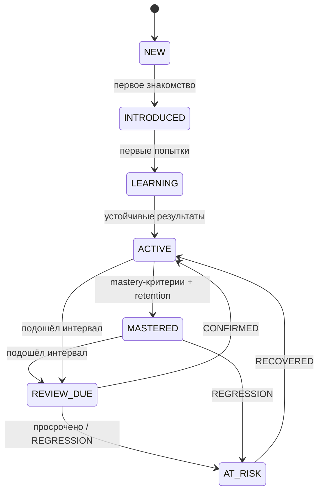

# Learning Model Requirements

> **Status**: current
> **Last updated**: 2026-07-19
> **Sources**: `docs/design-direction.md` (v0.2) · бриф §6–§10 · `staging/journal/2026-07-19-concept-v02-and-wiki.md` (Concept Gate, решения [PD-2026-07-19]) · концепт одобрен пользователем («ок») 2026-07-19
> **Роль**: продуктовый контракт учебной модели (roadmap 0.1). Определяет, ЧТО измеряется и подтверждается. Формулы и численные thresholds — контракт 0.4 (OPEN-1); жизненный цикл сессии — контракт 0.5; содержание программы — фаза П.

> Спека — **target**. Фазы — тегами `[mvp]` / `[post-mvp]`. Термины — по имени из [[../glossary]].

---

## 1. Рамки модели

Обучение — гибкий разговор с носителем, а не школа: движок — навигатор и память, ученик и агент свободны в выборе тем. При этом знание подтверждается только через evidence, а состояние меняет только движок. Эта спека фиксирует систему измерения, которая делает свободный формат честным.

## 2. Модальности и skill dimensions

- **MUST**: MVP покрывает только текстовые модальности: reading, writing, grammar, vocabulary, письменная спонтанная речь (chat-style production).
- **MUST NOT**: выставлять любые оценки по listening и speaking, в том числе прокси-оценки. Непокрытая модальность помечается как «не измеряется», не как ноль.
- **MUST**: каждая тема отслеживается по dimensions:
  - `recognition` — узнавание конструкции/слова в тексте;
  - `controlled_production` — применение в заданном упражнении;
  - `spontaneous_production` — самостоятельное употребление в свободной переписке/разговоре;
  - `transfer` — перенос в новый контекст (другая тема разговора, рабочий сценарий).
- **SHOULD**: программа задаёт required dimensions per topic; не каждой теме нужны все четыре.

## 3. Evidence-модель

- **MUST**: каждая оценка имеет сохранённое evidence: исходный текст ученика, задание/контекст, тип задания, оценка, обоснование, версия rubric (если применялась), idempotency key.
- **MUST NOT**: считать упоминание темы, пассивное согласие или пересказ правила за evidence.
- Источники evidence:
  1. **объективные задания** — проверяются кодом (выбор, трансформация, порядок слов, cloze) `[mvp]`;
  2. **rubric-оценки письма** — оценка агентом спонтанной письменной речи по versioned rubric `[mvp]`;
  3. **подмешанные проверки** — движок выдаёт в Session Manifest цели с `review_id`, темой, dimension и критериями; агент встраивает их в разговор и фиксирует результат `[mvp]`;
  4. **скрытые подтверждения** — агент замечает спонтанное корректное/некорректное употребление активной темы в разговоре и фиксирует его через CLI с цитатой `[mvp]`.
- **MUST**: результат каждого повторения классифицируется: `PROGRESS / CONFIRMED / REGRESSION / RECOVERED / INSUFFICIENT_EVIDENCE`.
- **Правило rubric-оценок [PD-2026-07-19]**:
  - **MUST**: вклад rubric-оценок в Mastery ограничен (cap — численно в 0.4);
  - **MUST**: повышение состояния темы (например LEARNING → ACTIVE) на основании rubric-evidence требует повторяемости минимум в двух разных сессиях;
  - **MUST**: одна оценка агента не меняет состояние темы и не двигает уровень.

## 4. Mastery, Stability, Retrievability

Принципы (формула — OPEN-1, контракт 0.4):

- **MUST**: `Mastery` 0–100 на тему + score по каждой required dimension; `Stability` в днях; `Retrievability` 0–1 с угасанием со временем.
- **MUST**: прирост Mastery за одну сессию ограничен; одна удачная попытка не переводит тему в MASTERED.
- **MUST**: оценка учитывает сложность, самостоятельность, подсказки, режим (объективное задание / rubric / спонтанное употребление), временной интервал и повторяемость.
- **MUST**: Mastery и уровень не зависят от дисциплины (пропусков, streak) — знание и мотивация разделены.
- **MUST**: scoring детерминирован и воспроизводим replay'ем событий.

### Состояния темы

Состояние отражает только знание. Рекомендации движка («стоит ли браться») — отдельный вычисляемый атрибут, не состояние [PD-2026-07-19: замков нет].

- **MUST**: переходы выполняет только движок по evidence; `LOCKED` из брифа исключён — вместо него флаг рекомендации `recommended / early` (раннее знакомство допустимо всегда).

## 5. Рабочий уровень (CEFR)

- **MUST**: отдельные уровни по Grammar, Vocabulary, Reading, Writing; общий working estimate вычисляется консервативно — не выше самого слабого core-навыка более чем на полступени.
- **MUST**: уровень меняет только движок по накопленному evidence тем соответствующего уровня.
- **MAY**: добровольный CEFR boundary gate как подтверждение перехода — по инициативе ученика или рекомендации движка; непройденный gate ничего не блокирует, результат идёт в evidence.
- **MUST**: оценка позиционируется как внутренняя CEFR-aligned, не сертификация.

## 6. Placement [PD-2026-07-19]

- **MUST** `[mvp]`: короткий текстовый placement ~30–40 минут: grammar, vocabulary, reading — объективно; writing — короткий фрагмент по rubric.
- **MUST**: результат — стартовые оценки по навыкам с пометкой `low-confidence`; движок повышает confidence по evidence первых 3–5 сессий (rolling уточнение) и корректирует рабочий уровень.
- **MUST**: deterministic seed и минимум две формы теста.
- **SHOULD**: повторный placement по запросу ученика; после длительного перерыва движок предлагает re-entry тест (§7), не полный placement.
- Полный placement из брифа (веса разделов, несколько сессий) — `[post-mvp]`, вернуться при расширении модальностей.

## 7. Повторения и re-entry

- **MUST** `[mvp]`: базовые интервалы `1 → 3 → 7 → 14 → 30 → 60 → 120 → 180` дней, адаптация по результату; интерфейс scheduler отделён от формулы (FSRS — `[post-mvp]`).
- **MUST**: повторение бывает явным (тест/упражнение), подмешанным (`review_id` в Session Manifest) и скрытым (conversation evidence).
- **MUST NOT**: блокировать темы из-за overdue backlog; backlog влияет только на рекомендации и состав Session Manifest.
- **Re-entry протокол [PD-2026-07-19]**:
  - **MUST**: после перерыва длиннее порога (policy, значение в 0.4) или при падении средней Retrievability приоритетных тем ниже порога движок формирует re-entry рекомендацию: начать сессию с быстрого повторения или короткого теста остаточных знаний;
  - **MUST**: агент обязан предложить re-entry блок первым шагом сессии;
  - **MUST**: отказ ученика допустим, ничего не блокирует и не штрафуется; результат re-entry обновляет Retrievability и план повторений.

## 8. Мотивация [PD-2026-07-19]

- **MUST**: XP начисляется за практику: выполненные задания, evidence, закрытые повторения, re-entry блоки. Штрафов и списаний XP нет.
- **MUST**: streak — счётчик подряд идущих дней с практикой; прерывание просто обнуляет счётчик, накопленный XP и достижения не сгорают.
- **MUST**: XP/streak не влияют на Mastery, уровень и рекомендации тем.
- Показатели раздельны: `Learning Score` (владение программой), `XP/streak` (практика), `Tutor Compliance Score` (соблюдение программы агентом).

## 9. Требования к программе как источнику генерации уроков

Программа проектируется заранее целиком [PD-2026-07-19]; уроки и упражнения генерятся агентом по ней (гибридная контент-модель, банк растёт из сессий). Чтобы генерация была корректной, каждая тема программы **MUST** содержать:

- стабильный ID (`grammar.present-perfect.result`) и CEFR-уровень;
- учебные цели в форме can-do;
- required dimensions и критерии освоения по каждой;
- advisory prerequisites (hard/soft — как сила рекомендации, не замок);
- типовые ошибки (в т.ч. характерные для русскоязычных);
- примеры целевых конструкций;
- связанный лексикон темы — ссылки на LexicalItem ([[lexical-system]]);
- рабочие контексты (AI, AEC, SaaS, переписка);
- ограничения языка объяснений (уровень английского, когда допустим русский).

Требования к банку упражнений:

- **MUST**: удачное сгенерированное упражнение сохраняется с метаданными (тема, dimension, сложность, происхождение, версия policy);
- **SHOULD**: банк переиспользуется для повторений и retention-проверок;
- **MUST**: банк — не условие старта; пустой банк не блокирует сессию.

Детали формата — Curriculum Contract (0.3); правила генерации — policies (П.3).

## 10. Открытые вопросы

- **OPEN-1**: scoring-формула, caps, thresholds (включая пороги re-entry) → блокирует контракт 0.4. Единый реестр — [[../OPEN]].

## История изменений

- **2026-07-19 (2)**: в §9 добавлен связанный лексикон темы (появилась [[lexical-system]]).
- **2026-07-19**: создана по итогам Concept Gate (4 развилки + поправка о заранее проектируемой программе + решение оставить XP/streak без штрафов). Все решения — [PD-2026-07-19].
