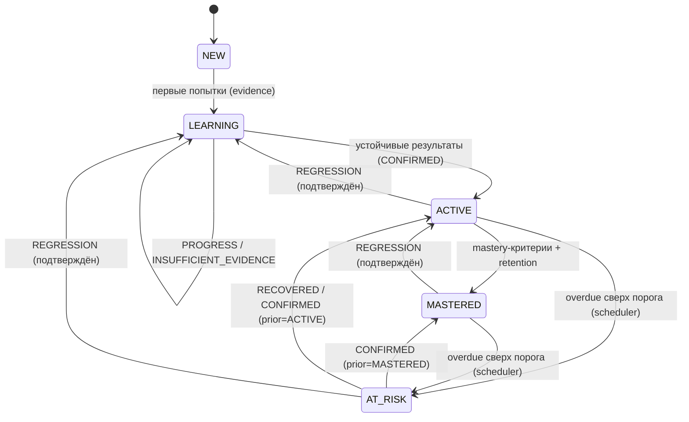

# Learning Model Requirements

> **Status**: current
> **Last updated**: 2026-09-22
> **Sources**: `docs/design-direction.md` (v0.2) · бриф §6–§10 · `staging/journal/2026-07-19-concept-v02-and-wiki.md` и `staging/journal/2026-07-19-concept-review-triage.md` (Concept Gate + red-team триаж, решения [PD-2026-07-19]) · концепт одобрен пользователем («ок») 2026-07-19
> **Роль**: продуктовый контракт учебной модели (roadmap 0.1). Определяет, ЧТО измеряется и подтверждается. Численные формулы — 0.4 (OPEN-1); anti-gaming/coverage/confidence — 0.4 (OPEN-7/8); XP-ledger — 0.4 (OPEN-12); Informal-профиль — 0.4 (OPEN-13); lifecycle/pinning — 0.5/0.2 (OPEN-9/10); содержание программы — фаза П.

> Спека — **target**. Одна цель продукта, без фазовых тегов (Принцип 4). Термины — по имени из [[../glossary]].

---

## 1. Рамки модели

Обучение — гибкий разговор с носителем, а не школа: движок — навигатор и память, ученик и агент свободны в выборе тем. При этом знание подтверждается только через evidence, а состояние меняет только движок. Эта спека фиксирует систему измерения, которая делает свободный формат честным.

## 2. Модальности и skill dimensions

- **MUST [PD-2026-07-22]**: продукт постоянно покрывает только текстовые модальности: reading, writing, grammar, vocabulary, письменная спонтанная речь (chat-style production).
- **MUST NOT**: выставлять любые оценки по listening и speaking, в том числе прокси-оценки. Непокрытая модальность помечается как «не измеряется», не как ноль.
- **MUST NOT [PD-2026-07-22]**: планировать voice/listening/speaking как расширение этого тренажёра. Эти навыки ученик развивает во внешних продуктах; TOEFL-подготовка здесь означает только Reading/Writing и языковую базу, без обещания полного экзаменационного score.
- **MUST**: каждая тема отслеживается по dimensions:
  - `recognition` — узнавание конструкции/слова в тексте;
  - `controlled_production` — применение в заданном упражнении;
  - `spontaneous_production` — самостоятельное употребление в свободной переписке/разговоре;
  - `transfer` — перенос в новый контекст (другая тема разговора, рабочий сценарий).
- **SHOULD**: программа задаёт required dimensions per topic; не каждой теме нужны все четыре.
- **MUST — timed-формы это полноправная письменная модальность** [PD-2026-09-22]: упражнение с **объявленным** ученику лимитом времени (Timed form — [[../glossary]]: `timed_writing`, раунд дрилла под лимит) даёт обычное письменное evidence по `controlled_production`/`spontaneous_production` и оценивается теми же rubric/objective-правилами. Лимит — условие выполнения, а не новая шкала: отдельного «скоростного балла» в Mastery нет. Scope остаётся text-only: timed-форма ничего не добавляет к listening/speaking и не является их прокси.
- **MUST NOT — лимит не наказывает** [PD-2026-09-22]: невыполнение объявленного лимита само по себе не понижает оценку и не создаёт отрицательного evidence; оно наблюдается осью automaticity (§4), где живёт скорость. Иначе одна и та же попытка штрафовалась бы дважды — по качеству и по времени.

## 3. Evidence-модель

- **MUST**: каждая оценка имеет сохранённое evidence: исходный текст ученика, задание/контекст, тип задания, оценка, обоснование, версии policy/rubric, idempotency key.
- **MUST NOT**: считать упоминание темы, пассивное согласие или пересказ правила за evidence.
- **MUST — семантическая идентичность и multi-credit** [PD-2026-07-19, ревью C-3]: idempotency key защищает только транспорт; помимо него evidence имеет семантическую идентичность (hash source-span ответа/цитаты, item-exposure ID упражнения). Один source-span засчитывается **не более чем раз** на пару (LearningTarget, dimension); переотправка того же ответа/цитаты/упражнения с новыми ключами и session ID не создаёт нового evidence. Правила admissibility, независимости (новый prompt/контекст/интервал) и multi-credit allocation — механизм в 0.4/0.2 ([[../OPEN]] OPEN-7).
- **MUST — классификацию считает движок** [ревью A-1/C-1]: агент передаёт только проверяемые наблюдения (raw answer, контекст, hints, rubric-observations); итоговый review outcome вычисляет движок по versioned policy. Клиентская готовая классификация запрещена.
- **MUST — observation ссылается на span, не готовый вердикт** [rereview C-R1; П.5, PD-2026-07-22]: rubric-observation обязана ссылаться на конкретный rubric-criterion, атомарный finding-code и точный UTF-8 span/error в raw answer, а не содержать `criterion_satisfied`, level, score, `correct` или outcome. Machine-checkable часть исполняет движок по закрытым opcodes; subjective часть остаётся под cap/trust и проходит consistency-check. Observation, не подтверждаемая raw answer/rendered snapshot/pinned rubric, **отклоняется** (`rejected` + audit-reason; ветки «помечается и всё равно учитывается» нет — [[../modules/evidence]] §4.1). Criterion levels и integer `score_ppm` вычисляет только движок.
- **Trust model [PD-2026-07-19, rereview C-R3]**: агент — **trusted reporter** raw_answer (агент и есть интерфейс; единственный ученик — сам пользователь). Допущение зафиксировано явно; границы аудита — через Tutor Compliance Score. Untrusted-захват user-turn на adapter boundary (`provider_message_id` + content hash + span) — в продукте, не ломающий evidence-модель; порядок — [[../roadmap]].
- **MUST — объяснение агента ≠ evidence** [rereview C-R2]: evidence появляется только при отдельном сохранённом learner response. Целенаправленное объяснение единицы агентом даёт enrollment, но не evidence знания.
- Источники evidence:
  1. **объективные задания** — проверяются кодом (выбор, трансформация, порядок слов, cloze);
  2. **rubric-оценки письма** — агент даёт rubric-observations по versioned rubric; scoring считает движок;
  3. **подмешанные проверки** (ReviewAssignment) — движок выдаёт в Session Manifest цели с `review_id`, ReviewTarget, dimension и критериями; агент встраивает их в разговор и фиксирует наблюдения;
  4. **скрытые подтверждения** — агент фиксирует спонтанное корректное/некорректное употребление активной темы через CLI с цитатой; source-span цитаты уникален (см. выше).
- **MUST**: результат каждого повторения классифицируется движком: `PROGRESS / CONFIRMED / REGRESSION / RECOVERED / INSUFFICIENT_EVIDENCE` ([[../glossary]]).
- **Правило rubric-оценок [PD-2026-07-19]**:
  - **MUST**: вклад rubric-оценок в Mastery ограничен (cap — численно в 0.4);
  - **MUST**: повышение состояния на основании rubric-evidence требует повторяемости минимум в двух **независимых** сессиях; «разная сессия» сама по себе не доказывает независимость (независимость — по новому контексту/интервалу, ревью C-2, [[../OPEN]] OPEN-7);
  - **MUST**: один engine-computed rubric AttemptAssessment из subjective observations не меняет состояние темы и не двигает уровень; promotion требует принятой повторяемости/independence. Неполное или отклонённое observation coverage даёт non-contributing `insufficient_evidence`, а не learner score zero.

## 4. Mastery, Stability, Retrievability

Принципы (формула — OPEN-1, контракт 0.4):

- **MUST**: `Mastery` 0–100 на тему + score по каждой required dimension; `Stability` в днях; `Retrievability` 0–1 с угасанием со временем.
- **MUST**: прирост Mastery за одну сессию ограничен; одна удачная попытка не переводит тему в MASTERED.
- **MUST**: оценка учитывает сложность, самостоятельность, подсказки, режим (объективное задание / rubric / спонтанное употребление), временной интервал и повторяемость.
- **MUST**: Mastery и уровень не зависят от дисциплины (пропусков, streak) — знание и мотивация разделены.
- **MUST**: scoring детерминирован и воспроизводим replay'ем событий.

### Состояния темы — три независимые оси

Состояние разложено на три оси **знания и расписания** (определения — [[../glossary]], rereview D-R1); один enum их не смешивает. Четвёртая, ортогональная им ось — `automaticity` (§4a, [PD-2026-09-22]) — описывает не «знает ли», а «выдаёт ли без обдумывания», и в перечисленные ниже три не входит:

- **enrollment**: `not_tracked` / `tracked` — взят ли элемент в отслеживание (не знание);
- **knowledge state**: `NEW → LEARNING → ACTIVE → MASTERED` + `AT_RISK` — меняется только движком по evidence;
- **review status**: `not_due` / `due` / `overdue` — служебная scheduling-ось, управляется часами и scheduler.

`REVIEW_DUE` как knowledge state **устранён** (rereview D-R1): наступление интервала — это review status `due`, а не отдельное знание-состояние. Устойчивое состояние сохраняется в `prior_steady_state` ∈ {ACTIVE, MASTERED}, чтобы подтверждение его восстанавливало. Диаграмма показывает knowledge state; аннотации в скобках — какой review outcome / scheduler-событие инициирует переход.

- **MUST**: переходы knowledge state выполняет только движок; `LOCKED` из брифа исключён — вместо него флаг рекомендации `recommended / early`.
- **MUST — restore-on-confirm** [ревью D-1]: при `CONFIRMED` элемент возвращается в `prior_steady_state` (в т.ч. `MASTERED`), не демотируется. `prior_steady_state` — явное поле.
- **MUST — AT_RISK** [rereview D-R2, P0-1]: в `AT_RISK` переводит **только** просрочка сверх порога ([[../OPEN]] OPEN-18). REGRESSION в `AT_RISK` не ведёт: он понижает состояние (`ACTIVE → LEARNING`, `MASTERED → ACTIVE`). `AT_RISK` означает риск забыть от простоя, REGRESSION — продемонстрированную потерю владения. Glossary, диаграмма и тотальная таблица 0.4 синхронны.
- **MUST — тотальность** [ревью D-2]: для каждой пары `(knowledge state, review outcome)` определён исход, включая no-op. Полная таблица — контракт 0.4 ([[../OPEN]] OPEN-10); диаграмма показывает основные ветки.
- **MUST — enrollment ≠ знание** [ревью D-6]: `tracked` (Mastery 0, knowledge state `NEW`) означает взятие в отслеживание, не знание. Enrollment-триггеры дают только `tracked`, не evidence.

### 4a. Automaticity — четвёртая ось [PD-2026-09-22]

Точность и скорость — разные вещи. Ученик может знать правило и применять его верно, каждый раз останавливаясь, чтобы его вспомнить; цель метода — чтобы форма вылетала без этой остановки. Три оси выше этого различия не видят: они отвечают на вопрос «владеет ли», а не «владеет ли автоматически». Поэтому вводится отдельная ось, а не пятый dimension внутри Mastery [PD-2026-09-22, PD-A].

- **MUST — определение**: `automaticity` — ось состояния per LearningTarget со значениями `not_measured → deliberate → proceduralized → automatic`. `not_measured` — измерений скорости ещё не было; `deliberate` — форма производится, но медленно и с обдумыванием; `proceduralized` — производится устойчиво и точно в дрилле; `automatic` — производится быстро относительно собственной базы ученика и подтверждено вне дрилла.
- **MUST — ось не трогает знание**: `automaticity` **никогда** не меняет Mastery, Stability, Retrievability, knowledge state, review status и рабочий CEFR-уровень, не участвует в таблице переходов §4 и не даёт XP. Она — отдельная проекция для планирования и для честного ответа ученику «это уже на автомате или ещё нет». Смешение её с Mastery потребовало бы переписать тотальную таблицу переходов и сломало бы replay уже накопленного evidence.
- **MUST — считает только движок**: значение выводится **исключительно** из сохранённого evidence дрилл-блоков и timed-форм по versioned policy `automaticity@1`; агент его не заявляет и не передаёт. Предъявление, объяснение и самооценка ученика ось не двигают.
- **MUST — форма критерия**: переход в `automatic` требует **одновременно** трёх условий — точность ≥ порога по ≥ N дрилл-блокам в ≥ M сессиях, **и** медианная `response_latency_ms` ≤ k × базовой latency **этого же ученика** на уже освоенном материале, **и** ≥ 1 подтверждение в spontaneous- или timed-форме вне дрилла. Конкретные пороги (`N`, `M`, `k`) — policy-значения `automaticity@1`, а не константы этой спеки ([[../modules/scoring]] §3d); их калибровка — [[../OPEN]] OPEN-37.
- **MUST — latency относительна** [PD-2026-09-22, PD-B]: абсолютных порогов времени нет. `response_latency_ms` — шумная величина (агент сообщает её как trusted reporter, §3), поэтому сравнение идёт только с собственной базой ученика. Отсутствие поля означает «не измерялось» и никогда не читается как ноль или как провал.
- **MUST — регресс возможен и безобиден**: неуспешный дрилл-блок понижает ось до `proceduralized`, но состояние знания не меняет. Это наблюдение о скорости, а не о потере владения.

## 5. Рабочий уровень (CEFR)

- **MUST**: отдельные уровни по core skills (Grammar, Vocabulary, Reading, Writing); общий working estimate вычисляется консервативно относительно слабейшего core-навыка. Представление уровня **решено** в 0.4: только целые CEFR-bands `A1…C2`, подуровней и «полступеней» нет ([[../modules/scoring]] §4, OPEN-8 закрыт).
- **MUST**: уровень меняет только движок по накопленному evidence тем соответствующего уровня.
- **MUST — coverage, не выборка** [PD-2026-07-19, ревью C-4]: повышение CEFR-уровня требует покрытия, а не нескольких лёгких тем: минимальное число независимых тем и ширина dimensions уровня, confidence floor. Непроверенная область трактуется как **unknown**, а не как отсутствие слабости; unknown не поднимает уровень. Матрица покрытия и пороги — контракт 0.4 ([[../OPEN]] OPEN-8).
- **MUST — самооценка отдельно, per-skill** [PD-2026-07-19, ревью A-2/A-R3]: самооценка хранится как `self_reported_level` отдельно от измеренного уровня и даёт только provisional working estimate. Замещение измерением идёт **по каждому навыку отдельно** — self-report перестаёт влиять на конкретный skill после его первого допустимого evidence/confidence floor (не глобально от одного attempt); provenance сохраняется.
- **MAY**: добровольный CEFR boundary gate как подтверждение перехода — по инициативе ученика или рекомендации движка; непройденный gate ничего не блокирует, результат идёт в evidence.
- **MUST**: оценка позиционируется как внутренняя CEFR-aligned, не сертификация.
- **MUST — Informal ↔ CEFR** [PD-2026-07-19, ревью C-5/H-1]: evidence помечается `contribution_scope` ([[../glossary]]). Recognition сленга/мемов/жаргона **никогда** не засчитывается в CEFR. Уместное письменное **производство** в реальном рабочем контексте (Slack/GitHub/переписка) может давать компонент writing/transfer через `contribution_scope`, но с dedup и cap — один source-span не засчитывается одновременно в informal-профиль и CEFR сверх cap. Владение informal ведётся отдельным профилем **Informal Online Competence** с собственной шкалой ([[lexical-system]] §3b, механизм — [[../OPEN]] OPEN-13).

## 6. Placement [PD-2026-07-19]

- **SHOULD**: короткий текстовый placement, целевая медиана ~30–40 минут (time-box/число items — контракт assessments; `~` не проверяемо как MUST, ревью E-9): grammar, vocabulary, reading — объективно; writing — короткий фрагмент по rubric.
- **MUST — потолок** [PD-2026-07-19, ревью D-9]: placement выдаёт объективно проверенным темам максимум `ACTIVE`, **никогда `MASTERED`** (нет retention во времени); writing из одного rubric-фрагмента — только provisional (полный writing-уровень — ≥2 независимых items в сессиях).
- **MUST — writing из placement входит только в provisional-оценку** [PD-2026-09-22]: единственный rubric-фрагмент даёт `provisional_working_estimate.writing` (наивысший band writing-item'а, набравшего `score_ppm ≥ scoring@2.placement.writing.provisional_threshold_ppm`, с `confidence: very_low`, `basis: placement`, `provisional: true`), а `measured_working_level.writing` остаётся unknown до ≥2 независимых non-placement items — иначе один фрагмент читался бы как измеренный навык ([[../modules/scoring]] §4c).
- **MUST**: результат — стартовые оценки по навыкам с пометкой `low-confidence`; confidence повышается rolling-уточнением по evidence первых сессий. Точное окно, coverage и снижение confidence — versioned policy, контракт 0.4 ([[../OPEN]] OPEN-8), не «после 3–5» на глаз.
- **MUST**: deterministic seed и минимум две формы теста; exposure-history и cooldown повторных прохождений — [[../flows/placement]] / [[../OPEN]] OPEN-17.
- **SHOULD**: повторный placement по запросу ученика; после длительного перерыва движок предлагает re-entry тест (§7), не полный placement.
- Принятый placement-контракт ([[../flows/placement]]) и есть целевой placement; «полный placement из брифа» отдельной целью не является — расширения (веса разделов, несколько сессий) потребуют нового решения через [[../OPEN]].

## 7. Повторения и re-entry

- **MUST — короткая лестница закрепления перед основной** [PD-2026-09-22, PD-D]: после первого предъявления цель проходит **relearning ladder** `1 → 2 → 4` дня продуктивных проверок и только затем попадает в базовую последовательность. Провал ступени повторяет **ту же** ступень, а не отбрасывает цель в начало. Мотив: для морфосинтаксиса прыжок к семидневному интервалу после двух подтверждений слишком велик, и материал распадается раньше, чем успевает процедурализоваться. Лестница — **отдельная фаза перед** основной таблицей, а не её замена: базовые интервалы ниже остаются как есть. Параметр — `scheduler@2.relearning_ladder_days` ([[../modules/scheduler]] §3a).
- **MUST**: базовые интервалы `1 → 3 → 7 → 14 → 30 → 60 → 120 → 180` дней, адаптация по результату; интерфейс scheduler отделён от формулы; FSRS — MAY, возможная замена формулы за интерфейсом без смены модели.
- **MUST — время** [PD-2026-07-19, ревью G-10]: всё хранится в UTC-инстантах; у ученика настраиваемая IANA-таймзона. Интервалы повторений считаются по **прошедшему времени** (elapsed 24h), не по календарю. Streak — по локальной календарной дате (§8).
- **MUST**: повторение бывает явным (тест/упражнение), подмешанным (`review_id` в Session Manifest) и скрытым (conversation evidence).
- **MUST NOT**: блокировать темы из-за overdue backlog; backlog влияет только на рекомендации и состав Session Manifest.
- **Re-entry протокол [PD-2026-07-19]**:
  - **MUST**: после перерыва длиннее порога или при падении средней Retrievability приоритетных тем ниже порога движок формирует re-entry рекомендацию. Оба порога (длина перерыва и Retrievability) — scheduler-policy, владелец 0.4 scheduler ([[../OPEN]] OPEN-18, rereview J-R3), не суженный OPEN-1;
  - **MUST**: агент обязан предложить re-entry блок первым шагом сессии;
  - **MUST**: отказ ученика допустим, ничего не блокирует и не штрафуется; результат re-entry обновляет Retrievability и план повторений.

## 8. Мотивация [PD-2026-07-19]

- **MUST**: XP начисляется за практику: выполненные задания, evidence, закрытые повторения, re-entry блоки. **Штрафов и списаний XP нет** (Season — только период агрегации отображения, [[../glossary]]).
- **MUST — award-once** [ревью A-6/C-7/E-6]: XP начисляется через immutable award-event с уникальным source ID; один source event даёт начисление ровно один раз, независимо от replay; определены единицы, eligibility (в т.ч. для ABANDONED) и caps. XP-ledger, шкалы Learning Score и Tutor Compliance Score — контракт 0.4 ([[../OPEN]] OPEN-12). «Выполнено»/«закрыто» опираются на review outcome и finalization, не на факт вызова.
- **MUST**: streak — счётчик подряд идущих дней практики по **локальной календарной дате** ученика; прерывание обнуляет счётчик, накопленный XP не сгорает.
- **MUST — day attribution** [rereview G-R3]: практический день фиксируется как immutable `practice_day`, выведенный из `occurred_at` + snapshot таймзоны на момент события; при смене таймзоны прошлые дни не пересчитываются; определены dedup дня, сессия через полночь и retry после полуночи. Механизм — [[../OPEN]] OPEN-12.
- **MUST**: XP/streak не влияют на Mastery, уровень и рекомендации тем.
- Показатели раздельны: `Learning Score` (владение программой), `XP/streak` (практика), `Tutor Compliance Score` (соблюдение программы агентом).

## 9. Требования к программе как источнику генерации уроков

Программа проектируется заранее целиком [PD-2026-07-19]; уроки и упражнения генерятся агентом по ней (гибридная контент-модель, банк растёт из сессий). Чтобы генерация была корректной, каждая тема программы **MUST** содержать:

- стабильный ID (`grammar.present-perfect.result`), learner-facing title и CEFR-уровень;
- учебные цели в форме can-do;
- required dimensions и `mastery_criteria` по каждой — по versioned schema из контракта 0.4 (ревью E-1; критерий по каждой required dimension обязателен, наличие проверяет валидатор);
- advisory prerequisites (`strong`/`soft` — сила рекомендации, не замок);
- типовые ошибки (в т.ч. характерные для русскоязычных);
- примеры целевых конструкций;
- связанный лексикон темы — ссылки на LexicalItem ([[lexical-system]]);
- рабочие контексты (AI, AEC, SaaS, переписка);
- ограничения языка объяснений (уровень английского, когда допустим русский).

Тема **MAY** добавлять авторские teaching anchors: `core_points`, `contrasts`, `scope_limits`, structured error objects и sourced `memory_insights`. Они усиливают точность и запоминаемость, но не являются условием старта: полный TeachingSegment можно собрать из can-do, examples, contexts и типовых ошибок; отсутствие optional insight нельзя заполнять выдуманным фактом.

### 9.1 Динамический, но полный урок [PD-2026-07-23]

- **MUST — не каталог готовых сценариев**: программа хранит авторские опоры, а LessonProposal, LessonArc, объяснения и упражнения собираются под текущий запрос, время и доказанное состояние ученика. Не требуется заранее генерировать все уроки или все возможные сочетания.
- **MUST — preflight до обучения**: тьютор называет профиль и тему, перечисляет содержание и формат, объясняет причину выбора и отмечает, является ли центральная тема новой. Прямой запрос ученика уже является согласием; системная рекомендация требует подтверждения.
- **MUST — одна центральная новая тема**: обычный программный урок вводит не более одной центральной новой темы; остальные единицы служат опорой, контрастом или повторением. Микроурок длится 10–19 минут, полный — от 20 минут.
- **MUST — полнота объяснения**: до первого применения сохраняется TeachingSegment с понятной моделью смысла, формой, минимум двумя контрастными примерами, типовыми ошибками и короткой проверкой понимания. Объяснение связывает «что», «почему» и «когда», а не выдаёт одно правило без контекста.
- **SHOULD — запоминаемая причина**: уместные фонетические, исторические и этимологические пояснения используются как memory hook, но не подменяют современное правило. Runtime-факт сопровождается источником и авторским пересказом; при недоступной сети необязательный экскурс пропускается, а не выдумывается.
- **MUST — практика после модели**: новый сложный материал получает worked example и постепенное снятие опоры; затем retrieval/production без подсказки и перенос в новый контекст. Результат попытки определяет следующую ветку: продолжение, более простой шаг или объяснение причины ошибки и retry.
- **MUST — свободный разговор остаётся понятным**: профиль `free_conversation` держится преимущественно в доказанно известном языке и допускает 1–3 явно пояснённые новые единицы. Тьютор поддерживает поток, отмечает повторяющуюся focus-error сразу и даёт пакет остальных исправлений в естественной паузе.
- **MUST — результат не зависит от выбранного профиля**: программа, свободный разговор, practice, review, error clinic, transfer, writing, reading, vocabulary и diagnostic используют одну evidence-модель. Выбор темы учеником не мешает системе фиксировать попытку и вычислять результат по pinned policy.
- **MUST NOT — преждевременный background prefetch**: следующий урок не генерируется фоновым агентом до измерения реальной задержки минимум на 30 учебных шагах. После триггера допустим только content-addressed draft с повторной проверкой актуального learner state перед использованием.

#### Обратная связь зависит от стадии [PD-2026-09-22, PD-E]

Прежнее правило «всегда объясняй причину ошибки, а не только исправленную строку» **заменяется** стадийным протоколом. Основание замены: на стадии процедурализации каждый возврат к правилу вытаскивает ученика из режима автоматического производства обратно в режим сознательного припоминания — то есть ровно из того состояния, ради которого дрилл и делается. Правило не отменено, оно перенесено: полное «почему» живёт в дебрифе, а не в каждом исправлении.

- **MUST — дрилл и фрейм-работа**: (1) подсказка — отметить проблемный фрагмент и дать **один** ход на самоисправление; (2) если ученик не исправил — показать правильную **фразу (фрейм)**, а не правило; (3) потребовать перепечатать предложение **целиком**, не одно слово; (4) ошибка становится карточкой в очереди повторений. Полное объяснение здесь даётся **только** по явному запросу ученика или при **повторе той же ошибки ×2** — тогда одна строка причины плюс ссылка на тему.
- **MUST — свободный разговор**: focus-ошибка исправляется **сразу** в форме recast + retry; остальные исправления копятся и выдаются пакетом в естественной паузе. Это правило §9.1 выше не меняется, а уточняется: recast без объяснения здесь легитимен.
- **MUST — дебриф занятия**: единственное место, где обязательны полное «почему», контрасты и формулировка правила. Занятие без дебрифа не считается полным.
- **MUST — правило одной строкой до практики**: в профилях `practice`, `spaced_review` и `drill` целевая форма вводится **одной строкой** перед практикой, а полноценное объяснение переносится в дебриф. Программный урок (`program_lesson`) сохраняет полную дугу и полный TeachingSegment (правило выше о полноте объяснения не ослаблено), но **фреймы предъявляются раньше разбора формы**: сначала то, что заучивается, затем то, что объясняет.
- **MUST — объём практики превышает объём объяснения**: в любом профиле, кроме `diagnostic`, время и число шагов продукции превышают время и число шагов объяснения. Это проверяемое свойство состава занятия ([[../modules/control]] §4.3a), а не пожелание: обратная пропорция и есть та ошибка, которую метод исправляет.

Исследовательская основа контура автоматизации: рамка Skill Acquisition Theory — декларативное знание → процедурализация через практику → автоматизация ([DeKeyser, 1997](https://eric.ed.gov/?id=EJ547482); [Suzuki & DeKeyser, 2017](https://onlinelibrary.wiley.com/doi/abs/10.1111/lang.12241)); распределённая продуктивная практика с короткими интервалами вместо ранних недельных ([Serfaty & Serrano, 2024](https://onlinelibrary.wiley.com/doi/10.1111/lang.12585)); сфокусированная письменная коррекция с повтором держится месяцами и на артиклях работает не хуже металингвистического объяснения ([Bitchener & Knoch, 2010](https://www.researchgate.net/publication/249237898_The_Contribution_of_Written_Corrective_Feedback_to_Language_Development_A_Ten_Month_Investigation)); interleaving контрастных структур после короткого blocked-ввода даёт лучшую отложенную точность ([Nakata & Suzuki, 2019](https://onlinelibrary.wiley.com/doi/abs/10.1111/modl.12581)); многословные единицы обрабатываются быстрее одиночных слов, что и делает фрейм разумной единицей заучивания ([Yi & Zhong, 2024](https://www.cambridge.org/core/journals/studies-in-second-language-acquisition/article/abs/processing-advantage-of-multiword-sequences-a-metaanalysis/64D9BFF2B458422C8CCE202A520F914A)).

Методические опоры: CEFR action-oriented descriptors задают наблюдаемые can-do outcomes ([Council of Europe](https://www.coe.int/en/web/common-european-framework-reference-languages/cefr-descriptors)); retrieval practice улучшает долговременное сохранение лучше повторного чтения ([Karpicke & Roediger, 2008](https://doi.org/10.1126/science.1152408)); worked examples снижают лишнюю нагрузку у начинающих ([Sweller & Cooper, 1985](https://www.tandfonline.com/doi/abs/10.1207/s1532690xci0201_3)); человеческая субъектность и прозрачность остаются обязательными при использовании генеративного ИИ ([UNESCO](https://www.unesco.org/en/articles/guidance-generative-ai-education-and-research)).

Требования к банку упражнений:

- **SHOULD**: удачное сгенерированное упражнение сохраняется с метаданными (тема, dimension, сложность, происхождение, версия policy); критерии «удачности», lifecycle `generated → accepted/rejected` и dedup — policies П.3 ([[../OPEN]] OPEN-16, ревью E-4);
- **SHOULD**: банк переиспользуется для повторений и retention-проверок;
- **MUST**: банк — не условие старта; пустой банк не блокирует сессию.

Детали формата — Curriculum Contract (0.3); `mastery_criteria` schema и scoring — контракт 0.4; правила генерации — policies (П.3).

## 10. Открытые вопросы

Механизмы, зафиксированные как инварианты выше, достраиваются в контрактах (единый реестр — [[../OPEN]]):

- **OPEN-1**: численная scoring-формула и пороги Mastery/Stability/Retrievability → 0.4.
- **OPEN-7**: anti-gaming + observation schema (span-ссылка, machine-checkable часть) → 0.4.
- ~~OPEN-8~~ **закрыт** в 0.4 (целые bands, coverage, confidence). Формула `learner_priority` переоткрыта отдельно — [[../OPEN]] OPEN-22.
- **OPEN-10**: AttemptAssessment vs terminal ReviewOutcome, таблица переходов, Attempt lifecycle → 0.5/0.4.
- **OPEN-12**: XP-ledger, шкалы, day-attribution streak → 0.4.
- **OPEN-13**: Informal Online Competence + generic LexicalMasteryProfile → 0.4.
- **OPEN-18**: scheduler-policy — re-entry trigger, overdue→AT_RISK порог → 0.4 scheduler.
- **OPEN-37**: калибровка порогов и latency-фактора `automaticity@1` (§4a) → [[../modules/scoring]], после ~30 реальных дрилл-блоков.

## История изменений

- **2026-09-22 (2)**: [PD-2026-09-22] §6 — writing из placement входит **только** в `provisional_working_estimate` (порог `score_ppm`, `confidence: very_low`, флаг `provisional`); `measured_working_level.writing` по-прежнему требует ≥2 независимых non-placement items.
- **2026-09-22**: [PD-2026-09-22] контур автоматизации — timed-формы признаны полноправной письменной модальностью evidence (§2); введена четвёртая ось `automaticity` с формой критерия и запретом влиять на Mastery/Stability/knowledge state (§4a, PD-A/PD-B); перед базовыми интервалами добавлена relearning ladder `1 → 2 → 4` (§7, PD-D); правило «всегда объясняй причину» **заменено** стадийным протоколом обратной связи, зафиксированы «правило одной строкой до практики» и превышение объёма практики над объяснением (§9.1, PD-E). Калибровка порогов — OPEN-37.
- **2026-07-23**: [PD-2026-07-23] определены десять профилей динамического урока, preflight/consent, одна центральная новая тема, полный TeachingSegment, known-language envelope свободного разговора и измерительный триггер вместо преждевременного background prefetch.
- **2026-07-22 (2)**: П.5 применена [PD-2026-07-22] — observation несёт atomic finding code + точный span; levels/score считает только движок; неполное покрытие → non-contributing insufficient_evidence, не ноль ученика.
- **2026-07-22**: фазовые теги `[mvp]`/`[post-mvp]` сняты [PD-2026-07-22]: спека описывает одну цель продукта, порядок и статус — только в roadmap (Принцип 4). untrusted-захват — в продукте (порядок в roadmap); «полный placement из брифа» упразднён как отдельная цель; FSRS — MAY.
- **2026-07-19 (5)**: rereview — три оси состояния, REVIEW_DUE устранён (D-R1); AT_RISK только подтверждённый/overdue (D-R2); AttemptAssessment vs ReviewOutcome (A-R1); observation ссылается на span (C-R1); trusted-reporter модель (C-R3); объяснение агента ≠ evidence (C-R2); half-step → OPEN-8 (E-R4); per-skill self-report (A-R3); day-attribution streak (G-R3); re-entry порог → OPEN-18 (J-R3).
- **2026-07-19 (4)**: red-team триаж — evidence семантическая идентичность и вычисление классификации движком (C-1/C-3); restore-on-confirm, review-status слой и тотальность переходов (D-1/D-2/D-3); CEFR coverage и unknown-as-unknown (C-4); Informal→CEFR через contribution_scope с cap (C-5); self_reported_level отдельно (A-2); placement потолок ACTIVE и SHOULD по времени (D-9/E-9); UTC+IANA и streak по локальной дате (G-10); XP award-once (A-6/C-7/E-6); `strong/soft`, mastery_criteria→0.4, банк SHOULD (A-4/E-1/E-4).
- **2026-07-19 (3)**: в §5 добавлен профиль Informal Online Competence (informal-трек, концепт Codex).
- **2026-07-19 (2)**: в §9 добавлен связанный лексикон темы (появилась [[lexical-system]]).
- **2026-07-19**: создана по итогам Concept Gate. Все решения — [PD-2026-07-19].
